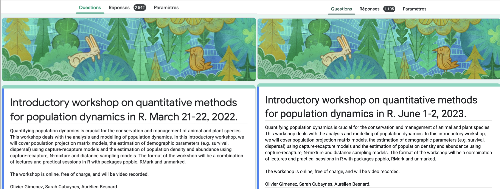
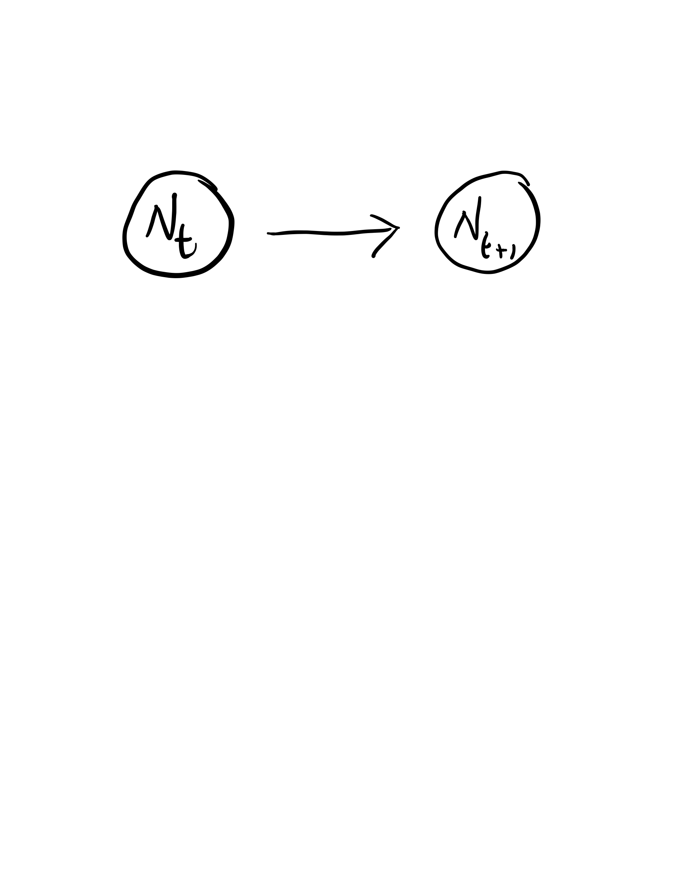
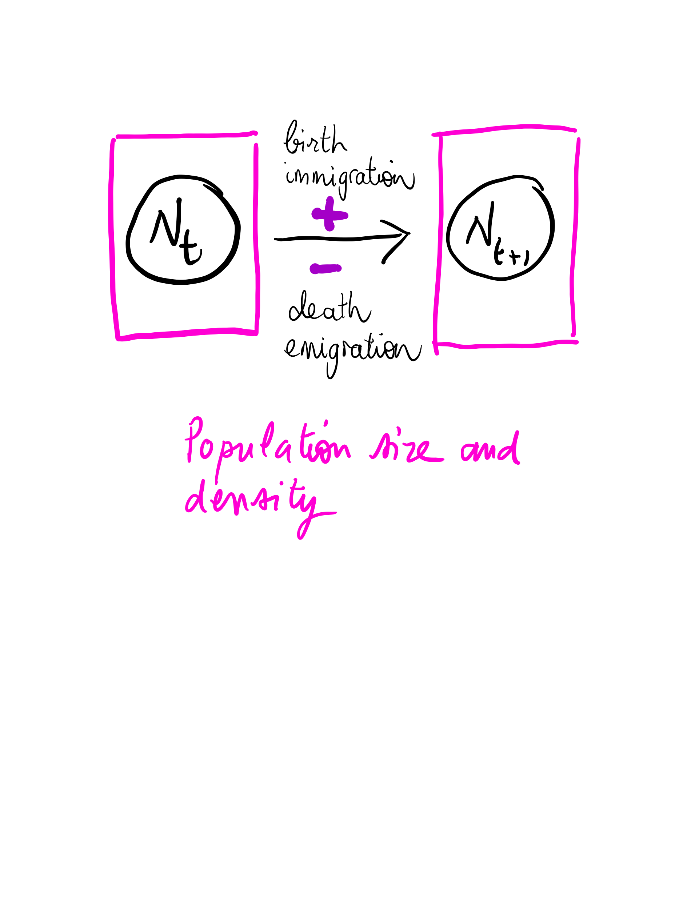

```{r setup, include=FALSE, echo=FALSE, cache = FALSE}
options(htmltools.dir.version = FALSE)
knitr::opts_chunk$set(comment = "")
library(tidyverse)
theme_set(theme_light())
update_geom_defaults("point", list(size = 2)) 
```

class: middle
background-image: url(img/montpellier.png)
background-size: cover

???

+ Welcome. My name is Olivier Gimenez
+ I am a scientist working in statistical ecology and population dynamics in particular. 
+ I am based in Montpellier in southern France.
+ I thought I'd share some a few pictures of what you’re missing. It's a bit cruel I know. 
+ We really wish the workshop would be in Montpellier to show you the city wonders and its surroundings.  

---
class: center, middle
background-image: url(img/zoom-covid.png)
background-size: cover

???

+ Instead, we'll be spending quality time on Youtube. 
+ It has its advantages, not sure we could have fit you all in our conference room. 


---
.pull-left[
.title-font[How it all started]

<center><blockquote class="twitter-tweet"><p lang="en" dir="ltr">📢👋 Together with <a href="https://twitter.com/SarahCubaynes?ref_src=twsrc%5Etfw">@SarahCubaynes</a> and <a href="https://twitter.com/abesnardEPHE?ref_src=twsrc%5Etfw">@abesnardEPHE</a> we will be giving a 2-day introductory workshop March 21-22 on quantitative methods for population dynamics in R <a href="https://twitter.com/hashtag/rstats?src=hash&amp;ref_src=twsrc%5Etfw">#rstats</a> Join us 🥳 It&#39;s online and free of charge 😉 You just need to register <a href="https://t.co/I5sNS5kDOo">https://t.co/I5sNS5kDOo</a> Please RT 😇 <a href="https://t.co/rkw8JWZBJi">pic.twitter.com/rkw8JWZBJi</a></p>&mdash; Olivier Gimenez 🖖 (@oaggimenez) <a href="https://twitter.com/oaggimenez/status/1447543032476225537?ref_src=twsrc%5Etfw">October 11, 2021</a></blockquote> <script async src="https://platform.twitter.com/widgets.js" charset="utf-8"></script></center>

]

???

+ Everything started in October 2021, on Twitter, when advertised for a workshop on quantitative methods for population dynamics. 

--

.pull-right[
.title-font[Where we're at]

.center[

]

]

???

+ The number of responses blew my mind. 
+ And here we're are, a few months later, with near 2600 folks who registered. 

---
class: center, middle
background-size: cover

## Quantitative methods for population dynamics

???

+ So why are we here altogether? 
+ This workshop deals with the analysis and modelling of population dynamics. 
+ Quantifying population dynamics is crucial for the conservation and management of animal and plant species. 

---

## Population dynamics

```{r, echo=FALSE, out.width="80%", fig.align='center'}

```

???

+ Population dynamics is the study of variation of population size over time. 

---

## Processes

```{r, echo=FALSE, out.width="80%", fig.align='center'}
knitr::include_graphics("img/intro2.png")
```

---

```{r, echo=FALSE, out.width="80%", fig.align='center'}

```

???

+ We will cover the estimation of population density and abundance using capture-recapture, N-mixture and distance sampling models.

---

```{r, echo=FALSE, out.width="80%", fig.align='center'}
knitr::include_graphics("img/Page2.png")
```

???

+ We will cover the estimation of demographic parameters (e.g. survival, dispersal) using capture-recapture models.


---

```{r, echo=FALSE, out.width="80%", fig.align='center'}
knitr::include_graphics("img/Page1.png")
```

???

+ We will cover the projection of population using structured and unstructured models.


---
## Credits and inspiration

???

+ This workshop does not come from nowhere, and I'd like to spend a minute or two on credits and to thank those who inspired me to organise this event. 

--

+ Past workshops on capture-recapture models with Roger Pradel, Rémi Choquet and Jean-Dominique Lebreton.

???

+ We've been running workshops on capture-recapture models in Montpellier for 10-15 years now with my colleagues Roger, Rémi and Jean-Dominique. 
+ I learnt so much from them, I owe them a lot. 

--

+ Past workshop on Population dynamics back in 2007.

???

+ We also run a workshop on pop dynamics. 


--

+ Lectures for Master students with Olivier Duriez.

???

+ Thanks

---
### The team - lecturers/helpers

```{r eval=FALSE, fig.asp=0.718, fig.width=7.5, message=FALSE, warning=FALSE, dev="svg", include=FALSE}
library(cowplot)
p1 <- ggdraw() + 
  draw_image(here::here("slides","img","sarah.jpg"), scale = 0.9) + 
  draw_label(label = "Sarah Cubaynes", hjust = -.7)

p2 <- ggdraw() + 
  draw_image(here::here("slides","img","aurelien.jpg"), scale = 0.9) + 
  draw_label(label = "Aurélien Besnard", hjust = -.7)

p3 <- ggdraw() + 
  draw_image(here::here("slides","img","olivier.jpg"), scale = 0.85) + 
  draw_label(label = "Olivier Gimenez", hjust = -0.7)

library(patchwork)

p1 / p2 / p3
```

<!-- Thierry (survie, matrice), Thibaut (effectif), Coline (survie, matrice) et Valentin -->

<!-- ??? -->

<!-- + We will be 3 teachers with you today and tomorrow.   -->
<!-- + Time for introductions I guess.  -->

<!-- --- -->
<!-- ### The team - helpers -->

```{r eval=FALSE, fig.asp=0.718, fig.width=7.5, message=FALSE, warning=FALSE, dev="svg", include=FALSE}
library(cowplot)
p1 <- ggdraw() + 
  draw_image(here::here("slides","img","coline.jpg"), scale = 0.9) + 
  draw_label(label = "Coline Canonne", hjust = -.7)

p2 <- ggdraw() + 
  draw_image(here::here("slides","img","thibaut.jpg"), scale = 0.9) + 
  draw_label(label = "Thibaut Couturier", hjust = -.7)

p3 <- ggdraw() + 
  draw_image(here::here("slides","img","thierry.jpg"), scale = 0.85) + 
  draw_label(label = "Thierry Chambert", hjust = -0.7)

p4 <- ggdraw() + 
  draw_image(here::here("slides","img","valentin.jpg"), scale = 0.85) + 
  draw_label(label = "Valentin Lauret", hjust = -0.7)

library(patchwork)

p1 / p2 / p3 / p4
```

<!-- ??? -->

<!-- + We will have the help of 4 young researchers with us today and tomorrow.   -->
<!-- + Time for introductions I guess.  -->


---
## On our plate

???

+ OK, what's on our plate? 

--

+ Estimating abundance and density of populations     
      + Conventional methods and the detectability issue
      + Capture-recapture, distance sampling and N-mixture

--

+ Estimation of demographic parameters       
      + Survival estimation from capture-recapture data
      + Using covariates to explain variation
      + Inference about dispersal

--

+ Population projection matrix models      
      + Count-based projection models
      + Age- and stage-structured models
      + Sensitivity analyses


---
## Philosophy of teaching

???

+ Before we start, a few words about our teaching philosophy. 

--

+ Lots of attendees, with huge heterogeneity in knowledge of statistical analyses, methods in population dynamics, and `R`.

???

+ You'll be several hundreds folks attending today and tomorrow, there is heterogeneity in knowledge of the methods we will cover. 

--

+ It is our hope that everyone will find something to take home. 

???

+ It is our hope however that everyone will find something to take home. 

--

+ We've packed a lot of things in two days.

???

+ We'll be covering a lot of things in two days. 

--

+ We do not expect you to digest everything.

???

+ Do not feel like you have to fully understand everything at once. 
+ Took us years to be comfortable with the material we will cover. 

--

+ All material (including videos) on website <https://oliviergimenez.github.io/popdyn-workshop/>.

???

+ To help, we have made all material available on a website. 
+ Let's take a minute to have a look to the website.


--

+ Feel free to play around with material while we walk through it, and afterwards.

???

+ Feel free to play around with the material we provide. 

--

+ The workshop is organized in modules, each module is a combination of lectures and live demos. 

???

+ We will have lectures, and live demos. In the live demos, we will demonstrate some R code directly in R, or simply explain it in the slides. 

---

## The way we will interact with each other

--

+ We'll be streaming lectures and live coding demos on Youtube.

???

+ Lectures and live demos will happen in Youtube. 

--

+ Everything is video recorded.

???

+ Everything is video recorded.

--

+ The recordings will be made available on the website. 

--

+ Questions and answers via the chat on Youtube. You need to have a YouTube account to use the chat. 

--

+ We'll do our best to answer your questions, but with > 2500 attendees, we'll probably miss some of them. Apologies in advance. 

