```{r setup, include=FALSE, echo=FALSE, cache = FALSE}
options(htmltools.dir.version = FALSE)
knitr::opts_chunk$set(comment = "")
library(tidyverse)
theme_set(theme_light())
update_geom_defaults("point", list(size = 2))
```


```{r, echo=FALSE, out.width="80%", fig.align='center'}
knitr::include_graphics("img/intro2.png")
```

???

+ Remember we're trying to say something about the dynamics of population
+ In other words the variation in population size from one year to the other
+ With Aurélien you've seen how to estimate population size.

---

```{r, echo=FALSE, out.width="80%", fig.align='center'}
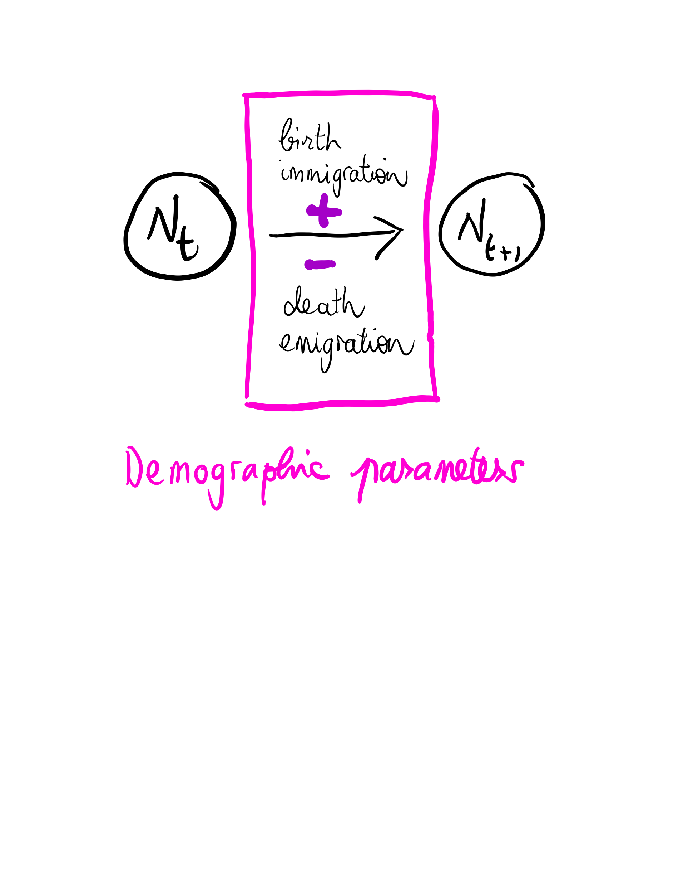
```

???

+ Now we're gonna look under the hood. 
+ And try to determine the mechanisms that explain these variation. 
+ The demographic parameters

---
# On our plate

+ Estimating survival with capture-recapture models
+ Including discrete and continuous covariates
+ Estimating transitions between sites/states
+ Estimating productivity with GLMs

???

+ This is what's on our plate. 

---
# On our plate

+ **Estimating survival with capture-recapture models**
+ Including discrete and continuous covariates
+ Estimating transitions between sites/states
+ Estimating productivity with GLMs


---
### Capture, mark and recapture

.pull-left[
```{r, echo=FALSE, out.width="90%"}
knitr::include_graphics("img/gull.jpg")
```
]

.pull-right[
```{r, echo=FALSE, out.width="110%"}
knitr::include_graphics("img/bighorn.png")
```
]

Artificial marks

???

+ Our starting point is the capture, marking and recapture of individuals
+ This might be artificial marks like

---
### Capture, mark and recapture

.pull-left[
```{r, echo=FALSE, out.width="90%"}
knitr::include_graphics("img/lynx.png")
```
]

.pull-right[
```{r, echo=FALSE, out.width="120%"}
knitr::include_graphics("img/bearscat.png")
```
]

Natural marks

???

+ This may also be natural marks like

---
class: center, middle
background-size: cover

## Capture-recapture data

???

+ what data do we get? Capture-recapture data.

---
### 3 capture occasions, 2 time intervals

```{r, echo = FALSE, fig.width = 7.5, fig.asp = 0.718, dev = "svg", message = FALSE, warning = FALSE,fig.align='center'}
# From Jay Rotella Univ of Montana 

# Define parameter values
n.occasions <- 3     # Number of capture occasions
n.mark <- 150
marked <- c(n.mark, 0)  # Number of newly marked individuals each year

# Vectors of values for phi and p for each year
# Each vector needs to have (n.occasions - 1) values or fewer and have values 
#  between 0 and 1. If it's fewer, the values will be recycled
# Here, we just give 1 value and it's used in every year
phi <- 0.8 # or, for example, could use phi <- c(0.6, 0.9)
p <- 0.6   # or, for example,  could use p <- c(0.3, 0.5)

# Define matrices with survival and recapture probabilities 
PHI <- matrix(phi, ncol = n.occasions-1, nrow = sum(marked), byrow = TRUE)
P <- matrix(p, ncol = n.occasions-1, nrow = sum(marked), byrow = TRUE)

# Define function to simulate a capture-history (CH) matrix
simul.cjs <- function(PHI, P, marked){
  n.occasions <- dim(PHI)[2] + 1
  CH <- matrix(0, ncol = n.occasions, nrow = sum(marked))
  # Define a vector with the occasion of marking
  # note: length(marked) is the number of marking occasions
  # so this next line indicates which occasion each individual was 1st marked on
  mark.occ <- rep(1:length(marked), marked[1:length(marked)])
  # Fill the CH matrix
  for (i in 1:sum(marked)) {
    CH[i, mark.occ[i]] <- 1       # Write a 1 at the release occasion
    if (mark.occ[i] == n.occasions) next # ignore animals 1st caught on last occasion
    for (t in (mark.occ[i] + 1):n.occasions) {
      # Bernoulli trial: does individual survive occasion?
      sur <- rbinom(1, 1, PHI[i, t - 1])
      if (sur == 0)
        break		# If dead, move to next individual
      # Bernoulli trial: is individual recaptured?
      rp <- rbinom(1, 1, P[i, t - 1])
      if (rp == 1) CH[i,t] <- 1
    } #t
  } #i
  return(CH)
}

# Simulate capture-histories
set.seed(2022)
CH <- simul.cjs(PHI, P, marked)

## collapse the numbers in each row into character data
#ch <- apply(CH, 1, paste, collapse = "")

# display data
CH %>%  
  kableExtra::kable() %>%
  kableExtra::scroll_box(width = "100%", height = "400px")
```

???

+ For example, imagine you go on the field 3 times, and three capture or sampling occasions.
+ Three occasions mean 2 time intervals
+ You get these data, with 1's and 0's for detected or non-detected
+ Detected = captured or observed
+ Everything is fine when you get all 1's, or even 0's between 1's
+ But what if 110 or 100, did the individual die or did it run undetected?


---
class: center, middle
background-size: cover

## Parameters

???

+ We're gonna need some parameters to describe the fate of individuals

---

```{r, echo=FALSE, out.width="90%", fig.align='center'}
knitr::include_graphics("img/param1.png")
```

???

+ Three capture or sampling occasions then

---

```{r, echo=FALSE, out.width="90%", fig.align='center'}
knitr::include_graphics("img/param2.png")
```

???

+ We need survival parameters, or the probability of being alive and present at a given occasion, and still present and alive at the next occasion
+ This is for example $\phi_1$ survival over the first interval
+ Or $\phi_2$ survival over the second time interval
+ We also need recapture probabilities, $p_2$ and $p_3$ recapture probabilities at second and third occasions
+ You might ask what about $p_1$? Well because we mark at first occasion, the detection probability is necessarily 1 so no need to estimate it. 

---
## Definition of parameters

--

+ Parameter $\phi_i$ is the probability that a marked animal in the population at sampling occasion $i$ survives until occasion $i+1$ and remains in the population (does not permanently emigrate). 

--

+ Parameter $p_i$ is the probability that a marked animal in the population is detected (captured or observed) at sampling occasion $i$.

--

+ While detection operates at a sampling occasion, survival operates over a time interval. 

--

+ How to estimate these parameters from the data we have?

???

+ Let's agree on a formal definition of survival and detection parameters. 

---
class: center, middle
background-size: cover

## Encounter histories

???

Now we're fully equiped to work out what happens in the life of our animals. 

---

```{r, echo=FALSE, out.width="90%", fig.align='center'}
knitr::include_graphics("img/cjs1.png")
```

???

+ Back to our example with 3 capture or sampling occasions. 

---

```{r, echo=FALSE, out.width="90%", fig.align='center'}
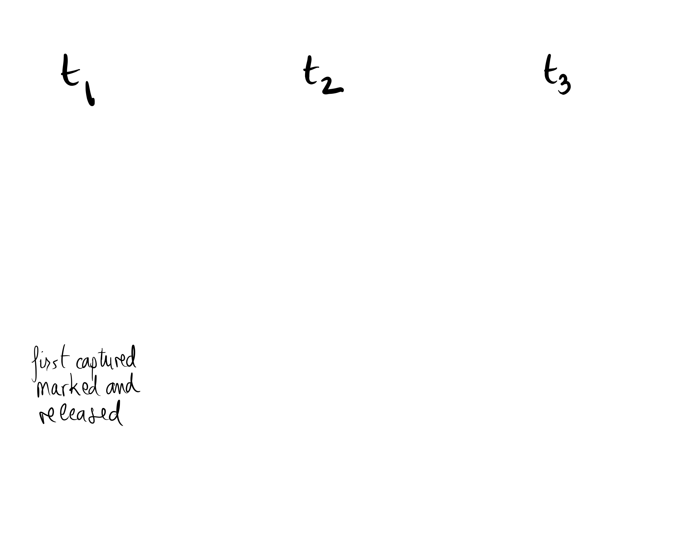
```

???

+ First things first, you get captured, marked and released in the population.

---

```{r, echo=FALSE, out.width="90%", fig.align='center'}
knitr::include_graphics("img/cjs3.png")
```

???

+ Then you may stay alive and present over the time interval.
+ Or you may die or emigrate

---

```{r, echo=FALSE, out.width="90%", fig.align='center'}
knitr::include_graphics("img/cjs4.png")
```

???

+ If you're alive, you are available to detection, then you get detected or not. 

---

```{r, echo=FALSE, out.width="90%", fig.align='center'}
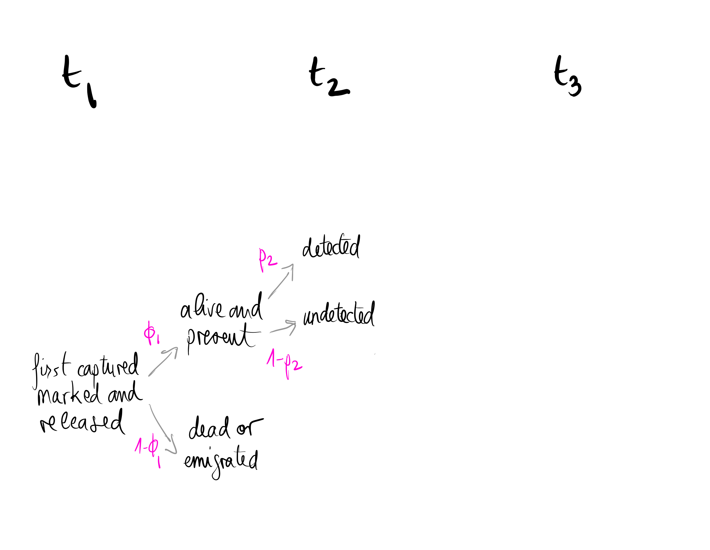
```

???

+ These events occur with some probabilities.
+ For example...

---

```{r, echo=FALSE, out.width="90%", fig.align='center'}
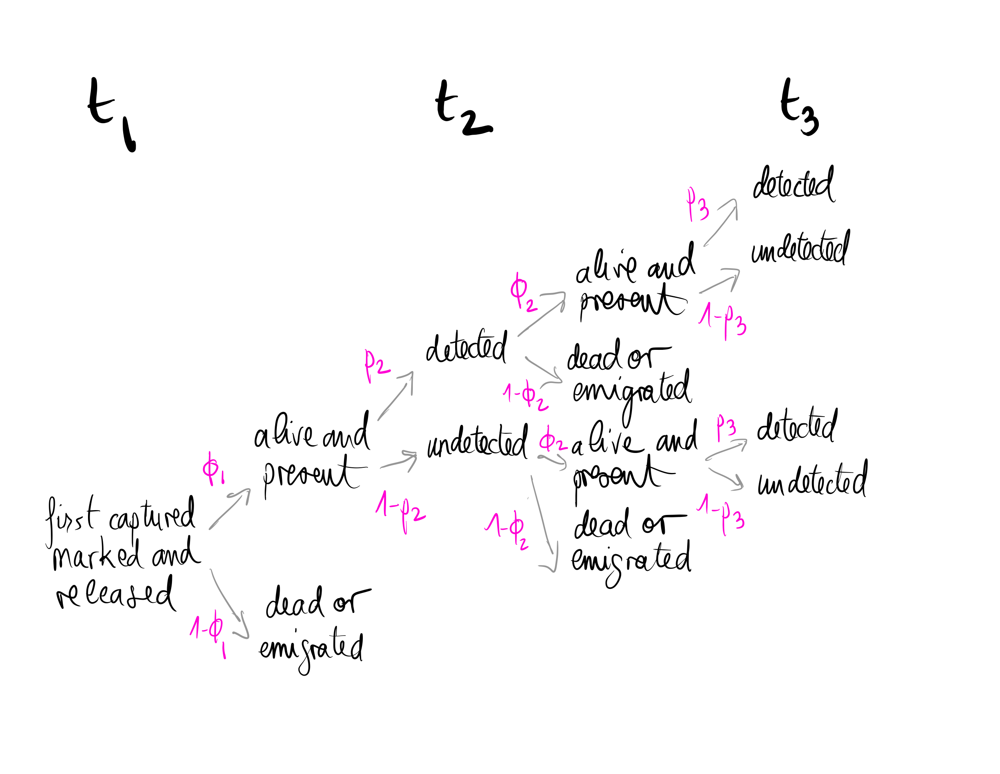
```

???

+ Then again, if you were alive and detected, you may remain alive or die/emigrate. Same thing if you were alive and undetected. And on the third occasion, you get detected or not. 

---

```{r, echo=FALSE, out.width="90%", fig.align='center'}
knitr::include_graphics("img/cjs7.png")
```

???

+ These successive events lead to encounter histories, series of 1's and 0's. 
+ For example... 
+ Note that several paths can lead to the same encounter history, for example 110. 

---
class: center, middle
background-size: cover

## Probabilities

???

+ From there, it's fairly easy to write down the probability for each encounter history.

---

```{r, echo=FALSE, out.width="90%", fig.align='center'}
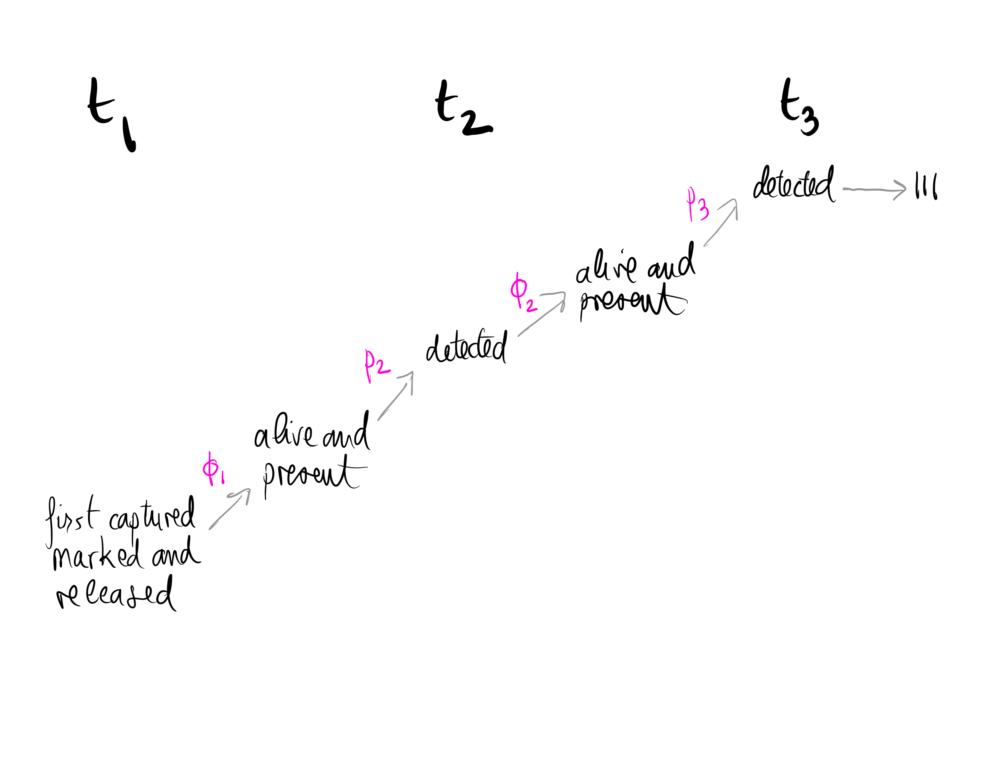
```

???

+ Take 111 for example. 

---

```{r, echo=FALSE, out.width="90%", fig.align='center'}
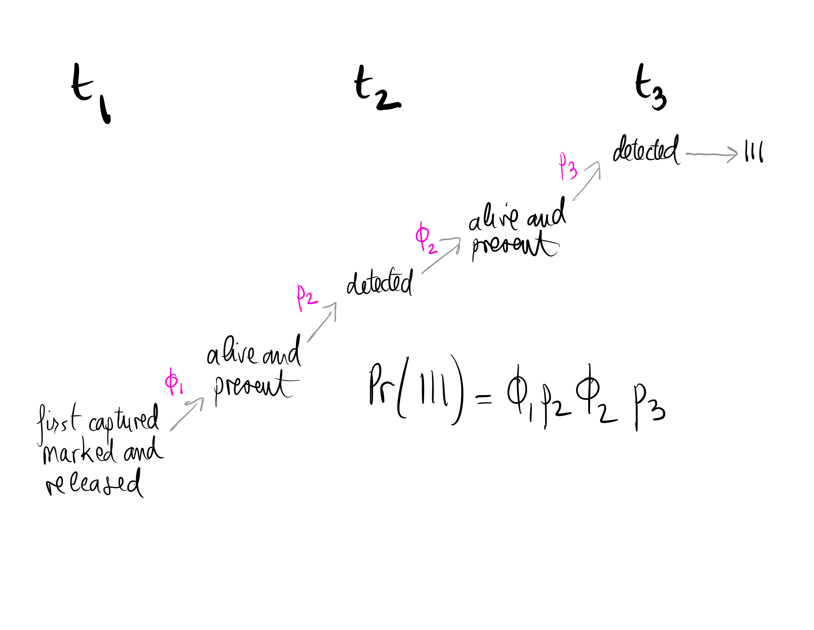
```


---

```{r, echo=FALSE, out.width="80%", fig.align='center'}
knitr::include_graphics("img/eh3.png")
```

???

+ The encounter history 110 is a bit trickier to deal with
+ Because two paths may lead to it
+ But because these paths are exclusive, we just need to write down the probability for each, and sum them up


---

```{r, echo=FALSE, out.width="80%", fig.align='center'}
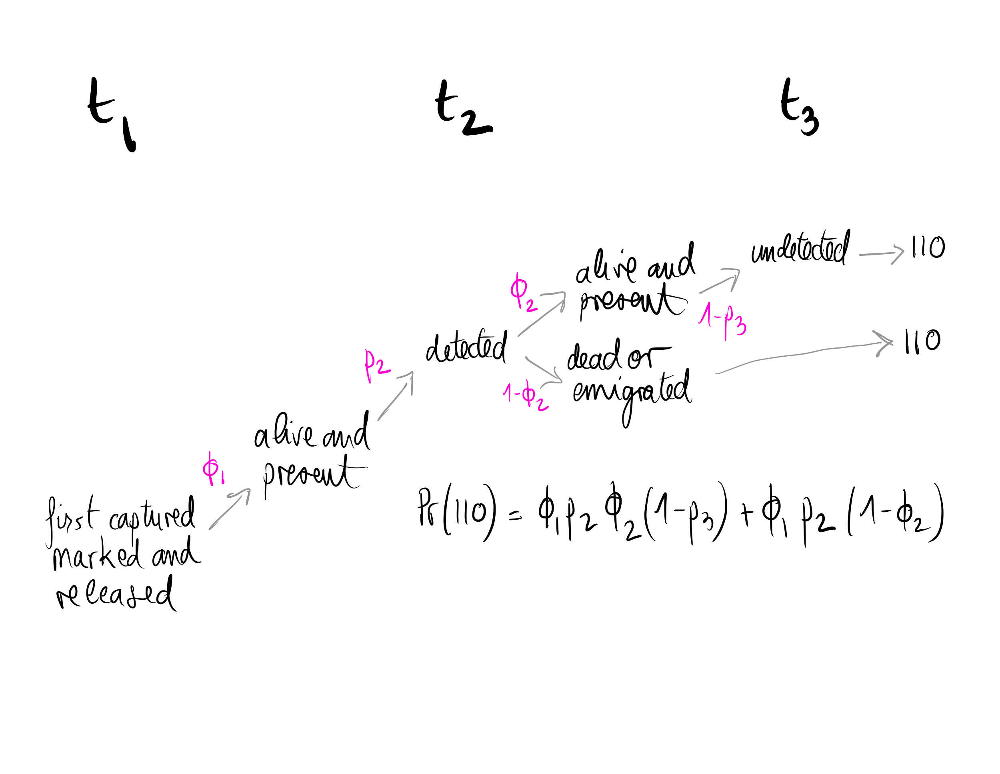
```

---

```{r, echo=FALSE, out.width="80%", fig.align='center'}
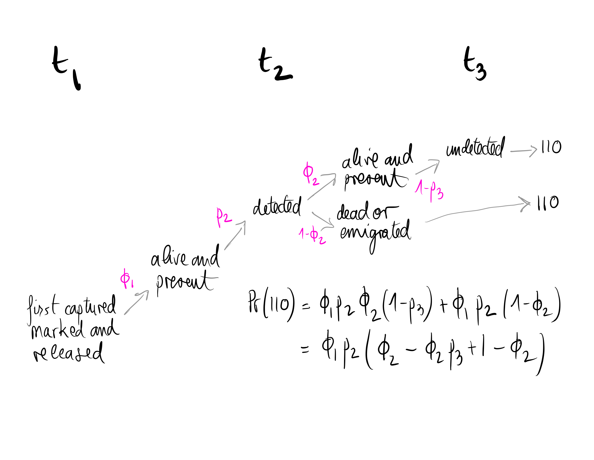
```

---

```{r, echo=FALSE, out.width="80%", fig.align='center'}
knitr::include_graphics("img/eh6.png")
```


---
### Probabilities of all possible encounter histories with 3 occasions

+ $\Pr(111) = \phi_1 p_2 \phi_2 p_3$
+ $\Pr(110) = \phi_1 p_2 (1-\phi_2 p_3)$
+ $\Pr(101) = \phi_1 (1-p_2) \phi_2 p_3$
+ $\Pr(100) = 1-\phi_1 p_2 -\phi_1(1-p_2)\phi_2 p_3$

???

+ If you do the work for all the possible encounter histories, you get
+ Where do we go from here? 
+ Remember our goal is to estimate survival and detection probabilities.


---
class: center, middle
background-size: cover

## Model likelihood

???

+ We're going to work with something Aurelien already introduced you with, the model likelohood. 
+ The core of statistical inference, whether you're a frequentist or a Bayesian. 

---
### Likelihood

--

+ When survival and detection probabilities vary over time, we call it the Cormack-Jolly-Seber model.

--

+ Its likelihood is $L(\mbox{data}\;|\;\mbox{parameters}) = \Pr(\mbox{data}\; | \; \phi_1,\phi_2,p_2,p_3)$.

--

+ You get maximum likelihood estimates by maximising the likelihood function (!) $L(\mbox{parameters}\;|\;\mbox{data})$.

--

+ It is $L = \mbox{constant} \times \Pr(111)^{n_{111}} \times \Pr(110)^{n_{110}} \times \Pr(101)^{n_{101}} \times \Pr(100)^{n_{100}}$.

--

+ We search for $\phi_1,\phi_2,p_2,p_3$ that maximize the likelihood function.

--

+ Let's inspect visually the likelihood function in the simple case where all parameters are constant over time, that is $\phi_1 = \phi_2 = \phi$ and $p_2 = p_3 = p$.

---

```{r, echo = FALSE, fig.width = 7.5, fig.asp = 0.718, dev = "svg", message = FALSE, warning = FALSE,fig.align='center'}
# From Jay Rotella Univ of Montana 

# Define parameter values
n.occasions <- 3     # Number of capture occasions
n.mark <- 150
marked <- c(n.mark, 0)  # Number of newly marked individuals each year

# Vectors of values for phi and p for each year
# Each vector needs to have (n.occasions - 1) values or fewer and have values 
#  between 0 and 1. If it's fewer, the values will be recycled
# Here, we just give 1 value and it's used in every year
phi <- 0.8 # or, for example, could use phi <- c(0.6, 0.9)
p <- 0.6   # or, for example,  could use p <- c(0.3, 0.5)

# Define matrices with survival and recapture probabilities 
PHI <- matrix(phi, ncol = n.occasions-1, nrow = sum(marked), byrow = TRUE)
P <- matrix(p, ncol = n.occasions-1, nrow = sum(marked), byrow = TRUE)

# Define function to simulate a capture-history (CH) matrix
simul.cjs <- function(PHI, P, marked){
  n.occasions <- dim(PHI)[2] + 1
  CH <- matrix(0, ncol = n.occasions, nrow = sum(marked))
  # Define a vector with the occasion of marking
  # note: length(marked) is the number of marking occasions
  # so this next line indicates which occasion each individual was 1st marked on
  mark.occ <- rep(1:length(marked), marked[1:length(marked)])
  # Fill the CH matrix
  for (i in 1:sum(marked)) {
    CH[i, mark.occ[i]] <- 1       # Write a 1 at the release occasion
    if (mark.occ[i] == n.occasions) next # ignore animals 1st caught on last occasion
    for (t in (mark.occ[i] + 1):n.occasions) {
      # Bernoulli trial: does individual survive occasion?
      sur <- rbinom(1, 1, PHI[i, t - 1])
      if (sur == 0)
        break		# If dead, move to next individual
      # Bernoulli trial: is individual recaptured?
      rp <- rbinom(1, 1, P[i, t - 1])
      if (rp == 1) CH[i,t] <- 1
    } #t
  } #i
  return(CH)
}

# Simulate capture-histories
set.seed(2022)
CH <- simul.cjs(PHI, P, marked)

# collapse the numbers in each row into character data
ch <- apply(CH, 1, paste, collapse = "")

# Store the numbers of animals with each of the 4 histories
x111 <- sum(ch == "111")
x101 <- sum(ch == "101")
x110 <- sum(ch == "110")
x100 <- sum(ch == "100")

# Make a data frame with a grid of combinations of 
#  possible parameter combinations 
# Look up `expand.grid` in R's help if the function is new to you
parms <- expand.grid(phi = seq(0.01, 0.99, by = 0.01),
                     p = seq(0.01, 0.99, by = 0.01))
# calculate the probability of each capture history 
#  for each combination of parameter values in the data frame
parms$p111 <- with(parms, phi*p*phi*p)
parms$p101 <- with(parms, phi*(1-p)*phi*p)
parms$p110 <- with(parms, phi*p*(1-phi*p))
parms$p100 <- with(parms, 1-p111-p101-p110)                 
                   
# work out the multinomial pdf value (log scale) for each pair of 
# possible parameter values GIVEN the data and the model
#  structure (contstant phi and p over time)
parms$log.lik <- NA
for (i in 1:nrow(parms)) {
  parms$log.lik[i] <- dmultinom(x = c(x111, x101, x110, x100), 
                            size = n.mark,
                            prob = c(parms$p111[i], 
                                     parms$p101[i], 
                                     parms$p110[i], 
                                     parms$p100[i]),
                            log = TRUE)
}

# print out values of phi and p associated with highest pdf value
#parms$phi[parms$log.lik == max(parms$log.lik)]
#parms$p[parms$log.lik == max(parms$log.lik)]

# make a contour plot of log-likelihood values
ggplot(parms, aes(x = p, y = phi, z = log.lik)) + 
  geom_contour_filled(bins = 30) +
#  # add green contour line as a form of 95% CI
#  stat_contour(breaks=c(max(parms$log.lik) - 1.92), color = "green") +
  # add black point to show estimates
  geom_point(data = data.frame(x = parms$p[parms$log.lik == max(parms$log.lik)],
                               y = parms$phi[parms$log.lik == max(parms$log.lik)]),
             aes(x = x, y = y, z = 0),
             color = "black") +
  
  # add red point to show the true parameter values
  geom_point(data = data.frame(x = p,
                               y = phi),
             aes(x = x, y = y, z = 0),
             color = "red") +
  scale_x_continuous(limits = c(0, 1), breaks = seq(0, 1, by = 0.2)) +
  scale_y_continuous(limits = c(0, 1), breaks = seq(0, 1, by = 0.2)) +
  labs(x = "detection", y = "survival") + 
  theme(legend.position = "none") + 
  annotate(
    geom = "curve", 
    x = parms$p[parms$log.lik == max(parms$log.lik)] + .1, 
    y = parms$phi[parms$log.lik == max(parms$log.lik)] - .2, 
    xend = parms$p[parms$log.lik == max(parms$log.lik)], 
    yend = parms$phi[parms$log.lik == max(parms$log.lik)], 
    curvature = .3, 
    arrow = arrow(length = unit(2, "mm"))
  ) +
  annotate(geom = "text", 
           x = parms$p[parms$log.lik == max(parms$log.lik)] + .1, 
           y = parms$phi[parms$log.lik == max(parms$log.lik)] - .25, 
           label = "max-lik estimate", 
           hjust = "left") + 
  annotate(
    geom = "curve", 
    color = "red",
    x = p - .1, 
    y = phi - .2, 
    xend = p, 
    yend = phi, 
    curvature = -.3, 
    arrow = arrow(length = unit(2, "mm"))
  ) +
  annotate(geom = "text", 
           color = "red",
           x = p - .1, 
           y = phi - .25, 
           label = "true value", 
           hjust = "right")
```

???

+ What do we have here?
+ The likelihood function with survival on the Y axis, and detection on the X axis
+ The maximum of this function is the yellow area, in black
+ We used simulated data, with known survival and detection, and 150 individuals
+ The true value of survival and detection is in red
+ We're not that far

---
class: center, middle
background-size: cover

## A bit of history

???

+ Before going further, let's talk about the history of the CJS model

---
### History of the Cormack-Jolly-Seber (CJS) model

--

<font size="5">S.T. Buckland (2016). A Conversation with Richard M. Cormack. Statistical Science 31: 142-150.</font>

???

+ Let's have a look to an interview of Richard Cormack by Steve Buckland. 

--

.pull-left[
```{r, echo=FALSE, out.width="80%"}
knitr::include_graphics("img/cormack-left.png")
```
]

???

+ George Jolly

--

.pull-right[
```{r, echo=FALSE, out.width="80%"}
knitr::include_graphics("img/cormack-right.png")
```
]

???

+ George Seber

---


???

+ Feel free to read the 3 original papers on the CJS model
+ My advice is to read that paper by Jean-Dominique Lebreton, Ken Burnham, Jean Clobert and David Anderson. 
+ In this paper, the authors introduce a framework to carry out stat inference that we're still using today. 
+ Plus to my knowledge this is the first proposal of using AIC for model selection. 


---
class: center, middle
background-size: cover

## Let's practice!

---
## The famous Dipper example

.center[
.pull-left[
```{r, echo=FALSE, out.width="60%", fig.cap="White-throated Dipper (Cinclus cinclus)"}
knitr::include_graphics("img/Marzo_BaguesMance.jpg")
```
]
]

--

.pull-right[
```{r, echo=FALSE, fig.cap="Gilbert Marzolin", out.width="60%"}
knitr::include_graphics("img/Marzocuissardes.jpg")
```
]

???

+ Gilbert Marzolin, a math teacher and colleague of ours who's been monitoring dipper populations for almost 40 years now. 

---
## 294 dippers captured and recaptured between 1981 and 1987 with known sex and wing length

.center.nogap[
```{r echo = FALSE, message=FALSE, warning=FALSE}
dipper <- read_csv("dat/dipper.csv")
dipper %>%  
  kableExtra::kable() %>%
  kableExtra::scroll_box(width = "100%", height = "400px")
y <- dipper %>%
  select(year_1981:year_1987) %>%
  as.matrix()
```
]

---
background-color: #234f66
## <span style="color:white">Live demo #1</span>

.center[

]

---
# On our plate

+ Estimating survival with capture-recapture models
+ **Including discrete and continuous covariates**
+ Estimating transitions between sites/states
+ Estimating productivity with GLMs


---
# Can we explain individual heterogeneity?

--

+ Discrete covariate like, e.g., sex

--

+ Continuous covariate like, e.g., mass or size

---
## Sex and wing length in Dipper

.center.nogap[
```{r echo = FALSE, message=FALSE, warning=FALSE}
dipper %>%  
  kableExtra::kable() %>%
  kableExtra::scroll_box(width = "100%", height = "400px")
```
]

---
# Sex effect

--

+ Let's use a covariate $\text{sex}$ that takes value 0 if female, and 1 if male

--

+ And write $\text{logit}(\phi_i) = \beta_1 + \beta_2 \; \text{sex}_i$ for bird $i$

--

+ Then female survival is 

$$\text{logit}(\phi_i) = \beta_1$$

--

+ And male survival is 

$$\text{logit}(\phi_i) = \beta_1 + \beta_2$$

--

+ Very much alike an ANOVA with one factor (two levels)

---
# Wing length effect

--

+ Include continuous individual covariate, say $x_i$.

--

+ $\text{logit}(\phi_i) = \beta_1 + \beta_2 x_i$.

--

+ Let's investigate the effect of sex and wing length on dipper survival.


---
background-color: black
# <span style="color:white">Live demo #2</span>

<br>
<br>

.center[

]


---
class: middle

## Can we explain time variation?

---
# Embrace heterogeneity

--

+ Include temporal covariates, say $x_t$.

--

+ $\text{logit}(\phi_t) = \beta_1 + \beta_2 x_t$.

--

+ Let's investigate the effect of an extreme climatic event on dipper survival.

---
background-color: #234f66
## <span style="color:white">Live demo #3</span>

.center[

]


---
## What if covariates vary with individual and time?

--

+ Think of age for example. 

--

+ In capture-recapture, age is the time elapsed since first capture. This is true age when animals are marked at birth.  

--

+ Now, think of body size across life.

--

+ Problem is we cannot record size when animal is non-detected.

--

+ Discretize in small, medium and large and treat as a state <span>&#8212;</span> more later.

--

+ Assume a model for covariate and fill in missing values (imputation).

---
background-color: black
# <span style="color:white">Live demo #4</span>

<br>
<br>

.center[

]


---
## Capture-recapture models rely on assumptions

--

+ Design
    + No mark lost
    + Identity of individuals recorded without error (no false positives)
    + Captured individuals are a random sample

--

+ Model
    + Homogeneity of survival and recapture probabilities
    + Independence between individuals (overdispersion)

--

+ Test validity of assumptions
    + These assumptions should be valid, whatever inferential framework
    + Use goodness-of-fit tests <span>&#8212;</span> Pradel et al. (2005)
    + R implementation with package R2ucare ([paper](https://besjournals.onlinelibrary.wiley.com/doi/full/10.1111/2041-210X.13014) and [vignette](https://oliviergimenez.github.io/R2ucare/))

---
## What does survival actually mean in capture-recapture ?

--

+ Survival refers to the study area.

--

+ Mortality and permanent emigration are confounded.

--

+ Therefore we estimate apparent survival, not true survival.

--

+ Apparent survival probability = true survival × study area fidelity.

--

+ Consequently, apparent survival < true survival unless study area fidelity = 1.

--

+ Use caution when interpreting survival. If possible, combine with ring-recovery data, or go spatial to get closer to true survival.

---
# On our plate

+ Estimating survival with capture-recapture models
+ Including discrete and continuous covariates
+ **Estimating transitions between sites/states**
+ Estimating productivity with GLMs


---
class: middle

## On the move: Transition estimation

---
## Two sites A and B

```{r, echo=FALSE, out.width="90%", fig.align='center'}
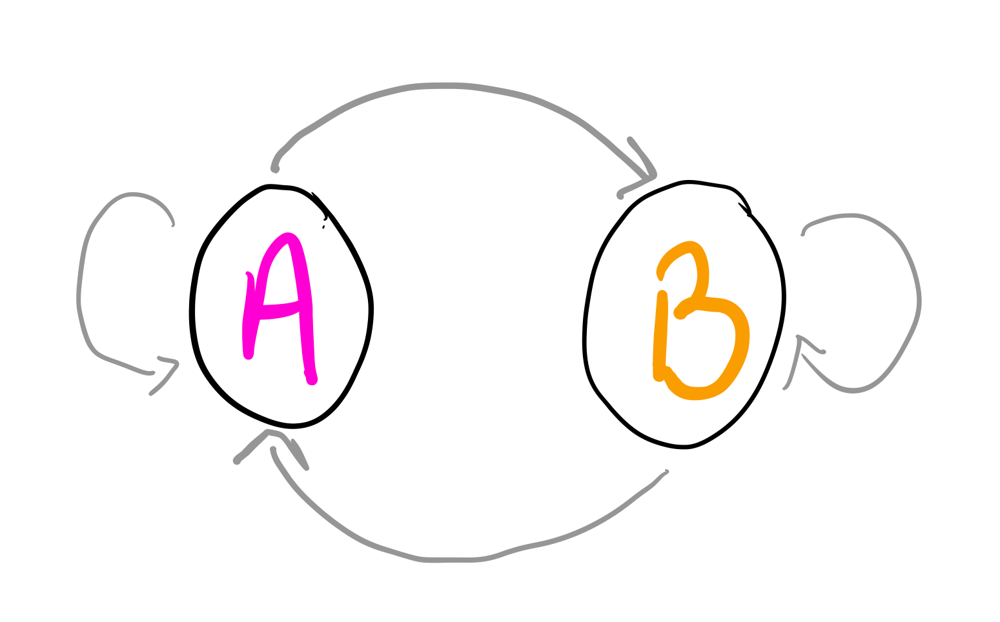
```


---

```{r, echo=FALSE, out.width="90%", fig.align='center'}
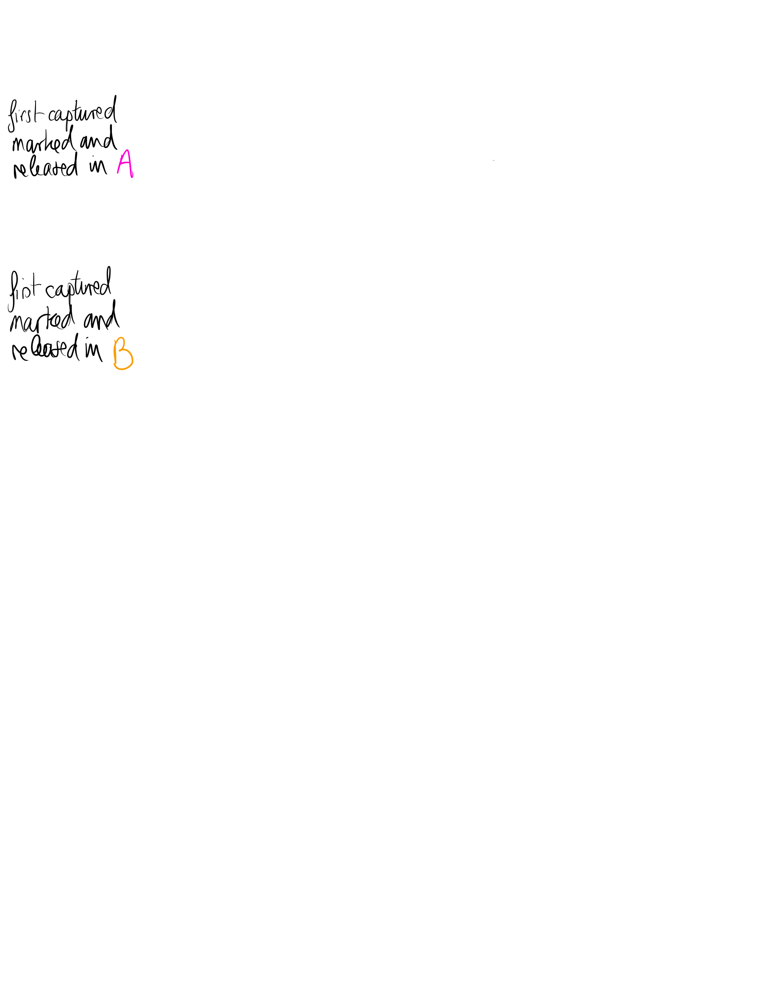
```

---

```{r, echo=FALSE, out.width="90%", fig.align='center'}
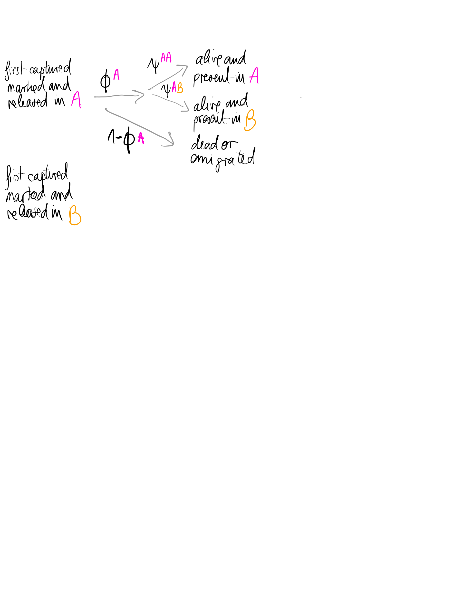
```

---

```{r, echo=FALSE, out.width="90%", fig.align='center'}
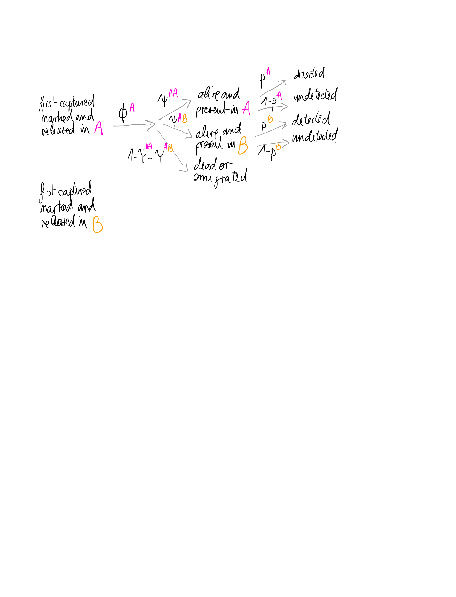
```

---

```{r, echo=FALSE, out.width="90%", fig.align='center'}
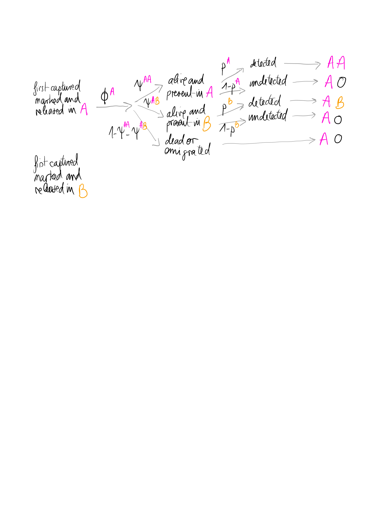
```

---

```{r, echo=FALSE, out.width="90%", fig.align='center'}
knitr::include_graphics("img/multisite6.png")
```

---
class: middle

## A little bit of history


---

<style>

.center2 {
  margin: 0;
  position: absolute;
  top: 50%;
  left: 50%;
  -ms-transform: translate(-50%, -50%);
  transform: translate(-50%, -50%);
}

</style>

.center2[

]


---

<style>

.center2 {
  margin: 0;
  position: absolute;
  top: 50%;
  left: 50%;
  -ms-transform: translate(-50%, -50%);
  transform: translate(-50%, -50%);
}

</style>

.center2[

]


---
class: middle, center
background-color: #230404

## <span style="color: white;">Thank you Canada!</span>


---
background-image: url(https://media.giphy.com/media/26BRGxMMN3Pn1MMdG/source.gif)
background-size: cover

---

.center[

]


---
class: middle, center

## Sites may be states.

---
## Examples of multistate models

+ *Epidemiological or disease states*: sick/healthy, uninfected/infected/recovered.

--

+ *Morphological states*: small/medium/big,  light/medium/heavy.

--

+ *Breeding states*: e.g. breeder/non-breeder, failed breeder, first-time breeder, breeder with 1 or 2 offspring. 

--

+ *Developmental or life-history states*: e.g. juvenile/subadult/adult.

--

+ *Social states*: e.g. solitary/group-living,  subordinate/dominant.

--

+ *Death states*: e.g. alive, dead from harvest, dead from natural causes. 

--

&nbsp;

**States = individual, time-specific categorical covariates.**

---
class: middle

## Let's practice!


---
background-image: url("img/geese.png")
background-size: cover

## <span style="color: white;">Wintering site fidelity in Canada Geese</span>

---
### 3 sites Carolinas, Chesapeake, Mid-Atlantic, with 21277 banded geese, data kindly provided by Jay Hestbeck

.center.nogap[
```{r echo = FALSE, message=FALSE, warning=FALSE}
geese <- read_csv("dat/geese.csv")
geese %>%  
  kableExtra::kable() %>%
  kableExtra::scroll_box(width = "100%", height = "400px")
y <- geese %>%
  as.matrix()
```
]

???

(large areas along East coast of US)


---
background-color: black
# <span style="color:white">Live demo #5</span>

<br>
<br>

.center[

]

---
# On our plate

+ Estimating survival with capture-recapture models
+ Including discrete and continuous covariates
+ Estimating transitions between sites/states
+ **Estimating productivity with GLMs**


---
## Further reading

+ Lebreton, Burnham, Clobert, and Anderson (1992). [Modeling Survival and Testing Biological Hypotheses Using Marked Animals: A Unified Approach with Case Studies](https://esajournals.onlinelibrary.wiley.com/doi/10.2307/2937171). Ecological Monographs 62: 67-118.

+ Lebreton, Nichols, Barker, Pradel and Spendelow (2009). [Modeling Individual Animal Histories with Multistate Capture–Recapture Models](https://www.sciencedirect.com/science/article/abs/pii/S0065250409004036). Advances in Ecological Research 41:87-173.

+ Cooch and White (2021). [Program MARK - a 'gentle introduction'](http://www.phidot.org/software/mark/docs/book/).

+ Williams, Nichols and Conroy (2002). [Analysis and Management of Animal Populations](https://www.elsevier.com/books/analysis-and-management-of-animal-populations/williams/978-0-12-754406-9).  

+ Pradel, Gimenez and Lebreton (2005). [Principles and interest of GOF tests for multistate capture-recapture models](http://abc.museucienciesjournals.cat/volume-28-2-2005-abc/principles-and-interest-of-gof-tests-for-multistate-capture-recapture-models-2/?lang=en). Animal Biodiversity and Conservation 28: 189–204.

```{r echo = FALSE, warning=FALSE, message=FALSE}
rm(list = ls(all = TRUE))
RMark::cleanup(ask = FALSE)
```


<!-- --- -->
<!-- ### 3 sampling occasions, 2 time intervals -->

<!-- ```{r, echo = FALSE, fig.width = 7.5, fig.asp = 0.718, dev = "svg", message = FALSE, warning = FALSE,fig.align='center'} -->
<!-- gv <- DiagrammeR::grViz(" -->
<!-- digraph dot { -->

<!-- graph [layout = dot, -->
<!--        rankdir = LR] -->

<!-- node [shape = plaintext, -->
<!--       label = '', -->
<!--       fontsize = 30, -->
<!--       fontname = Arial] -->

<!-- node [label = 'first captured,\n marked\n and released', fontcolor = 'blue'] -->
<!-- a -->

<!-- node [label = 'alive \n and present', fontcolor = 'black'] -->
<!-- b -->

<!-- node [label = 'dead \n or emigrated', fontcolor = 'black'] -->
<!-- c -->

<!-- node [label = 'detected', fontcolor = 'black'] -->
<!-- d -->

<!-- node [label = 'non-detected', fontcolor = 'black'] -->
<!-- e -->

<!-- node [label = 'alive \n and present', fontcolor = 'black'] -->
<!-- f -->

<!-- node [label = 'dead \n or emigrated', fontcolor = 'black'] -->
<!-- g -->

<!-- node [label = 'alive \n and present', fontcolor = 'black'] -->
<!-- h -->

<!-- node [label = 'dead \n or emigrated', fontcolor = 'black'] -->
<!-- i -->

<!-- node [label = 'detected', fontcolor = 'black'] -->
<!-- j -->

<!-- node [label = 'non-detected', fontcolor = 'black'] -->
<!-- k -->

<!-- node [label = 'detected', fontcolor = 'black'] -->
<!-- l -->

<!-- node [label = 'non-detected', fontcolor = 'black'] -->
<!-- m -->

<!-- node [label = '111', fontcolor = 'black'] -->
<!-- n -->

<!-- node [label = '100', fontcolor = 'black'] -->
<!-- t r q  -->

<!-- node [label = '110', fontcolor = 'black'] -->
<!-- s o  -->

<!-- node [label = '101', fontcolor = 'black'] -->
<!-- p -->


<!-- edge [color = grey, fontsize = 30, labelfontsize = 30] -->
<!-- a -> {b} [label = '$\\\\phi_1$', fontsize = 20] -->
<!-- a -> {c} [label = '$1 - \\\\phi_1$', fontsize = 20] -->
<!-- b -> {d} [label = '$p_2$', fontsize = 20] -->
<!-- b -> {e} [label = '$1 - p_2$', fontsize = 20] -->
<!-- d -> {f} [label = '$\\\\phi_2$', fontsize = 20] -->
<!-- d -> {g} [label = '$1 - \\\\phi_2$', fontsize = 20] -->
<!-- e -> {h} [label = '$\\\\phi_2$', fontsize = 20] -->
<!-- e -> {i} [label = '$1 - \\\\phi_2$', fontsize = 20] -->
<!-- f -> {j} [label = '$p_3$', fontsize = 20] -->
<!-- f -> {k} [label = '$1 - p_3$', fontsize = 20] -->
<!-- h -> {l} [label = '$p_3$', fontsize = 20] -->
<!-- h -> {m} [label = '$1 - p_3$', fontsize = 20] -->
<!-- j -> {n}  -->
<!-- k -> {o}  -->
<!-- l -> {p}  -->
<!-- m -> {q}  -->
<!-- i -> {r}  -->
<!-- g -> {s} -->
<!-- c -> {t} -->

<!-- { rank = same; n; o; p; q; r; s; t} -->
<!-- { rank = same; b; c} -->
<!-- { rank = same; d; e} -->
<!-- { rank = same; f; g; h; i} -->
<!-- { rank = same; j; k; l; m} -->

<!-- }", width = 1000, height = 600) -->

<!-- DiagrammeR::add_mathjax(gv, include_mathjax = FALSE) -->
<!-- ``` -->


<!-- --- -->
<!-- ### 3 sampling occasions, 2 time intervals -->

<!-- ```{r, echo = FALSE, fig.width = 7.5, fig.asp = 0.718, dev = "svg", message = FALSE, warning = FALSE,fig.align='center'} -->
<!-- gv <- DiagrammeR::grViz(" -->
<!-- digraph dot { -->

<!-- graph [layout = dot, -->
<!--        rankdir = LR] -->

<!-- node [shape = plaintext, -->
<!--       label = ''] -->

<!-- node [label = 'first captured,\n marked\n and released', fontcolor = 'blue'] -->
<!-- a -->

<!-- node [label = 'alive \n and present', fontcolor = 'black'] -->
<!-- b -->

<!-- node [label = 'dead \n or emigrated', fontcolor = 'black'] -->
<!-- c -->

<!-- node [label = 'detected', fontcolor = 'black'] -->
<!-- d -->

<!-- node [label = 'non-detected', fontcolor = 'black'] -->
<!-- e -->

<!-- node [label = 'alive \n and present', fontcolor = 'black'] -->
<!-- f -->

<!-- node [label = 'dead \n or emigrated', fontcolor = 'black'] -->
<!-- g -->

<!-- node [label = 'alive \n and present', fontcolor = 'black'] -->
<!-- h -->

<!-- node [label = 'dead \n or emigrated', fontcolor = 'black'] -->
<!-- i -->

<!-- node [label = 'detected', fontcolor = 'black'] -->
<!-- j -->

<!-- node [label = 'non-detected', fontcolor = 'black'] -->
<!-- k -->

<!-- node [label = 'detected', fontcolor = 'black'] -->
<!-- l -->

<!-- node [label = 'non-detected', fontcolor = 'black'] -->
<!-- m -->

<!-- node [label = '111', fontcolor = 'black'] -->
<!-- n -->

<!-- node [label = '100', fontcolor = 'black'] -->
<!-- t r q  -->

<!-- node [label = '110', fontcolor = 'black'] -->
<!-- s o  -->

<!-- node [label = '101', fontcolor = 'black'] -->
<!-- p -->


<!-- edge [color = grey] -->
<!-- a -> {b} [label = '$\\\\phi_1$'] -->
<!-- a -> {c} [label = '$1 - \\\\phi_1$'] -->
<!-- b -> {d} [label = '$p_2$'] -->
<!-- b -> {e} [label = '$1 - p_2$'] -->
<!-- d -> {f} [label = '$\\\\phi_2$'] -->
<!-- d -> {g} [label = '$1 - \\\\phi_2$'] -->
<!-- e -> {h} [label = '$\\\\phi_2$'] -->
<!-- e -> {i} [label = '$1 - \\\\phi_2$'] -->
<!-- f -> {j} [label = '$p_3$'] -->
<!-- f -> {k} [label = '$1 - p_3$'] -->
<!-- h -> {l} [label = '$p_3$'] -->
<!-- h -> {m} [label = '$1 - p_3$'] -->
<!-- j -> {n}  -->
<!-- k -> {o}  -->
<!-- l -> {p}  -->
<!-- m -> {q}  -->
<!-- i -> {r}  -->
<!-- g -> {s} -->
<!-- c -> {t} -->

<!-- { rank = same; n; o; p; q; r; s; t} -->
<!-- { rank = same; b; c} -->
<!-- { rank = same; d; e} -->
<!-- { rank = same; f; g; h; i} -->
<!-- { rank = same; j; k; l; m} -->

<!-- }", width = 1000, height = 600) -->

<!-- DiagrammeR::add_mathjax(gv, include_mathjax = FALSE) -->
<!-- ``` -->
