```{r setup, include=FALSE, echo=FALSE, cache = FALSE}
options(htmltools.dir.version = FALSE)
knitr::opts_chunk$set(comment = "")
library(tidyverse)
theme_set(theme_light())
update_geom_defaults("point", list(size = 2)) 
```

## Population dynamics

```{r, echo=FALSE, out.width="80%", fig.align='center'}
knitr::include_graphics("img/intro2.png")
```

---

```{r, echo=FALSE, out.width="80%", fig.align='center'}
knitr::include_graphics("img/Page3.png")
```

---

# Background - Detectability issues

Counting animals or plants in the field
```{r, echo=FALSE, out.width="75%", fig.align='center'}
knitr::include_graphics("img/Diapositive1.JPG")
```

---

# Background - Detectability issues
```{r, echo=FALSE, out.width="75%", fig.align='center'}
knitr::include_graphics("img/Diapositive2.JPG")
```

Detectability is rarely (never) exhaustive

---

# Background - Detectability issues

```{r, echo=FALSE, out.width="75%", fig.align='center'}
knitr::include_graphics("img/Diapositive3.JPG")
```
---

# Background - Detectability issues

```{r, echo=FALSE, out.width="75%", fig.align='center'}
knitr::include_graphics("img/Diapositive4.JPG")
```
Detectability (usually) varies over space
---

# Background - Detectability issues

```{r, echo=FALSE, out.width="75%", fig.align='center'}
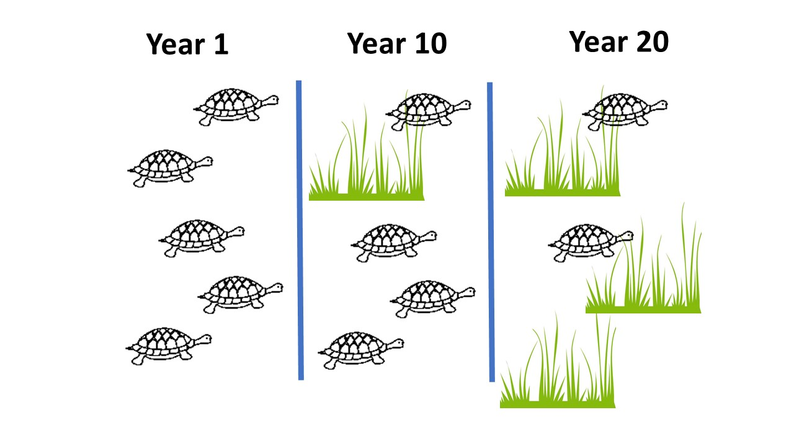
```

---
# Background - Detectability issues

```{r, echo=FALSE, out.width="75%", fig.align='center'}
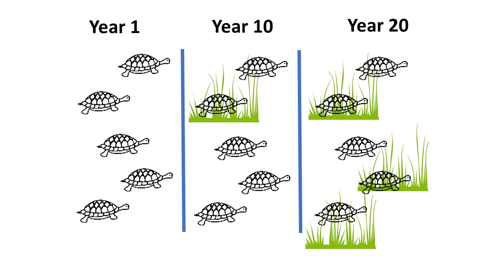
```

Detectability (usually) varies over time

---
# Background - Detectability issues

If *N* is the abundance of a particular species at a particular study area

and *C* the individuals counted in the field

E(*C*)=*pN*

where *p* is the probability of counting an individual in the study area

---
# Background - Detectability issues

Eventually population abundance is given by:

$$N=\frac{C}{\alpha*p}$$

$\alpha$ being the fraction of the study area that is sampled

*p* need to be estimated to provide unbiased estimates 

and allow inference regarding abundance variations over time and space


---
# Sampling design

How to select sampling units in the study area to obtain unbiased estimates of abundance is a complex task

Need to define the statistical population of sample units and rely on some random selection process of the units to survey

Several sampling design exit (random, systematic, stratified, spatially balanced, etc )

Not cover is this course however

---
# Some useful reading on sampling design

.pull-left[
```{r, echo=FALSE, out.width="70%", fig.align='center'}
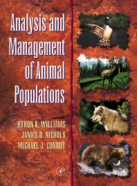
```
]

.pull-right[
```{r, echo=FALSE, out.width="60%", fig.align='center'}
knitr::include_graphics("img/book_thompson.jpg")
```
]


---
# Issue 1 - estimating abundances when *p*<1

Several methods exist, depends whether population is "closed" or "open"

Closed populations : Capture-recapture, Distance sampling, N-mixture

Open populations : Capture-recapture, open N-mixture

In this course : 
 - Capture-recapture for closed populations
 - Distance sampling
 - N-mixture for closed populations

---
## What does mean "closed" populations ?

Demographically :
  - no birth
  - no death
  
Geographiccaly :
  - no immigration
  - no emigration
  
Between the first and last field session

Implies to work over short intervals 

'Short' depending on species life history traits

---
## What does mean "closed" populations ?

.pull-left[
```{r, echo=FALSE, out.width="100%", fig.align='center'}
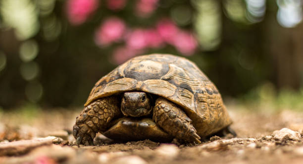
```
]

.pull-right[
```{r, echo=FALSE, out.width="100%", fig.align='center'}
knitr::include_graphics("img/photo_papillon.jpg")
```
]

---
class: center, middle
background-size: cover

# Capture-recapture for closed populations

---
## Capture-recapture methods for closed populations

Sample in a close population
```{r, echo=FALSE, out.width="75%", fig.align='center'}
knitr::include_graphics("img/Diapositive7.JPG")
```

---
## Capture-recapture methods for closed populations

Capture, mark and release some individuals (noted *n1*)
```{r, echo=FALSE, out.width="75%", fig.align='center'}
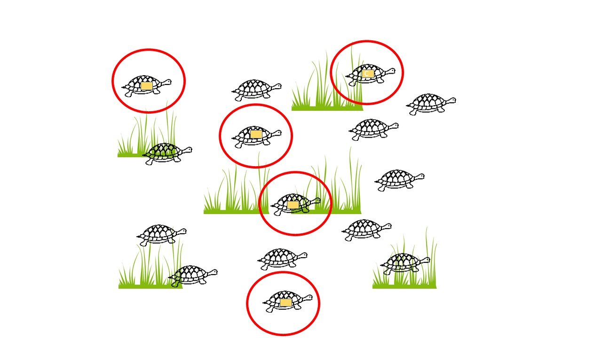
```
*p* is typically below 1, not all present individuals are captured (here *p* $\approx$ 1/3)
---
## Capture-recapture methods for closed populations

Make a second visit, capture a second independent sample of individuals
```{r, echo=FALSE, out.width="75%", fig.align='center'}
knitr::include_graphics("img/Diapositive10.JPG")
```
Among newly capture individuals (*m*) some are marked (*n2*), others aren't

---
## Capture-recapture methods for closed populations

The proportion of marked individuals after the first sample is $\frac{n1}{N}$

The proportion of marked individuals in second sample is $\frac{m}{n2}$

Assuming sampling sessions are independent (individuals have equal detection probability whether they have already been captured or not)

Then the proportion of maked individuals in the second sample, *m*, is the proportion of marked individuals in the entire population, then :

$$\hat{N}=\frac{n1*n2}{m}$$
---
## The Lincoln-Peterson index

.pull-left[
Petersen (fishes 1894)
```{r, echo=FALSE, out.width="75%", fig.align='center'}
knitr::include_graphics("img/photo_petersen.jpg")
```
]

.pull-right[
Lincoln (birds 1930)
```{r, echo=FALSE, out.width="75%", fig.align='center'}
knitr::include_graphics("img/photo_Lincoln.jpg")
```
]

---
## Lincoln-Petersen index implies individual indentification

Usually implies some marking

Group marking can also work 

---
## Lincoln-Petersen index implies individual indentification

Physical alteration of individuals

```{r, echo=FALSE, out.width="75%", fig.align='center'}
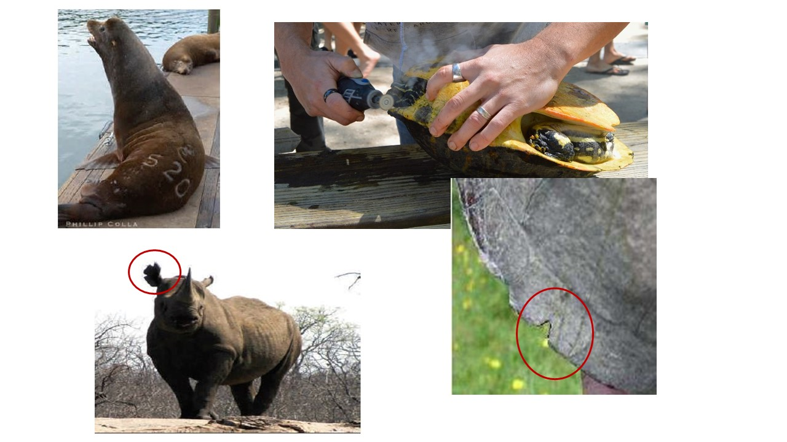
``` 
---
## Lincoln-Petersen index implies individual indentification

Add some tags

```{r, echo=FALSE, out.width="75%", fig.align='center'}
knitr::include_graphics("img/Diapositive37.JPG")
``` 

---
## Lincoln-Petersen index implies individual indentification

Natural marks (including DNA)

```{r, echo=FALSE, out.width="75%", fig.align='center'}
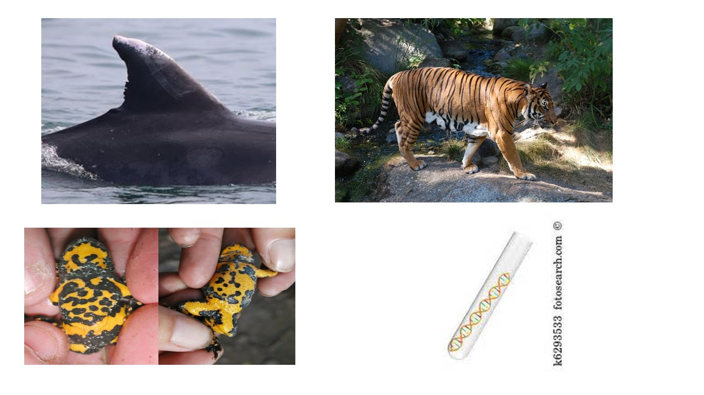
``` 
---
# Lincoln-Petersen assumptions 1

Population is closed demographically and geographically

```{r, echo=FALSE, out.width="70%", fig.align='center'}
knitr::include_graphics("img/Diapositive11.JPG")
```
Population is estimated to 30 individuals (supra-population ?)

---
# Lincoln-Petersen assumptions 2

Population is closed demographically and geographically

**All individuals are equally likely to be caught in each sample**

$n1=N*p1$, $n2=N*p2$, $m=N*p1*p2$ 

---
# Lincoln-Petersen assumptions 3

Population is closed demographically and geographically

All individuals are equally likely to be caught in each sample

**Marks are not lost (or unobserved)**

*m* is under-estimated and then $\hat{N}$ over-estimated

---
# Lincoln-Petersen and then ?

Population is closed demographically and geographically

**All individuals are equally likely to be caught in each sample**

Marks are not lost (or unobserved)

Several sources of variation in capture:
  - time - t  (weather, sampling effort)
  - behavior - b  (trap-effect)
  - individual heterogenity - h (age, sex, social status)
  
... and combination of these effects

To test these effects, we need more than 2 sessions

---
# Lincoln-Petersen and then ?

$$\hat{N}=\frac{n1*n2}{m}$$

can also be seen as 

$\hat{N}=\frac{n1}{\hat{p}}$

with $\hat{p}=\frac{m}{n2}$

Estimate $\hat{p}$ to estimate $\hat{N}$

---
# More than two sessions - capture histories

Each line = one individual / each column = one field session
```{r echo = FALSE}
hist<-c('1011','0110','1010','...','...','1101')
texte<-c('seen first session, not seen second session, seen third and fourth session',
         'not seen first session, seen second and third sessionn, not seen fourth session','','','','')
tableproba<-data.frame(History=hist,Comment=texte)
knitr::kable(tableproba, format = 'html')
```
---
# More than two sessions - assumptions

Population is closed demographically and geographically

Marks are not lost and individuals are identified without error

All individuals are equally likely to be caught in each sample 


---
# More than two sessions - capture histories

The M0 model - constant detection probability (among individuals, among sessions)

Generalisation of Lincolon-Petersen index to more than two sessions

```{r echo = FALSE}
hist<-c('111','110','101','100','011','010','001','000')
proba<-c('ppp','pp(1-p)','p(1-p)p','p(1-p)(1-p)','(1-p)pp','(1-p)p(1-p)','(1-p)(1-p)p','(1-p)(1-p)(1-p)')
tableproba<-data.frame(History=hist,Proability=proba)
knitr::kable(tableproba, format = 'html')
```

---
# Maximum Likelihoods

How to estimate $\hat{N}$ and $\hat{p}$
 
$$\hat{N}=\frac{C}{p*}$$
with *C* the number of individuals caugth at least once

and $p*$ the probability to caugth at least once

---
# Maximum Likelihoods

```{r, echo=FALSE, out.width="50%", fig.align='center'}
knitr::include_graphics("img/ML.png")
```

---
# More than two sessions

The M0 model is very constrained, possible te release some hypothesis

Mt = Variation over time of detection probabilities

Mb = Capture and recapture can be different (trap-dependence)


---
# Model Mt

Capture probabilities vary with session (climatic conditions, field effort, observer experience, etc)

with K session, K+1 parameters to estimate (N, p1, p2....pK)

---
# Model Mt

```{r echo = FALSE}
hist<-c('111','110','101','100','011','010','001','000')
proba1<-c('ppp','pp(1-p)','p(1-p)p','p(1-p)(1-p)','(1-p)pp','(1-p)p(1-p)','(1-p)(1-p)p','(1-p)(1-p)(1-p)')
proba2<-c('p1p2p3','p1p2(1-p3)','p1(1-p2)p3','p1(1-p2)(1-p3)','(1-p1)p2p3','(1-p1)p2(1-p3)','(1-p1)(1-p2)p3','(1-p1)(1-p2)(1-p3)')
proba3<-c('pcc','pc(1-c)','p(1-c)c','p(1-c)(1-c)','(1-p)cc','(1-p)c(1-c)','(1-p)(1-c)c','(1-p)(1-c)(1-c)')
Probavide<-c('','','','','','','','')
tableproba<-data.frame(History=hist,M0=Probavide,Mt=proba2,Mb=Probavide)
knitr::kable(tableproba, format = 'html')
```


---
# Model Mb

Probability of first capture (*p*) differ from probability of recapture (*c*)

Individuals can become trap-shy (*c*<*p*) or trap-happy (*c*>*p*)

3 parameters to estimate (*N*, *p*, *c*)

---
# Model Mb

```{r echo = FALSE}
hist<-c('111','110','101','100','011','010','001','000')
proba1<-c('ppp','pp(1-p)','p(1-p)p','p(1-p)(1-p)','(1-p)pp','(1-p)p(1-p)','(1-p)(1-p)p','(1-p)(1-p)(1-p)')
proba2<-c('p1p2p3','p1p2(1-p3)','p1(1-p2)p3','p1(1-p2)(1-p3)','(1-p1)p2p3','(1-p1)p2(1-p3)','(1-p1)(1-p2)p3','(1-p1)(1-p2)(1-p3)')
proba3<-c('pcc','pc(1-c)','p(1-c)c','p(1-c)(1-c)','(1-p)cc','(1-p)c(1-c)','(1-p)(1-c)c','(1-p)(1-c)(1-c)')
Probavide<-c('','','','','','','','')
tableproba<-data.frame(History=hist,M0=Probavide,Mt=Probavide,Mb=proba3)
knitr::kable(tableproba, format = 'html')
```
---
# All models
```{r echo = FALSE}
hist<-c('111','110','101','100','011','010','001','000')
proba1<-c('ppp','pp(1-p)','p(1-p)p','p(1-p)(1-p)','(1-p)pp','(1-p)p(1-p)','(1-p)(1-p)p','(1-p)(1-p)(1-p)')
proba2<-c('p1p2p3','p1p2(1-p3)','p1(1-p2)p3','p1(1-p2)(1-p3)','(1-p1)p2p3','(1-p1)p2(1-p3)','(1-p1)(1-p2)p3','(1-p1)(1-p2)(1-p3)')
proba3<-c('pcc','pc(1-c)','p(1-c)c','p(1-c)(1-c)','(1-p)cc','(1-p)c(1-c)','(1-p)(1-c)c','(1-p)(1-c)(1-c)')
Probavide<-c('','','','','','','','')
tableproba<-data.frame(History=hist,M0=proba1,Mt=proba2,Mb=proba3)
knitr::kable(tableproba, format = 'html')
```

---
# Model with heterogeneity

Capture can depend on several unknown variables (age, sexe, social status, etc)

Each individual as a unique capture probability

N+1 parameters to estimate (N, pi with i=1, 2,....N)

This model has too many parameters, can use Pledger's mixture models

---
# Pledger's mixture model

Assume individuals belong to two groups with different capture probabilities

A proportion $\pi$ belongs to the first group with capture probability $p_H$

and then $(1-\pi)$ to the second group with $p_L$

then $p=\pi.p_L+(1-\pi).p_H$

We can just use this equation in M0 to get four parameters (N, $\pi$ , $p_H$ and $p_L$)


---
# More complex models

Combining different effects (bt, bh, th)

Use some individuals covariates (age, sex, body conditions, etc)


---
background-color: #234f66
## <span style="color:white">Live demo in R</span>

.center[

]

---
class: center, middle
background-size: cover

# Distance sampling

---

# Count individuals along strip transects

Traditionnal methods = count animals (or plants) along transects of fixed width
```{r, echo=FALSE, out.width="80%", fig.align='center'}
knitr::include_graphics("img/Diapositive12.JPG")
```

---
# Count individuals along strip transects

Assume all individuals in the strip are detected and counted
```{r, echo=FALSE, out.width="80%", fig.align='center'}
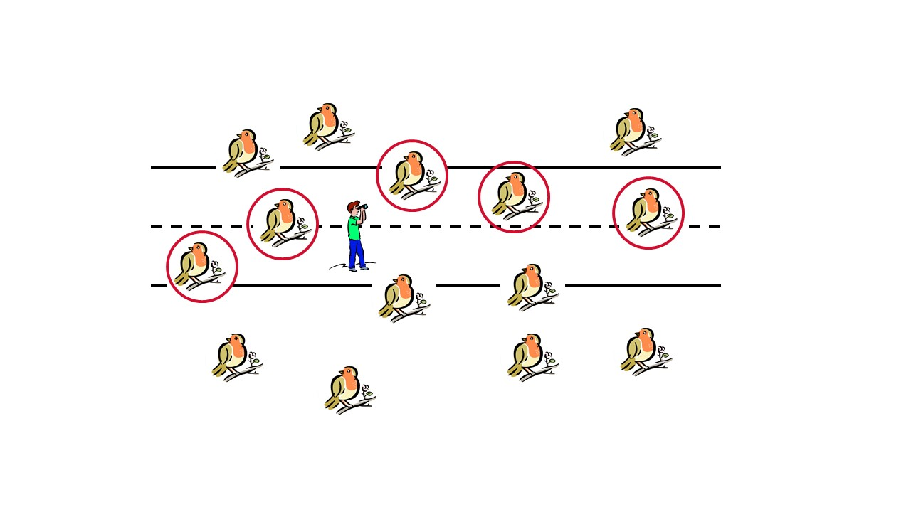
```

---
# Count individuals inside a circular area

The survey area can also be a circle = circular plot

```{r, echo=FALSE, out.width="80%", fig.align='center'}
knitr::include_graphics("img/Diapositive14.JPG")
```

---
# Count individuals inside a circular area

Assume all individuals in the circle are detected and counted

```{r, echo=FALSE, out.width="80%", fig.align='center'}
knitr::include_graphics("img/Diapositive15.JPG")
```

---
## Estimating density and abundance using counts (1)

Using raw counts  in the sample strips/circles

Density is easily estimated using : 

$$\hat{D}=\frac{\sum_{i=1}^ny_i}{\sum_{i=1}^n{a_i}}$$

With $y_i$ the count at each sample unit, and $a_i$ the surface of each sample unit

That can be translate into abundance N with : 
$$\hat{N} = \frac{\sum_{i=1}^ny_i}{\alpha}$$
with $\alpha$ the proportion of the study area eventually sampled


---
## Estimating density and abundance using counts (2)

```{r, echo=FALSE, out.width="50%", fig.align='center'}

```

L= transect length, w=transect width, y = number of birds detected

$$\hat{D}=\frac{\sum_{i=1}^ny_i}{\sum_{i=1}^nL_i*w_i}$$

---
## Estimating density and abundance using counts (3)

```{r, echo=FALSE, out.width="50%", fig.align='center'}
knitr::include_graphics("img/Diapositive15.JPG")
```

w =radius, y = number of birds detected

$$\hat{D}=\frac{\sum_{i=1}^ny_i}{\sum_{i=1}^n\pi*w_i^2}$$

---
# Assumptions

All individuals in the sample area are detected and counted

Yet detection probability is (always) below 1 (see first course this morning)

It can varies between the sample units and even in the sample units (depending on vegetation cover for instance)

*Note also that some observations are wasted (those outside the strips/circles)*


---
# Distance sampling - background (1)

The number of detection tends to decrease with the distance to the observer...

...some information on detection probability is encapsulated in the distances

What if we record the distances of detected individuals rather than only their presence ?

---
# Distance sampling - background (2)

Observations along a transect

Record perpendicular distances to the transects, assume not all individuals are detected
```{r, echo=FALSE, out.width="80%", fig.align='center'}
knitr::include_graphics("img/Diapositive16.JPG")
```

---
# Distance sampling - background (3)

Observations along several transects

```{r, echo=FALSE, out.width="80%", fig.align='center'}
knitr::include_graphics("img/Diapositive17.JPG")
```

---
# Distance sampling - background (4)

Observations from a fix locations

Record radial distances to the point, assume not all individuals are detected

```{r, echo=FALSE, out.width="80%", fig.align='center'}
knitr::include_graphics("img/Diapositive18.JPG")
```

---
# Distance sampling - background (5)

Observations from several fix locations

```{r, echo=FALSE, out.width="80%", fig.align='center'}
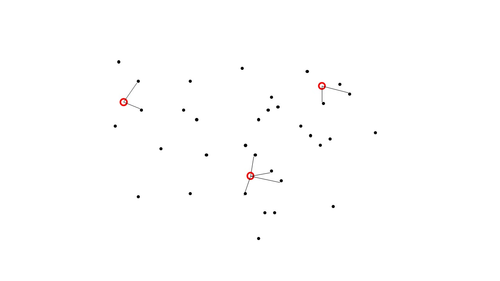
```

---
# Estimating density when detection<1


$$\hat{D}=\frac{\sum_{i=1}^ny_i}{a*\hat{p}}$$

With *p* the mean detection probability on the entire sampled area of surface *a*

*Note the match with Capture-recapture methods $\hat{N}=\frac{C}{\hat{p}}$*

How to estimate *p* using distance data ?

---
# Recorded data 

Distance sampling recorded data typically look like :

```{r, echo=FALSE, out.width="60%", fig.align='center'}
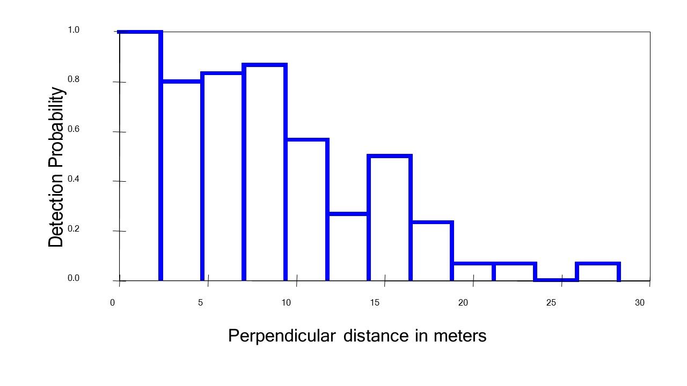
```
If *p* was equal to one, the histrogram would be flat

The decrease results from a decreasing detection probability with distance to the observer

---
# Estimating detection with distance data (1)

Some individuals are detected, some are not

```{r, echo=FALSE, out.width="80%", fig.align='center'}
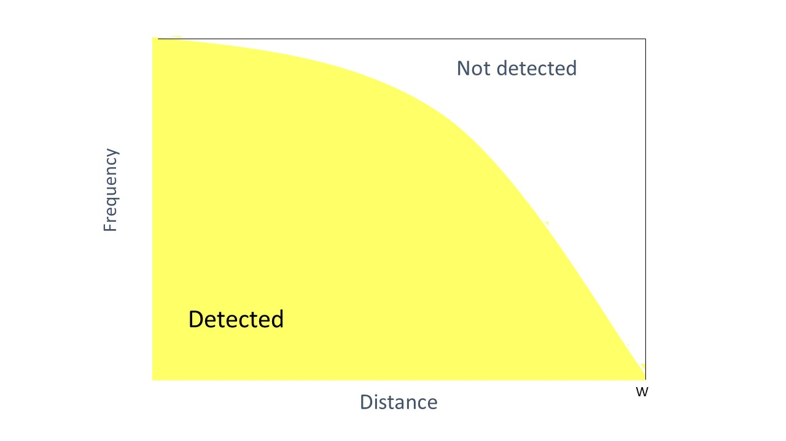
```

---
# Estimating detection with distance data (2)

For instance, if 100 individuals are observed and that 70% of the individuals are detected (below the curve) and 30% not detected

$$\hat{D} = \frac{100}{0.70} = 143$$

```{r, echo=FALSE, out.width="60%", fig.align='center'}

```

---
# How to extract *p* from these data ?

We need to estimate *p*

To do that, We need to fit a detection curve on the raw data

```{r, echo=FALSE, out.width="80%", fig.align='center'}
knitr::include_graphics("img/Diapositive20.JPG")
```
---
# How to extract P from these data ?

.pull-left[
```{r, echo=FALSE, out.width="90%", fig.align='center'}

```
]

.pull-right[

$\hat{p}=\frac{\int_{0}^{w} \hat{g}(x)\,dx}{w}$

with w the distance at which data are truncated and $g(x)$ the detection curve 

it is the $\frac{area\,under\, the\, curve }{area\, of\, the\, rectangle}$ 
]

---
# Modelling the detection function (1)

$g(x)$, the detection probability given the distance, need to be estimated

$g(x)$ is not known and may vary a lot due to factors such as observer experience and environment

The strategy of Distance sampling is to go for a few models for g(x) that have good properties:

- model robustness
- shape criterion
- efficiency


---
# Modelling the detection function (2)
Model robustness

- General function that can take a variety of shapes

- Robust w.r.t. pooling


Shape criterion 

- A “shoulder” near the transect line (detection approx. 1 around the line / point)


Efficiency 

- Provides precise estimates – use Maximum Likelihood

---
# Modelling the detection function (3)

Two component for $g(x)$ :

- A ‘key’ function (uniform, half-normal, hazard-rate)

- A ‘series’ expansion (cosine, simple polynomial, hermite polynomial)


---
# Fit a detection curve on the raw dat

```{r, echo=FALSE, out.width="80%", fig.align='center'}

```


---
# Uniform *key*

```{r, echo=FALSE, out.width="80%", fig.align='center'}
knitr::include_graphics("img/Diapositive23.JPG")
```

---
# Half-normal *key*


```{r, echo=FALSE, out.width="80%", fig.align='center'}
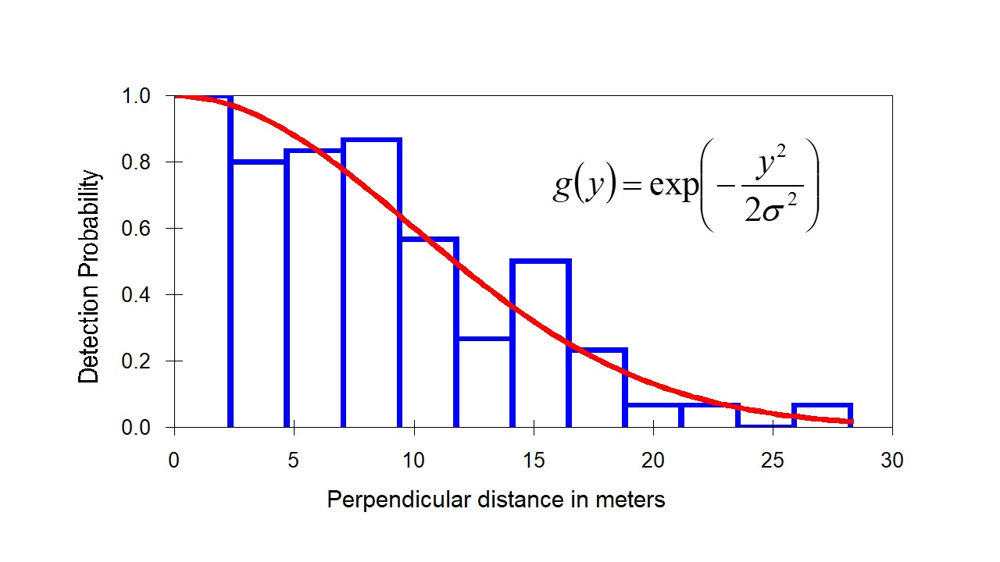
```


---
# Half-normal *key*

Change $\sigma$ allow to change the length of the tail

```{r, echo=FALSE, out.width="80%", fig.align='center'}
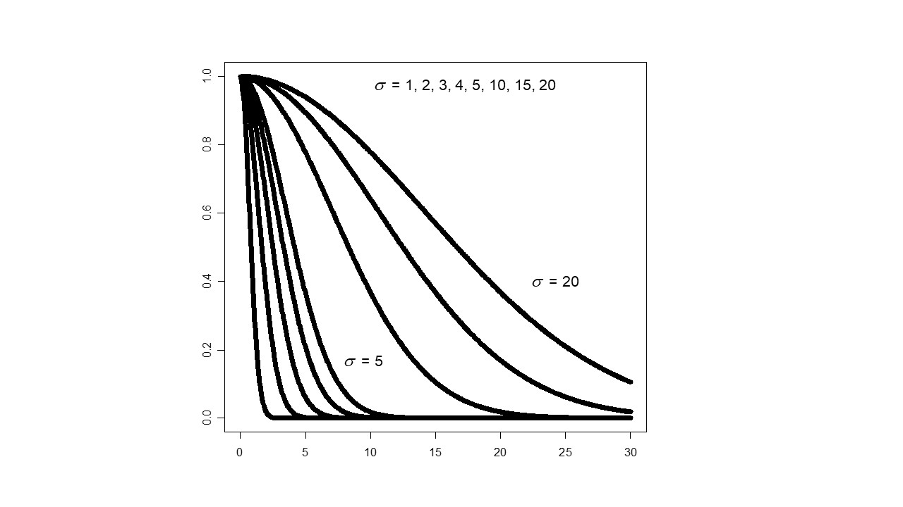
```

---
# Hazard-rate *key*

```{r, echo=FALSE, out.width="80%", fig.align='center'}
knitr::include_graphics("img/Diapositive26.JPG")
```

---
# Hazard-rate *key*

Change *b* allow to change the shoudler and the tail

```{r, echo=FALSE, out.width="80%", fig.align='center'}
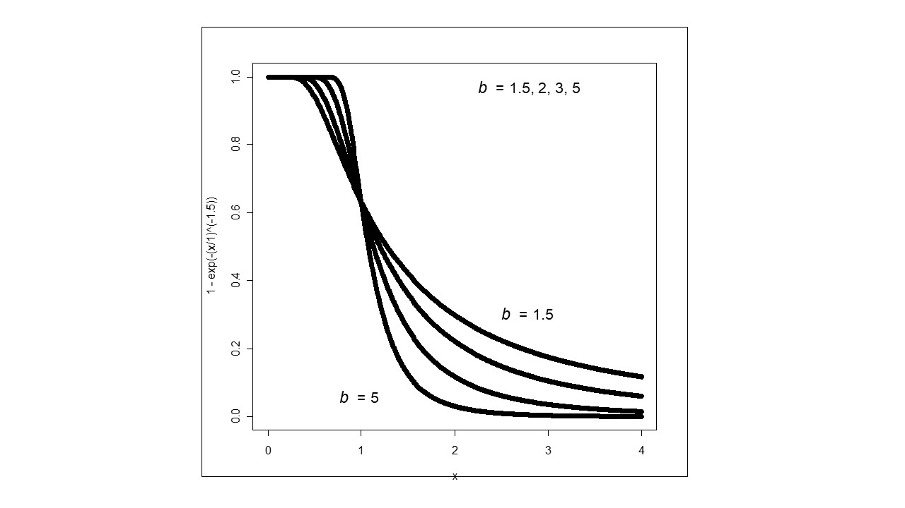
```
---
# Series expansion

- cosine $\sum a_j \cos (\frac{j \pi y}{w})$ 

- simple polynomial $\sum a_j (\frac{y}{w})^2j$

- hermite polynomial $\sum a_j H_2j (\frac{y}{\sigma})$
---
# Series expansion

Uniforme key function + single cosine adjustment term

```{r, echo=FALSE, out.width="80%", fig.align='center'}
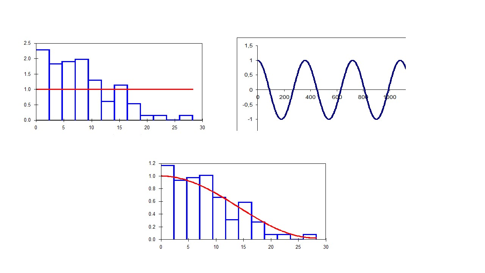
```

---
# Three critical assumptions

- Individuals on the line or point are all detected g(0)=1

- Individuals are detected at their initial location

- Measures are recorded accurately

---
# Individuals on the line or point are all detected

If g(0) is below 1 and unknown, density is underestimated of an unknown factor

```{r, echo=FALSE, out.width="80%", fig.align='center'}
knitr::include_graphics("img/Diapositive29.JPG")
```

---
# Individuals on the line or point are all detected

Possible to estimate g(0) using two or more independent observers or radiotrack individuals

Ensure g(0)=1 using cameras, trained pointing dogs, but be aware of potential biais

Use more recent modelling approach, i.e. Distance sampling with temporary emigration (need repeated surveys on the same sample unit)


---
# Individuals are detected at their initial location

Assumption 2: Animals do not move before detection (snapshot)

Effect of violation: 
- Random movements induce positive bias. Provided object movement is slow relative to movement of the observer, the bias is small. 
- Responsive movements can cause large bias (positive if there is attraction to the observer, negative if there is avoidance).

Recommendations: 
- In point transects, wait once on site before proceeding
- In line transects, look well ahead


---
# Measures are recorded accurately

Assumption 3: Distances are measured accurately.

Effect of violation: 
- The estimator is fairly robust to random errors in measurement. 
- It is sensitive to extreme outliers and to rounding distances.

Recommendations:
- If exact measurements are difficult, use intervals (group data)
- If outliers, use truncation (5-10% of the largest observations)
- If heaping (convenient ‘rounding’), use intervals and choose cutpoints such that “heaps” are at the midpoint of an interval
- Accurate measurement is the most effective solution, so use appropriate tools (tape measures; laser range finders; compass for angles)

---
# Line or point transects ?

Point transects is :
- Relevant for populations distributed in patches
- Convenient to use when the area is difficult to access / survey
- Naturally suited for stratification

Line transects is :
- Efficient for sparsely distributed populations
- Effective in low densities

---
background-color: #234f66
## <span style="color:white">Live demo in R</span>

.center[

]


---
class: center, middle
background-size: cover

# N-mixture

---

# Count on a fixed sample area

Traditionnal methods = count animals (or plants) along transects of fixed width
or on quadrat, or on circular plots

These counts are affected by detection issues
```{r, echo=FALSE, out.width="75%", fig.align='center'}
knitr::include_graphics("img/Diapositive12.JPG")
```

---
# Repeated counts at the same sample unit
```{r, echo=FALSE, out.width="80%", fig.align='center'}
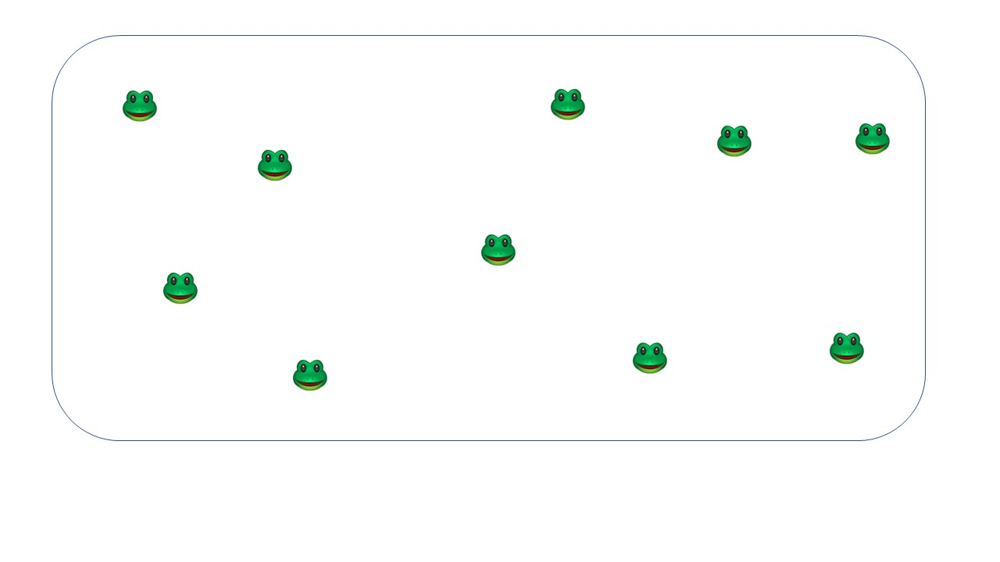
```
True abundance N=10
---
# Repeated counts at the same sample unit
```{r, echo=FALSE, out.width="80%", fig.align='center'}
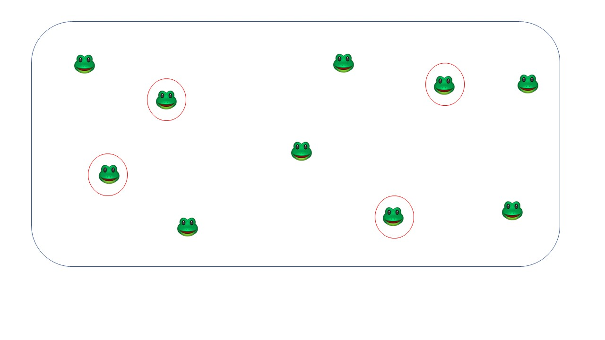
```
True abundance N=10, Count at first visit=4
---
# Repeated counts at the same sample unit
```{r, echo=FALSE, out.width="80%", fig.align='center'}
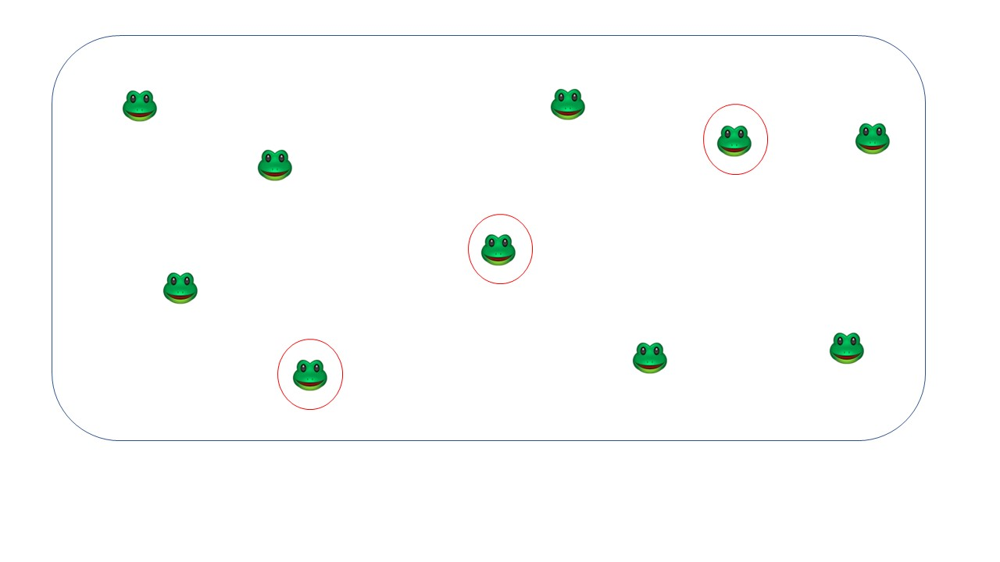
```
True abundance N=10, Count at second visit=3
---
# Repeated counts at the same sample unit
```{r, echo=FALSE, out.width="80%", fig.align='center'}
knitr::include_graphics("img/Diapositive33.JPG")
```
True abundance N=10, Count at third visit=6
---
# Repeated counts with imperfect detection

When counts are repeated on the same sample unit, some variations are observed

This is due to random process related to imperfect detection

Example : sex-ratio in Human is close to 0.5, 
Probability to have a son is thus 0.5 and the expected number of sons in four siblings is 2.  
Yet some parents have four sons and zero daughters.

---
# Repeated counts with imperfect detection
Example : true abundance = 5, detection probability=0.5

Repeated counts on the same unit with imperfect detection leads to variations

```{r, echo=FALSE, out.width="50%", fig.align='center'}
knitr::include_graphics("img/Diapositive34.JPG")
```

Repeated counts on the same units encapsulate information on detection and abundance

---
# N-mixture models (Royle 2004)

N-mixture models take advantage of these variations between counts at the same sample unit

Need some spatial replications (several sample units) and temporal replications (repeated counts at the same units)

Some strong assumptions :

- Abundance at a sample unit do not change between the successive counts ("closed population")
- Individuals have all the same detection probability (no heterogeneity)
- Abundances at the sample units follow a Poisson distribution
- Visits are independent (no trap-dependence)

---
# N-mixture models (Royle 2004)

Typical dataset used for N-mixture models

```{r, echo=FALSE, out.width="50%", fig.align='center'}
set.seed(254)
xinit<-rpois(10,3)
hist<-matrix(0,nrow=10,ncol=3)
for (i in 1:10)
{
  if (xinit[i]>0){hist[i,]<-rbinom(3,xinit[i],0.5)}
  
}
tt<-data.frame(site=seq(1:10),counts=hist)
knitr::kable(tt, format = 'html')
```

---
# N-mixture models formulation

N-mixture can be formulated as hierarchical models

A state process describing the system 

$N_i=Pois(\lambda_i)$

An observation process corresponding to detection issues

$y_{it}=Binom(N_i,p_{it})$

Covariates can be added on abundance (vegetation cover, elevation, etc) and on detection probabilty (vegetation cover, date, obsever experience, etc)

---
# N-mixture models - to use with caution

The method has been highly controversial for years

Couturier et al *2013* - Identifiability problems when *p* is low or highly variable

Barker et al *2017* - Without auxillary information about *p*, count data cannot distinguish between N-mixture model or other possible models of $N

Dennis *2015*, Kéry *2017* - Some parameters not identifiability especially with negative binomial distribution instead of Poisson  

Link et al *2018* - Estimates  sensitive to violation of double counting and constant λ / p - GOF unable to detect this

Conclusion : check parameter K (see live demo), perform GOF, do not rely on negative binomial distribution

---
# N-mixture models - further reading

Open N-mixture - Dail and Madsen (2011) / Hostetler and Chandler (2015)

Distance sampling based on Poisson model - Royle (2004)

Generalized Distance sampling - accomodate for temporary emigration - Chandler (2011)

Community N-mixture models - Yamaura et al. (2012)

---
background-color: #234f66
## <span style="color:white">Live demo in R</span>

.center[

]

