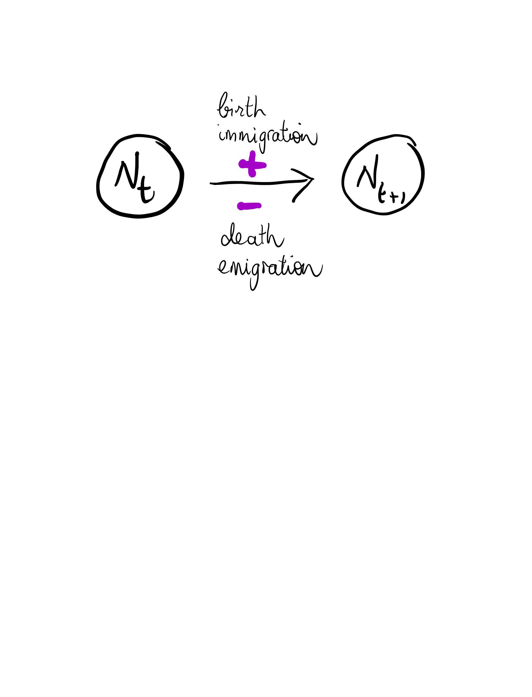
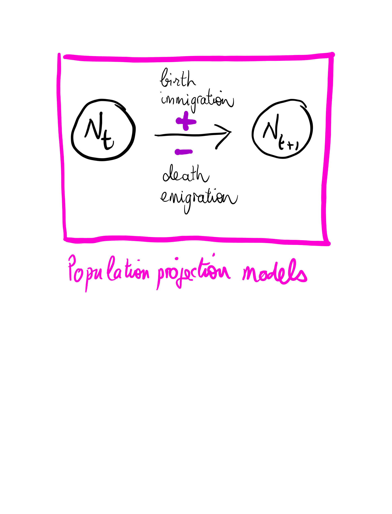

```{r setup, include=FALSE, echo=FALSE, cache = FALSE}
options(htmltools.dir.version = FALSE)
knitr::opts_chunk$set(comment = "")
library(tidyverse)
theme_set(theme_light())
update_geom_defaults("point", list(size = 2)) 
```

class: center, middle
background-size: cover

## Population dynamics

```{r, echo=FALSE, out.width="80%", fig.align='center'}

```

???

+ This workshop deals with the analysis and modelling of population dynamics. 
+ Quantifying population dynamics is crucial for the conservation and management of animal and plant species. 
+ We hope to have given you some tools to start working on your own. 

---
## What we covered (1/3)

.pull-left[

<br>
<br>

+ Abundance and density     
      + Counting methods
      + Detectability issue
      + Capture-recapture, N-mixture and distance sampling
]

.pull-right[

```{r, echo=FALSE, out.width="80%", fig.align='center'}
knitr::include_graphics("img/Page3.png")
```
]


---
## What we covered (2/3)

.pull-left[

<br>
<br>

+ Demographic parameters       
      + Capture-recapture data
      + Survival
      + Covariates
      + Transitions
]

.pull-right[

```{r, echo=FALSE, out.width="80%", fig.align='center'}
knitr::include_graphics("img/Page2.png")
```

]


---
## What we covered (3/3)

.pull-left[

<br>
<br>

+ Population projection matrix models      
      + Introduction to matrix models
      + Age- and stage-structured models
      + Sensitivity analyses
]

.pull-right[

```{r, echo=FALSE, out.width="80%", fig.align='center'}

```

]

---
class: middle, center

## Take-home messages and recommendations

???

+ We'll wrap up the workshop with a few take-home messages 
+ And recommendations for conducting your own analyses.


---
## The art of modelling

???

+ Before we leave, we'd like to give you a few pieces of advice.
+ This is not rocket science.
+ Just a few things based on our own experience.

--

+ Make your ecological question explicit. 

???

+ First things first. Make sure you've spent some to time to make your ecological question explicit. 
+ This step will help you to stay on course, and make the right choices. 
+ For example, it's ok to use subsets of your data to address different questions. 

--

+ Think of your model. 

???

+ Now in terms of modeling. Don't jump on your keyboard right away. 
+ Spend some time thinking about your model with pen and paper. 

--

+ Start simple. Make sure everything runs smoothly.

???

+ When it comes to model fitting, start simple. 
+ Consider all parameters constant. 
+ Make sure everything runs smoothly.

--

+ Add complexity one step at a time. 

???

+ Then add complexity. Time effect for example. Or random effects.
+ Or uncertainty in the assignment of states. 

---
## Simulations

+ Use simulations to better understand your model. 

+ R is the perfect tool for simulations. 

+ Model is an engine to generate data, instead of estimating parameters.

???

+ When it comes to model building, consider simulating data to better understand your model. 
+ R is the perfect tool.
+ You will always learn something on your model by seeing it an engine to generate data, instead of estimating its parameters.

---
## Till next time

--

+ Website will be updated with

    + video recordings
    + your feedbacks

???

+ We will update the workshop website in the coming weeks. 
+ With the video recordings of course. 
+ Any feedback you might have. Please get in touch with me if you have any, that would be great. 

--

+ Please, fill in feedback form at <https://forms.gle/XoXvz58RQq6kAMT38>. Will hep us to improve materials and delivery for next time. 

--

+ A book is on its way. More in 2023 hopefully.

???

+ And last, a book is on its way. Based on the material we used for the workshop and more stuff. 
+ More in 2023 hopefully. 


