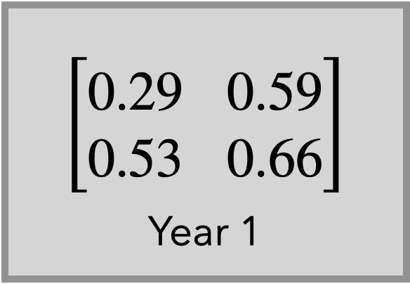
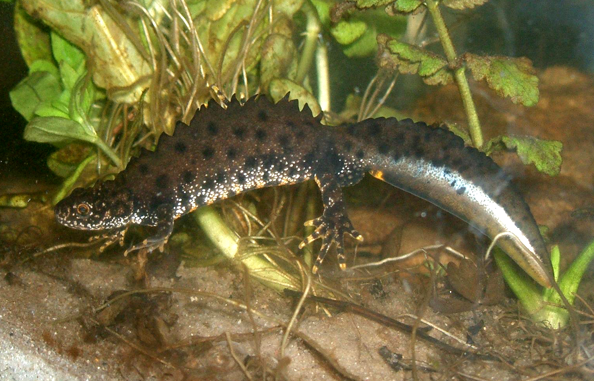

```{r setup, include=FALSE, echo=FALSE, cache = FALSE}
options(htmltools.dir.version = FALSE)
knitr::opts_chunk$set(comment = "")
library(tidyverse)
theme_set(theme_light())
update_geom_defaults("point", list(size = 2)) 
```

# What we've learned during this class

### Obj. 1: Know current and past trends in population abundance
- see class 1

--

### Obj. 2: Estimate demographic parameters and identify the causes of variation
- see class 2

--

### Obj. 3: Evaluate population viability to inform decision about management actions
- some hints about this now!

---
# Population Viability Analysis (PVA)

Morris et al. 1999. A practical handbook for population viability analysis. The Nature Conservancy :

+ use of **quantitative methods** to predict the **likely future status** of a population or collection of populations of conservation concern 


+ **tentative assessments** based upon what we now know **rather than as iron-clad predictions **of population fate


---
# Why is PVA useful ? 

+ quantify the rate of population change over time

--

+ estimate extinction risks (used by the IUCN)

--

+ identify key parameters for population management

--

+ evaluate and compare the relative impact of population management actions

---
# Can we assess population viability from population counts ?

```{r, echo=FALSE, out.width="60%", fig.align='center'}
knitr::include_graphics("img/pop_size.png")
```

---
class: center, middle

# 1- Count based PVA

---
# Finite population growth rate $\lambda$

.pull-left[

```{r, echo=FALSE, fig.align='center'}
n=50
Year = 1990:(1990+(n-1))
Ngrowth <- Ndecline <- Nstable <- NULL
Nstable = rep(50,n)
Ngrowth[1] <- Ndecline[1] <- Nstable[1]
for(i in 2:n){
  Ndecline[i] = Ndecline[i-1] * 0.98
  Nstable[i] = Nstable[i-1] * 1
  Ngrowth[i] = Ngrowth[i-1] * 1.02
  }
data <- data.frame(Year=rep(Year,3), 
                   pop=c(Ndecline, Nstable,Ngrowth),
                   trajectory=c(rep("decline",n),
                                rep("stable",n), 
                                rep("growth",n) ) 
                   )
p <- ggplot(data,aes(x=Year, y=pop,group=trajectory)) +
  geom_point(aes(color=trajectory)) +
annotate(geom="text", x = 2025, y = 75,
         label="lambda > 1, growing",
         color="darkgreen",
         size=8)  +
  annotate(geom="text", x = 2027, y = 55,
           label="lambda = 1, stable",
           color="darkblue",
           size=8)  +
  annotate(geom="text", x = 2025, y = 35,
           label="lambda < 1, declining",
           color="darkred",
           size=8)  +
  ylab("Population size") +
  xlab("Time")
p + theme(legend.position = "none") 
```

]

.pull-right[

- exponential growth or decay at a constant rate of change

- $\lambda = \frac{N_{t+1}}{N_{t}}$ gives the **proportional change** in population size

- after t time steps, the population will be $N_{t} = N_{0} \cdot \lambda^{t}$

- $\lambda$ is log-normally distributed

]

---

# Growth rate versus intrinsic rate of increase

- **Population growth rate** $\lambda \sim Lognormal(\mu,\sigma^{2})$

- easier to work with the **intrinsic rate of increase** 
`$$r = \log(\lambda) = \log(\frac{N_{t+1}}{N_{t}}) = \log(N_{t+1}) - \log(N_{t})$$`

--

- which is normally distributed
$r \sim N(\mu,\sigma^{2})$

--
- $\mu$ is the **mean rate of increase** 

- $\sigma^{2}$ is the **environmental variance**


---
# Environmental variance

- if the mean rate of increase $\mu < 0$ extinction will certainly occur. 

--

- a population can still decline or go extinct even if the mean rate of increase $\mu>0$ because of environmental variance $\sigma^{2}$.

--
- variable environments increase extinction risks.


---
## Example of the Yellowstone grizzly bear population 
from Morris & Doak. 2002. Quantitative conservation biology: Theory and practice of population viability analysis. Massachusetts, USA.

.pull-left[
```{r echo = FALSE,out.width="85%"}
library(popbio)
N <- grizzly$N
Years <- grizzly$year

ggplot(data = grizzly, aes(x = year, y = N))+
  geom_line(color = "#00AFBB", size = 1)+
  geom_point(color = "#00AFBB", size=2) +
   theme_gray(base_size = 12)

```
]

.pull-right[
```{r, echo=FALSE, out.width="60%", fig.align='center'}
knitr::include_graphics("img/bear.jpg")
```
]

---
# Step 1 : Calculate $\mu$ and $\sigma^{2}$  from the data

```{r echo = TRUE}
# rate of increase over years
logN <- log(N[-1]/N[-length(N)]) # log(Nt+1) - log(Nt)
#mean rate of increase
mu = mean(logN) #<<
#environmental variance
sigma2 = var(logN) #<< 
```

```{r echo = FALSE}
data.frame(mu=mu,sigma2=sigma2)
```

--

- $\mu >0$ in average the population is growing

--

- $\sigma^{2} = 0.013$ reflect low inter-annual variance in the rate of increase


---
## or using linear regression for unequal time intervals

```{r echo = TRUE}
x <- sqrt(grizzly$year[-1] - grizzly$year[-length(grizzly$year)]) # sqrt time intervals
y <- logN / x
mod <- lm(y ~ 0 + x) # forcing a y-intercept of zero
mod
mu <- coef(mod) # the slope = mean intrinsic rate of increase
```

---
## or using linear regression for unequal time intervals

```{r echo = TRUE}
# get an estimate for sigma2
anova(mod)
sigma2 <- anova(mod)[["Mean Sq"]][2] # environmental variance
```

---

## Get confidence intervals for $\mu$ and $\sigma_{2}$

```{r echo = TRUE}
## Confidence interval for mu
confint(mod, 1)
```
- confidence interval of mean rate of increase encompasses 0, we cannot rule out potential risk of decline!

--

```{r echo = TRUE}
## Confidence interval for sigma 2
df1 <- length(logN) - 1
df1 * sigma2 / qchisq(c(.975, .025), df = df1)
```


---

## Back-transform to get finite population growth rate $\bar{\lambda}$  :
 
```{r echo = TRUE}
lambda <- exp(mu) 
lambda # average growth rate

```

--

- here $\bar{\lambda} > 1$, so the grizzly population is growing in average

- it does not rule out the possibility of a decline owing to the chance occurrence of a sequence of bad years (remember confidence interval)

---

# Step 2 : Project the population

- Expected population size using mean rate of increase and ignoring environmental variance (not recommended)

`$$N_{t} =  N_{0} \cdot \mu^{t}$$`

`$$ln(N_{t}) =  ln(N_{0}) + \mu \cdot t$$`

--

* initial population $N_{0}=44$

* time steps to project over : $t =38$ years (nb. years - 1)

* mean rate of increase $\mu = 0.021$ 
---
# Step 2 : Project the population

```{r,echo=FALSE, out.width="50%", fig.align='center'}
grizzly$type <- "data"
grizzly2 <- data.frame(year=rep(grizzly$year,2),
N=c(N[1]*exp(mu)^(0:(length(N)-1) ), grizzly$N ) ,
type=c(rep("prediction",length(N)),rep("census",length(N))  ) )

ggplot(data = grizzly2, aes(x = year, y = N, group=type, color=type))+
geom_line() +
geom_point() +
ylab("Population size")
```

---
# Step 2 : Project the population
## Let's account for observed variation in growth rate

- First, set the initial population, number of time steps, and number of repetitions: 

```{r,echo=TRUE}
n0 = grizzly$N[1] # initial pop.

T=50 # time iterations to project over

runs=500  # number of repetitions (pop. trajectories)

stoch.pop=matrix(NA,T,runs) # to store resuts       
stoch.pop[1,]=n0 # initiate
```

---
# Step 2 : Project the population
## Let's account for observed variation in growth rate


- Then set a quasi-extinction threshold 

```{r,echo=TRUE}
Ne = 30  # threshold for minimum viable pop. / quasi-extinction threshold
#48 from USFWS Grizzly Bear Recovery Plan to 'uplist' the bear from threatened status.
```

--
- 1 female or a minimum viable population (genetic drift, demographic stochasticity)

- can also be the lowest level of abundance at which it remains feasible to attempt intervention to prevent further decline. 

---
## Now run the projections
```{r,echo=TRUE}
# let's project the population
for (i in 1:runs){ #<<
  for (t in 2:T){	#<< 
# Draw r from normal using estimates of mu and sigma2
        r <- rnorm(1,mu,sqrt(sigma2)) 
# back-transform to get lambda and get pop. size
    lambda=exp(r) 
#project one time step from the current pop size
    stoch.pop[t,i]=stoch.pop[(t-1),i]*lambda 
# leave the loop if pop <= threshold
    if(stoch.pop[t,i]<=Ne){ 
      stoch.pop[t,i] <- 0 
      i<i+1}  
  }
}
```

---
## Now run the projections
```{r,echo=TRUE}
# let's project the population
for (i in 1:runs){ # loop over repetitions
  for (t in 2:T){	# loop over years
# Draw r from normal using estimates of mu and sigma2
        r <- rnorm(1,mu,sqrt(sigma2)) #<<
# back-transform to get lambda and get pop. size
    lambda=exp(r) 
#project one time step from the current pop size
    stoch.pop[t,i]=stoch.pop[(t-1),i]*lambda 
# leave the loop if pop <= threshold
    if(stoch.pop[t,i]<=Ne){ 
      stoch.pop[t,i] <- 0 
      i<i+1}  
  }
}
```

---
## Now run the projections
```{r,echo=TRUE}
# let's project the population
for (i in 1:runs){ # loop over repetitions
  for (t in 2:T){	# loop over years
# Draw r from normal using estimates of mu and sigma2
        r <- rnorm(1,mu,sqrt(sigma2)) 
# back-transform to get lambda and get pop. size
    lambda=exp(r) #<<
#project one time step from the current pop size
    stoch.pop[t,i]=stoch.pop[(t-1),i]*lambda #<<
# leave the loop if pop <= threshold
    if(stoch.pop[t,i]<=Ne){ 
      stoch.pop[t,i] <- 0 
      i<i+1}  
  }
}
```


---
## Now run the projections
```{r,echo=TRUE}
# let's project the population
for (i in 1:runs){ # loop over repetitions
  for (t in 2:T){	# loop over years
# Draw r from normal using estimates of mu and sigma2
        r <- rnorm(1,mu,sqrt(sigma2)) 
# back-transform to get lambda and get pop. size
    lambda=exp(r)
#project one time step from the current pop size
    stoch.pop[t,i]=stoch.pop[(t-1),i]*lambda 
# leave the loop if pop <= threshold
    if(stoch.pop[t,i]<=Ne){ #<<
      stoch.pop[t,i] <- 0 #<<
      i<i+1}  #<<
  }
}
```

---
## Step 3 : Examine the results

Plot the population trajectories :
```{r, echo=FALSE, fig.align='center'}

matplot(log(stoch.pop),type="l",
        ylab="log(population size)",
        xlab="Time steps")
```

---
## Step 3 : Examine the results
Plot population size at the last time step :
```{r,echo=FALSE, fig.align='center', warning=FALSE, message==FALSE}
lastN <- data.frame(pop = stoch.pop[T,])
ggplot(lastN,aes(x=pop)) +
         geom_histogram(bins = 40) +
  xlab("YNP grizzly population size after T=50 years")
       
```

---
## Step 3 : Examine the results
Plot prediction together with observed counts :
```{r, echo=FALSE, fig.align='center', warning=FALSE, message=FALSE}

# Mean population size with confidence interval
pop.mean=apply(stoch.pop,1,mean, na.rm=T)
log.pop.sd  =apply(log(stoch.pop+0.00001),1,sd, na.rm=T)
ucl =exp(log(pop.mean)+1.96*log.pop.sd)     #upper confidence limit
lcl =exp(log(pop.mean)-1.96*log.pop.sd)     #lower confidence limit

dataproj <- data.frame(year = grizzly$year[1] : (grizzly$year[1] + (T-1)),
                 pop.mean= pop.mean,
                 low = ucl,
                 up = lcl,
                 N = c(grizzly$N, rep(NA, T-length(grizzly$N) )))

p <- ggplot(dataproj, aes(year)) + 
  geom_line(aes(y=log(pop.mean)), colour="blue") + 
  geom_ribbon(aes(ymin=log(low), ymax=log(up)), alpha=0.2)
p +  geom_line(aes(y=log(N)), colour="red") +
  geom_point(aes(y=log(N)), colour="red") +
  ylab("log(Popiulation size)") +
  xlab("Time steps")
  
```

---
# Step 4 : Quantify extinction risks

- The average population growth rate doesn’t do a good job of predicting what most population realizations will do

--

- What are the chances that the population will go extinct at various times ? 

  + extinction risk
  
  + time to extinction
---
# Step 4 : Quantify extinction risks

- Ultimate extinction probability = percentage of trajectories (over the 500 runs) reaching the extinction threshold at some point (over T years)

```{r,echo=TRUE}
Pr.ext = sum(lastN <= Ne) / runs # prob. to reach the extinction threshold
Pr.ext
```


---
# Step 4 : Quantify extinction risks
- Cumulative extinction risk over the years

```{r,echo=FALSE, fig.align='center', out.width="45%"}

# Cumulative extinction function
ex <- extCDF(mu, sigma2, Nc=n0, Ne=Ne)
# use bootstrap to get confidence intervals
CIext <- countCDFxt(mu, sigma2, nt = T-1,Nc=n0, Ne=Ne, tmax = T, Nboot = 500,
      plot = FALSE)

Prext <- data.frame(years = (grizzly$year[1] : (grizzly$year[1] + (T-1) ) ) , 
                      m = CIext$Gbest,
                    low = CIext$Glo,
                    up = CIext$Gup)
ggplot(Prext, aes(x= years)) +
  geom_point(aes(y=m), colour="purple") +
  geom_line(aes(y=m), colour="purple") + 
  geom_ribbon(aes(ymin=low, ymax=up), alpha=0.2) +
  xlab("Years") +
  ylab("Quasi-extinction probability")
```

---
# Step 5 : Quantify time to extinction
- mean time to extinction is an overestimation (because of few pop. growing fast)
- median time to extinction is a better measure

```{r,echo=TRUE}
# Time to reach extinction for extinct pop.
maxt<-NULL	# empty vector to store results
for (i in 1:runs){	# loop over repetitions
  N <- stoch.pop[,i]
  # max time N > threshold
  maxt[i]<-max(which(N>0)) } #<<
# time at extinction for pseudo-extinct populations
time.ext <- maxt[maxt<T] #<<
median(time.ext)
```

---
# Step 5 : Quantify time to extinction

```{r,echo=FALSE}
df <- data.frame(time.ext=time.ext) 
  ggplot(df,aes(x=time.ext)) +
           geom_histogram(bins = 40) +
    geom_vline(aes(xintercept = median(time.ext)), colour="red") +
    xlab("Time to extinction") +
    annotate(geom="text", x = 15, y = 15,
         label=paste( median(time.ext)),
         color="red",
         size=4) 
```

---
# Step 6 : Perturb and run the model

### Interesting to evaluate the sensitivity of the results to changes in :

- initial population size
- extinction threshold
- amount of environmental variance
- number of time steps

---
# Live demo

---
# Count based extinction analyses are based on strong hypotheses

- exhaustive counts (no sampling error)

--

- no density-dependence (exponential growth)

--

- only source of variation is environmental stochasticity (no demographic stochasticity, no trends in mean or variance over time, uncorrelated environment among successive  years)

--

- moderate environmental variability (no catastrophe, no bonanzas)

---
# Avantages

- simplicity (data requirement at least 10 censuses and calculation)
 
- work relatively well when assumptions are met
 
- assess model quality by hindcasting

---

# Limitations

- $\lambda$ is only a summary of the population dynamics

--

- no info about the mechanisms governing the dynamics

--

- no hints about which management action might be most efficient? 

- is it better to act on survival ? fecundity ? of adults ? juveniles ?

---
# Can we assess population viability from demographic parameters ?

```{r, echo=FALSE, out.width="60%", fig.align='center'}
knitr::include_graphics("img/PPM.png")
```

---
class: center, middle

# 2- PVA using Matrix Projection Models (MPMs)


---
# Let's assume no migrations for now 

- Survival and fecundity rates are enough to fully describe the population dynamics

`$$N_{t+1} = N_{t} * F + N_{t} * S$$`

  + F = fecundity
  + S = survival  (= 1- mortality)


---
# Demographic parameters (see class 2)

- demographic parameters are often **heterogeneous across the life cycle** : survival and fecundity vary with age and/or stage in many species.

```{r, echo=FALSE, fig.align='center', out.width="60%"}
knitr::include_graphics("img/oak-tree.jpg")
```


---

# Matrix Population Models (MPMs)

- Incorporate vital rates that are heterogeneous across the life cycle

- Project the population based on the matrix summarizing the age- or stage- dependent demographic parameters 

---

# The Barn swallow (*Hirundo rustica*) example

```{r, echo=FALSE, out.width="50%", fig.align='center'}
knitr::include_graphics("img/barnswallowlifecycle.png")
```

---
# Demographic parameters

Survival rates :
- $S_{0}$ chick survival 
- $S_{1}$ juvenile survival (1 yo)
- $S_{2}$ adult survival (2+ yo)

Fecundity : 
- $F_{1}$ number of females produced by a juvenile female
- $F_{2}$ number of females produced by an adult female

---
# Timing of data collection ?

```{r, echo=FALSE, out.width="100%", fig.align='center'}
knitr::include_graphics("img/PreBreeding.png")
```

+ pre-breeding census

---
# Timing of data collection ?

```{r, echo=FALSE, out.width="100%", fig.align='center'}
knitr::include_graphics("img/PostBreeding.png")
```

+ post-breeding census

---

# Step 1 : write the agenda of events

+ Let's first consider a pre-breeding census


```{r, echo=FALSE, out.width="100%", fig.align='center'}
knitr::include_graphics("img/AgendaPreB1.png")
```

---

# Step 1 : write the agenda of events

+ Let's first consider a pre-breeding census

```{r, echo=FALSE, out.width="100%", fig.align='center'}
knitr::include_graphics("img/AgendaPreB2.png")
```

---

# Step 1 : write the agenda of events

+ Let's first consider a pre-breeding census

```{r, echo=FALSE, out.width="100%", fig.align='center'}
knitr::include_graphics("img/AgendaPreB3.png")
# a life cycle diagram (or directed graph) is composed of 2 things :
#nodes which rep discrete stage or age class 
# and edges which represent the transitions between stages/ages
# caswell 2001 intro to pop.biology
```
--
+ Note that newborn are not observed directly !

---
# Step 2 : Translate into life cycle graph or 'Caswell representation'

- a trick is to go 'up the arrows'

```{r, echo=FALSE, out.width="35%", fig.align='center'}
knitr::include_graphics("img/preBLifeCycle.png")
```

---

# Step 3 : Translate into equations

- Link $N_{(t+1)}$ to $N_{(t)}$ via survival and fertility rates
- a trick is to read the parameters going up the arrows

$N_{(1,t+1)} = F_{1} \cdot S_{0} \cdot N_{(1,t)}+ F_{2} \cdot S_{0} \cdot N_{(2,t)}$

$N_{(2,t+1)} = S_{1} . N_{(1,t)} + S_{2} . N_{(2,t)}$

---
# Step 3 : Arrange in a matrix format

+ called the **transition matrix**, or the **projection matrix** 


$$N_{(t+1)} = \begin{bmatrix}F_{1} \cdot S_{0} & F_{2} \cdot S_{0}\\
S_{1} & S_{2}
\end{bmatrix} \cdot N_{(t)}$$

---
# Step 3 : Arrange in a matrix format

+ with $S_{0} = 0.2$, $S_{1} = 0.5$ and $S_{2} = 0.65$
+ $F_{1} = 3/2$ and $F_{2} = 6/2$


$$N_{(t+1)} = \begin{bmatrix}0.3 & 0.6\\
0.5 & 0.65
\end{bmatrix} \cdot N_{(t)}$$

---
# Why is the matrix format interesting ? 

- easier to read than multiple equations

- intrinsic numeric features (back to it later)

- work the same way for complex life cycles 
  
---
# Examples 

```{r, echo=FALSE, out.width="60%", fig.align='center'}

```

---
# Examples 
## Several sites

---
# Examples 
## Variable age at first reproduction

---
# Examples 
## Transition among stages


---
# The projection matrix
- How many age classes / stages in the life cycle ?
- age at first reproduction ?
- maximum age at death fixed or not ?


```{r, echo=FALSE, out.width="60%", fig.align='center'}
knitr::include_graphics("img/Leslie.png")
```


---
# The projection matrix
- pre- or post-breeeding census ?

--

```{r, echo=FALSE, out.width="100%", fig.align='center'}
knitr::include_graphics("img/PostBreeding.png")
```

+ post-breeding census

---
# Step 1 : write the agenda of events

```{r, echo=FALSE, out.width="100%", fig.align='center'}
knitr::include_graphics("img/AgendaPostB1.png")
```

---

# Step 1 : write the agenda of events

```{r, echo=FALSE, out.width="100%", fig.align='center'}
knitr::include_graphics("img/AgendaPostB2.png")
```

---

# Step 1 : write the agenda of events

```{r, echo=FALSE, out.width="100%", fig.align='center'}
knitr::include_graphics("img/AgendaPostB3.png")
# a life cycle diagram (or directed graph) is composed of 2 things :
#nodes which rep discrete stage or age class 
# and edges which represent the transitions between stages/ages
# caswell 2001 intro to pop.biology
```
--
+ Note that newborn are now observed !

---
# Step 2 : Translate into life cycle graph or 'Caswell representation'

```{r, echo=FALSE, out.width="70%", fig.align='center'}
knitr::include_graphics("img/postBLifeCycle.png")
```

---

# Step 3 : Translate into equations

$N_{(0,t+1)} =  S_{0} \cdot F_{1} \cdot  N_{(0,t)} + S_{1} \cdot F_{2} \cdot N_{(1,t)}+ S_{2} \cdot F_{2} \cdot  N_{(2,t)}$

$N_{(1,t+1)} = S_{0} \cdot N_{(0,t)}$

$N_{(2,t+1)} = S_{1} \cdot N_{(1,t)} + S_{2} \cdot N_{(2,t)}$

--
# Step 4 : Arrange in a matrix format

$$N_{(t+1)} = \begin{bmatrix} S_{0} \cdot F_{1} & S_{1} \cdot F_{2} & S_{2} \cdot F _{2} \\
S_{0} & 0 & 0 \\
0 & S_{1} & S_{2}\\
\end{bmatrix} \cdot N_{(t)}$$

---
class: center, middle

# 1- Deterministic MPMs

---
# Step 5: Project the population

+ write the transition matrix in R :
  
```{r, echo=TRUE}
A.swallow <- matrix(c(0.3, 0.6, 0.5, 0.65), # pre-breeding leslie matrix
                    nrow = 2, 
                    byrow = TRUE) 
A.swallow
```
---
# Step 5: Project the population

+ start from an initial population $n_{0}$ at time $t =0$
  
```{r, echo=TRUE}
n0 = c(50,30) # vector with initial population
n0
```

---
# Step 5: Project the population

+ project to the next time step :
  
```{r, echo=TRUE}
n1 =  A.swallow %*% n0 # matrix product
n1
```
---
# Step 5: Project the population

+ project the population over 10 years :
  
```{r, echo=TRUE,message=FALSE}
require(matrixcalc)

t = 10
# matrix product
n10 = matrix.power(A.swallow,t) %*% n0 #<<
n10
```

---
# Step 5: Project the population

+ or using built-in function from package popbio :
  
```{r, echo=TRUE,results='hide'}
library(popbio) # load package
t =11
# project the population
results <- pop.projection(A.swallow,n0,iterations = t) #<<
results
```

---
## Let's plot the projection

```{r, echo=FALSE, out.width="50%", fig.align='center'}
pop.age  = t(results$stage.vectors) # pop size par âge
N=results$pop.sizes # total pop size

matplot(1:t,pop.age,type='l',xlab = "Time",
        ylab = "Population size", cex = 1.5,
        cex.main = 1.5, cex.lab = 1.5, lwd=2.5,
        cex.axis = 1.5,lty=c(1,1), col = c("#3333FF","purple"),
        main = "Age- structured population projection", las=TRUE) 
legend("topleft", 
       legend = c("age 1","age 2"),
       lty = c(1,1), 
       col = c("#3333FF","purple"),
       bty = "n",cex = 1.2,lwd=2.5)
```

---
## Convergence to a stable distribution

Transient dynamics :
+ depends on the initial population
+ damping ratio measures how fast the population converges toward the equilibrium

Stationary phase :
+ independent of initial conditions
+ depends on the transition matrix only
+ constant growth rate = stable population growth rate ( $\lambda$ )
+ constant proportion of individuals per age/stage = stable age/stage structure

---
## Let's examine the results
  
```{r, echo=TRUE}
results = pop.projection(A.swallow, n0, iterations = t) 
names(results)
```

---
## Let's examine the results

First element contains the average growth rate 
= stable growth rate in stationary phase

```{r, echo=TRUE}
results$lambda
```

---
## Let's examine the results

Second element contains the stable age/stage structure
= % of each age/stage in the population in stationary phase

```{r, echo=TRUE}
results$stable.stage
```

---
## Let's examine the results

Third element contains pop. sizes per age/stage class at each time step

```{r, echo=TRUE}
results$stage.vectors
```

---
## Let's examine the results

Fourth element contains total pop. size at each time step

```{r, echo=TRUE}
results$pop.sizes
```

---
## Let's examine the results

Fifth element is the rate of change ($\lambda_{t}) at each time step

```{r, echo=TRUE}
results$pop.changes
```

---
## Quantities in stationary phase

Calculated directly from the transition matrix : 

```{r, echo=TRUE}
lambda(A.swallow) #stable population growth rate
```

---
## Quantities in stationary phase

Calculated directly from the transition matrix : 

```{r, echo=TRUE}
stable.stage(A.swallow) # stable age/stage structure
```

---
## Quantities in stationary phase

Calculated directly from the transition matrix : 

```{r, echo=TRUE}
# relative contribution of each age/stage to the next generation
reproductive.value(A.swallow) 
```

---
## Quantities in stationary phase

Calculated directly from the transition matrix : 

```{r, echo=TRUE}
generation.time(A.swallow) # average time between generations
# corresponds to average age of mother at first reproduction
```

---
# Step 6 : Let's perturb the model

What happens if female adult survival is reduced by 50% ?

```{r, echo=TRUE}
A.swallow.modified <- matrix(c(0.3, 0.6, 0.5, 0.65/2), # pre-breeding leslie matrix
                    nrow = 2, 
                    byrow = TRUE) 
A.swallow.modified
```

---
# Step 6 : Let's perturb the model

```{r, echo=TRUE,results=FALSE}
n0 = c(100,100)
t=10
results.modified <- pop.projection(A.swallow.modified,
                                   n0,
                                   iterations = t) 
```

---
# Step 6 : Let's perturb the model

```{r, echo=FALSE, out.width="50%", fig.align='center'}
pop.age  = t(results.modified$stage.vectors) # pop size par âge

matplot(1:t,pop.age,type='l',xlab = "Time",
        ylab = "Population size", cex = 1.5,
        cex.main = 1.5, cex.lab = 1.5, lwd=2,
        cex.axis = 1.5,lty=c(1,1), col = c("blue","red"),
        main = "Age- structured population projection",
        las=TRUE) 
legend("topright", legend = c("age 1","age 2"),
       lty = c(1,1), col = c("blue","red"),bty = "n")
```
---
# Step 6 : Let's perturb the model

```{r, echo=TRUE}
lambda(A.swallow.modified)
```

+ the population is now declining
+ adult survival is important to population growth

---
## Which demographic parameter contributes most to population growth ?

+ What happens if juvenile survival is reduced ?

+ What happens if fecundity or chick survival is reduced ?

---
## **Perturbation analyses** are aimed at :
+ measuring the **impact of a change in a specific demographic parameter on population dynamics** 

+ **sensitivity** measure **absolute change** (e.g. -0.1 in parameter)
$$\frac{\delta \lambda}{\delta \theta}$$ 

+ **elasticity** measures **relative change** (e.g. -0.1% change in parameter)
$$\frac{\delta \lambda}{\delta \theta} \cdot \frac{\theta}{\lambda}$$ 

+ both are useful, elasticity is better to compare parameters that are on different scales (change in survival versus fertility)

--

+ two-ways to run perturbation analysis : 
  - by cell of the transition matrix
  - by demographic parameter

---
## 1- Which cell of the transition matrix has more impact on population dynamics ?
```{r, echo=TRUE}
S <- sensitivity(A.swallow,zero=TRUE)
S
```

---
## 1- Which cell of the transition matrix has more impact on population dynamics ?

```{r,echo=FALSE, out.width="40%", fig.align='center'}
image2(S, mar=c(1,3.5,5,1), box.offset=.1)
graphics::title("Sensitivity matrix for the barn swallow", line=2.5)

```

---
## 1- Which cell of the transition matrix has more impact on population dynamics ?

```{r, echo=TRUE}
E <- elasticity(A.swallow)
E
```

---
## 1- Which cell of the transition matrix has more impact on population dynamics ?

```{r,echo=FALSE, out.width="40%", fig.align='center'}
image2(E, mar=c(1,3.5,5,1), box.offset=.1)
title("Elasticity matrix for the barn swallow", line=2.5)

```

+ adult survival appears as the most influential parameter

---
## 2- Which demographic parameter has more impact on population dynamics ?

```{r, echo=TRUE}
swallow.param <- list(s0 = 0.20,
                      s1 = 0.5,
                      s2 = 0.65,
                      f1 = 3/2,
                      f2 = 6/2)

swallow.equation <- expression( s0 * f1, s0 * f2, s1, s2)
VS <- vitalsens(swallow.equation, swallow.param)
```

---
## 2- Which demographic parameter has more impact on population dynamics ?

```{r, echo=TRUE}
VS <- vitalsens(swallow.equation, swallow.param)
VS
```

---
## 2- Which demographic parameter has more impact on population dynamics ?

```{r, echo=FALSE, fig.align='center'}
barplot(t(VS[,2:3]), beside=TRUE, las=1, xlab="Demographic parameter",
        main="",
        col=c("#3333FF","purple"))
legend(x="topright", rownames(t(VS[,2:3])), fill=c("#3333FF","purple"))
abline(h=0)
```

---
# Implications for management

+ identify key parameters for population management
  - best strategy here is to reduce adult mortality

+ evaluate the impact of relative management actions
 - actions focused on nest protection will have little impact

---
# Live demo on the loggerhead turle

Example from Crouse et al. 1987. A stage‐based population model for loggerhead sea turtles and implications for conservation in Ecology.

```{r, echo=FALSE, out.width="50%", fig.align='center'}
knitr::include_graphics("img/loggerhead-turtle.jpg")
```


+ most sensitive parameters are adult survival (not transition among stages or fecundity)
+ measures for egg protection are not enough
+ recommendation : use of turtle excluding devices on fishing boats

---
# Assumptions and limitations of deterministic MPMs

+ one sex model : females drive the demography, males are not limiting

+ synchronous breeding : discrete time

+ no density-dependence (exponential growth or decay)

+ demographic parameters are constant in time

+ no environmental stochasticity

+ no demographic stochasticity 

---
# Interest of deterministic models

+ species living in constant environment

+ recolonization, recovering from over-exploitation

+ very stable environments such as protected areas

--
+ even if projected pop. size might be biased, perturbation analyses provide useful information to identify key parameters for population management

---
class: center, middle

# 2- MPMs with environmental stochasticity

---
# Environmental stochasiticty 

- Demographic parameters can vary over the years

--

- Environmental variacne increases extinction risks

--
- Several options to include it:

- annual variance around mean value on demographic parameters

- catastrophic events, sucession of 'good' and 'bad' years

- scenarios with specific environmental variables

---
# 1- Include annual variability on demographic parameters

Step 1 : Draw annual values of each demographic parameters from normal distribution with mean and variance

```{r,echo=TRUE,results='hide'}
s0 = rnorm(n=1000,mean=0.35,sd=0.15)
s1 = rnorm(n=1000,mean=0.5,sd=0.15)
s2 = rnorm(n=1000,mean=0.65,sd=0.15)
f1 = rnorm(n=1000,mean=1.5,sd=0.15)
f2 = rnorm(n=1000,mean=3,sd=0.5)
```

---
## Step 1 : Draw annual values of each demographic parameters from normal distribution with mean and variance

```{r,echo=FALSE}
par(mfrow=c(2,2))
hist(s1, main="Yearling survival",xlim=c(0,1))
abline(v=0.5, col="blue")
hist(s2, main="Adult survival",xlim=c(0,1))
abline(v=0.65, col="blue")
hist(f1, main="Yearling fecundity")
abline(v=1.5, col="purple")
hist(f2, main="Adult fecundity")
abline(v=3, col="purple")
```

---
## Step 2 : Sample values of demographic parameters to contruct the annual stochastic transition matrices

.pull-left[

```{r, echo=FALSE, out.width="60%", fig.align='center'}

```
]

.pull-right[

```{r, echo=FALSE, out.width="60%", fig.align='center'}
knitr::include_graphics("img/pilemat2.png")
```
]

---
## Step 2 : Sample values of demographic parameters to contruct the annual stochastic transition matrices

```{r, echo=TRUE}
# number of time steps to project over
T <- 30 
# Create a list of stochastic transition matrices
A.swallowSE <- list()
# fill in by sampling from distrib. of demo. param.
for(i in 1:T){
A.swallowSE[[i]] <- matrix( c( 
sample(s0,1) * sample(f2,1),sample(s0,1)*sample(f2,1),#<<
        sample(s1,1), sample(s2,1) ) , #<<
        nrow = 2, 
        ncol= 2 )
}
```

---
## Step 3 : Project the population using stochastic transition matrices 

```{r, echo=FALSE}
runSE <- stoch.projection(A.swallowSE, #<<
          n0 = c(100,100),
          tmax = T, 
          nreps=1000, 
          verbose=TRUE )
runSE
```

---
## Step 3 : Project the population using stochastic transition matrices 

```{r, echo=TRUE}
runSE <- stoch.projection(A.swallowSE, 
          # initial population                
          n0 = c(100,100), #<<
          tmax = T, 
          nreps=1000, 
          verbose=TRUE )
runSE
```

---
## Step 3 : Project the population using stochastic transition matrices 

```{r, echo=TRUE}
runSE <- stoch.projection(A.swallowSE, 
          n0 = c(100,100), 
          # number of time steps to project over
          tmax = T, #<<
          nreps=1000, 
          verbose=TRUE )
runSE
```

---
## Step 3 : Project the population using stochastic transition matrices 

```{r, echo=TRUE}
runSE <- stoch.projection(A.swallowSE, 
          n0 = c(100,100), 
          tmax = T, 
          # number of repetitions
          nreps=1000, #<<
          verbose=TRUE )
runSE
```

---
## Step 4 : Examine the results
Population size at the last time step : 

```{r, echo=TRUE}
pop.size <- data.frame( pop=apply(runSE, 1, sum))
ggplot(pop.size,aes(x=pop)) +
         geom_histogram(bins = 40) +
  xlab("Population size after T=20 years")
```

---
## Step 4 : Examine the results
Stochastic growth rate : 

```{r, echo=TRUE, message='hide'}
lambdastoch <- stoch.growth.rate(A.swallowSE, maxt = T, verbose=TRUE )
names(lambdastoch)
```

---
## Step 4 : Examine the results
Stochastic growth rate : 

```{r, echo=TRUE}
# long-term stochastic growth rate 
lambdastoch$approx # by Tuljapukar's approximation
lambdastoch$sim # by simulation 
lambdastoch$sim.CI # with confidence interval

```

---
## Step 4 : Examine the results
Probability of extinction : 

```{r, echo=TRUE}
proba.ext <- stoch.quasi.ext(A.swallowSE,
   # initial population size
   n =c(100,100), #<<
   Nx = 10, 
   nreps = 1000, 
   tmax=50, 
   maxruns = 10, 
   verbose = TRUE)

proba.ext
```

---
## Step 4 : Examine the results
Probability of extinction : 

```{r, echo=TRUE}
proba.ext <- stoch.quasi.ext(A.swallowSE,
   n =c(100,100),
   # quasi-extinction threshold
   Nx = 10, #<<
   nreps = 1000, 
   tmax=50, 
   maxruns = 10, 
   verbose = TRUE)

proba.ext
```

---
## Step 4 : Examine the results
Probability of extinction : 

```{r, echo=TRUE}
proba.ext <- stoch.quasi.ext(A.swallowSE,
   n =c(100,100),
   Nx = 10, 
   # number of runs
   nreps = 1000, #<<
   tmax=50, 
   maxruns = 10, 
   verbose = TRUE)

proba.ext
```

---
## Step 4 : Examine the results
Probability of extinction : 

```{r, echo=TRUE}
proba.ext <- stoch.quasi.ext(A.swallowSE,
   n =c(100,100),
   Nx = 10, 
   nreps = 1000, 
   # number of time steps
   tmax=50, #<<
   maxruns = 10, 
   verbose = TRUE)

proba.ext
```

---
## Step 4 : Examine the results
Probability of extinction : 

```{r, echo=TRUE}
proba.ext <- stoch.quasi.ext(A.swallowSE,
   n =c(100,100),
   Nx = 10, 
   nreps = 1000, 
   tmax=50, 
   # repeat to get robust estimates
   maxruns = 10, #<<
   verbose = TRUE)

proba.ext
```

---
## Step 4 : Examine the results
Probability of extinction : 

```{r, echo=FALSE}
matplot(proba.ext, xlab = "Years", ylab = "Extinction probability", 
        type = "l", 
        lty = 1, 
        las=TRUE,
        col = rainbow(10))
```


---
## Step 4 : Examine the results
Probability of extinction : 

```{r, echo=TRUE}
proba.ext.median <- apply(proba.ext,1,median)
proba.ext.median
```

---

or using frequency of good and bad years

---
# Live demo on the crested newts

```{r, echo=FALSE, out.width="60%", fig.align='center'}

```

---

# Limitations of MPMs

- projections : we are making assumptions about demographic parameters, and the environment in the future

- keep a critical eyes on results

- debate among studies : work well (ref Brook Nature 2000 21 logn term species work well) or less well (other refs, need robust data, useful for perturbation analysis)

- in any case, if exact pop size is not correct, it is still useful to evaluate and compare different magagement actions / identify key demographic parameters


---
# In which cases constant MPMs are useful despite its limitations ?

- especially for big populations

- when survival and fertility are best structured by age or stage

-  strong knowledge of the species biology, life cycle and estimate of demo. param. are critical 

- short-term studies often underestimate variance in demo. param, extinction risk increase with increased temporal variance in pop size

---
# Other models exist 

- MPMs including demographic stochasticity 
  - Principle : draw individual survival, nb of offspring from binomial and poisson distributions.
  - especially important for small populations

- density-dependent MPMs 

- two sex models 

- integral projection models

- continuous-time models

---
# Useful references

