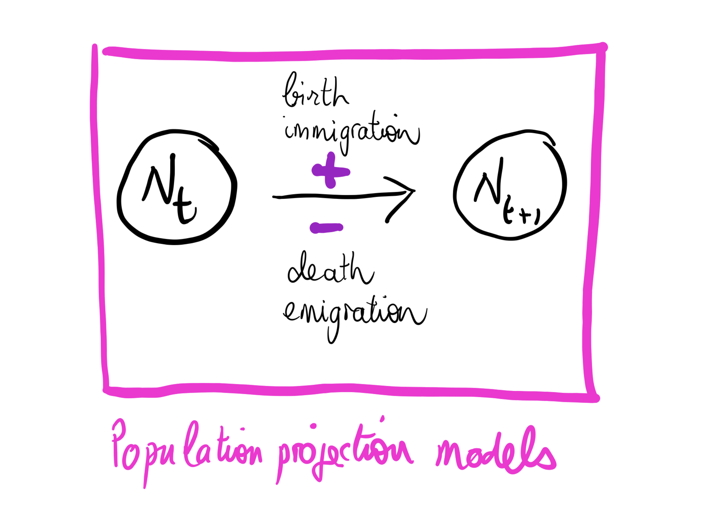
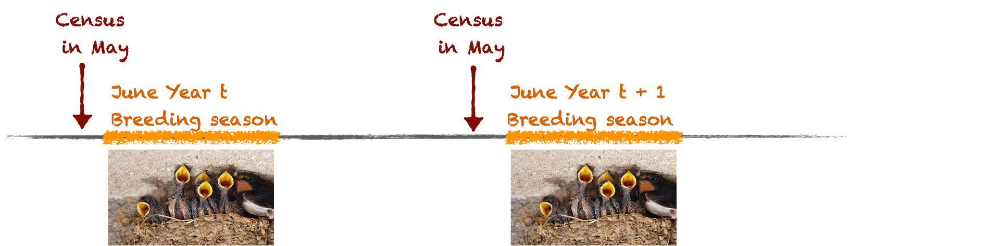
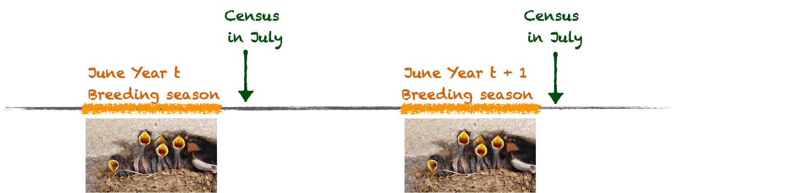
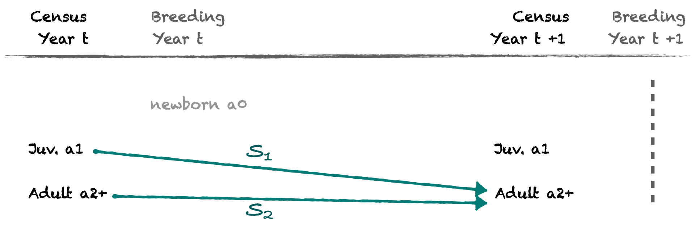
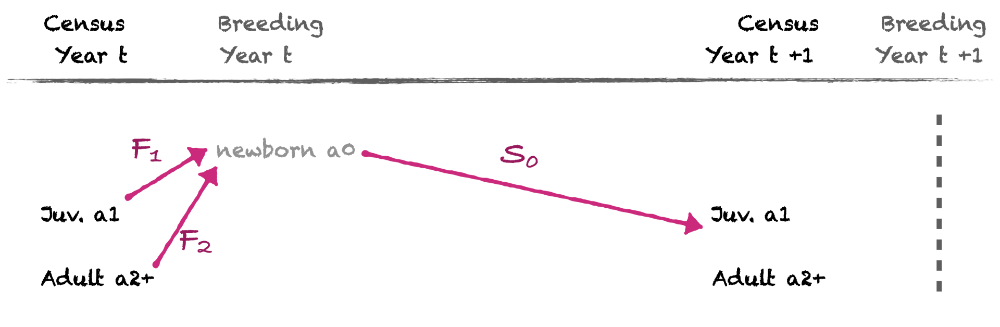
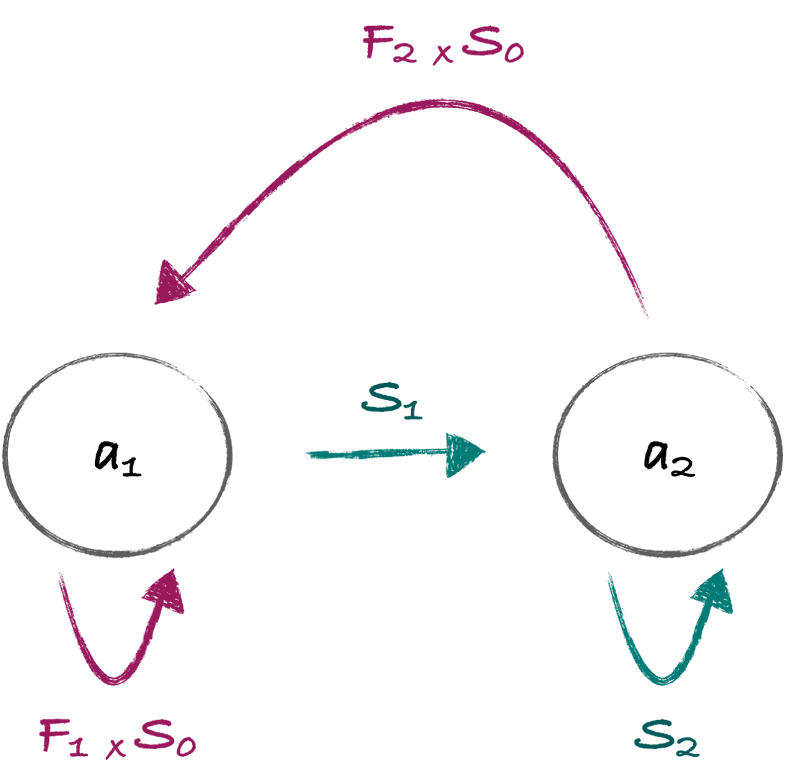
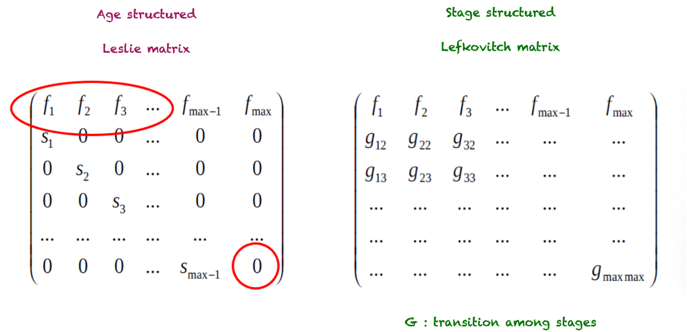
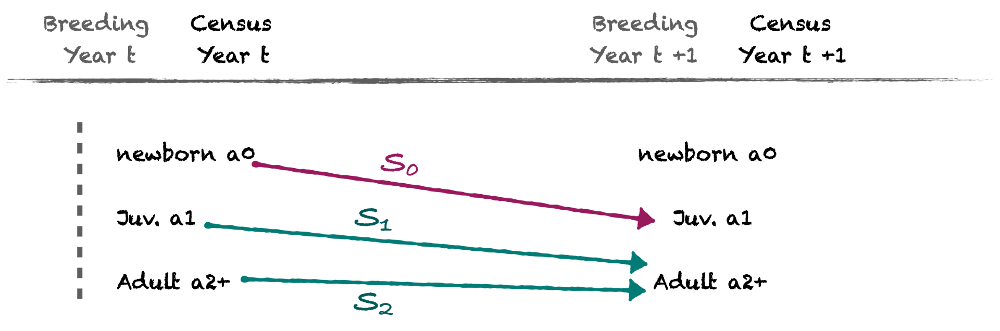
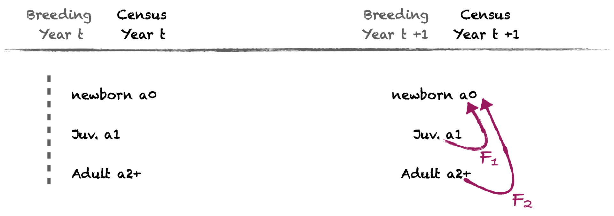
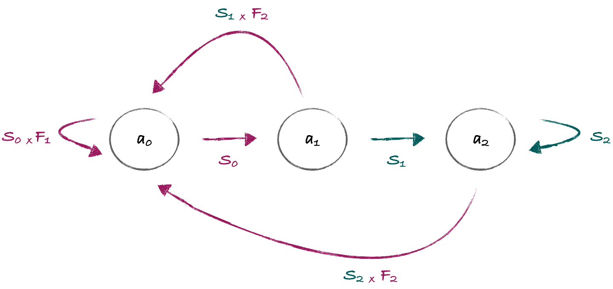

```{r setup, include=FALSE, echo=FALSE, cache = FALSE}
options(htmltools.dir.version = FALSE)
knitr::opts_chunk$set(comment = "")
library(tidyverse)
theme_set(theme_light())
update_geom_defaults("point", list(size = 2)) 
```

# What we've learned during this class

### Obj. 1: Know current and past trends in population abundance
- see class 1

--

### Obj. 2: Estimate demographic parameters and identify the causes of variation
- see class 2

--

### Obj. 3: Evaluate population viability to inform decision about management actions
- some hints about this now!

---
# Population Viability Analysis (PVA)


+ use of **quantitative methods** to predict the **likely future status** of a population or collection of populations of conservation concern 


+ **tentative assessments** based upon what we now know **rather than as iron-clad predictions **of population fate


---
# Why is PVA useful ? 

+ quantify the rate of population change over time

--

+ estimate extinction risks (used by the IUCN)

--

+ identify key parameters for population management

--

+ evaluate and compare the relative impact of population management actions

---
# Can we assess population viability from population counts ?

```{r, echo=FALSE, out.width="60%", fig.align='center'}
knitr::include_graphics("img/pop_size.png")
```

---
class: center, middle

# 1- Count based PVA

---
# Finite population growth rate $\lambda$

.pull-left[

```{r, echo=FALSE, fig.align='center'}
n=50
Year = 1990:(1990+(n-1))
Ngrowth <- Ndecline <- Nstable <- NULL
Nstable = rep(50,n)
Ngrowth[1] <- Ndecline[1] <- Nstable[1]
for(i in 2:n){
  Ndecline[i] = Ndecline[i-1] * 0.98
  Nstable[i] = Nstable[i-1] * 1
  Ngrowth[i] = Ngrowth[i-1] * 1.02
  }
data <- data.frame(Year=rep(Year,3), 
                   pop=c(Ndecline, Nstable,Ngrowth),
                   trajectory=c(rep("decline",n),
                                rep("stable",n), 
                                rep("growth",n) ) 
                   )
p <- ggplot(data,aes(x=Year, y=pop,group=trajectory)) +
  geom_point(aes(color=trajectory)) +
annotate(geom="text", x = 2025, y = 75,
         label="lambda > 1, growing",
         color="darkgreen",
         size=8)  +
  annotate(geom="text", x = 2027, y = 55,
           label="lambda = 1, stable",
           color="darkblue",
           size=8)  +
  annotate(geom="text", x = 2025, y = 35,
           label="lambda < 1, declining",
           color="darkred",
           size=8)  +
  ylab("Population size") +
  xlab("Time")
p + theme(legend.position = "none") 
```

]

.pull-right[

- exponential growth or decay at a constant rate of change

- $\lambda = \frac{N_{t+1}}{N_{t}}$ gives the **proportional change** in population size

- after t time steps, the population will be $N_{t} = N_{0} \cdot \lambda^{t}$

- $\lambda$ is log-normally distributed

]

---

# Growth rate versus intrinsic rate of increase

- **Population growth rate** $\lambda \sim Lognormal(\mu,\sigma^{2})$

- easier to work with the **intrinsic rate of increase** 
`$$r = \log(\lambda) = \log(\frac{N_{t+1}}{N_{t}}) = \log(N_{t+1}) - \log(N_{t})$$`

--

- which is normally distributed
$r \sim N(\mu,\sigma^{2})$

--
- $\mu$ is the **mean rate of increase** 

- $\sigma^{2}$ is the **environmental variance**


---
# Environmental variance

- if the mean rate of increase $\mu < 0$ extinction will certainly occur. 

--

- a population can still decline or go extinct even if the mean rate of increase $\mu>0$ because of environmental variance $\sigma^{2}$.

--
- variable environments increase extinction risks.


---
## Example of the Yellowstone grizzly bear population 

.pull-left[
```{r echo = FALSE,out.width="100%"}
library(popbio)
N <- grizzly$N
Years <- grizzly$year

ggplot(data = grizzly, aes(x = year, y = N))+
  geom_line(color = "#00AFBB", size = 1)+
  geom_point(color = "#00AFBB", size=2) +
   theme_gray(base_size = 12)

```
]

.pull-right[
```{r, echo=FALSE, out.width="60%", fig.align='center'}
knitr::include_graphics("img/famous-grizzly-bear-399-her-600w-1826571545.jpg")
```
]

---
# Step 1 : Calculate $\mu$ and $\sigma^{2}$  from the data

```{r echo = TRUE}
# rate of increase over years
logN <- log(N[-1]/N[-length(N)]) # log(Nt+1) - log(Nt)
#mean rate of increase
mu = mean(logN) #<<
#environmental variance
sigma2 = var(logN) #<< 
```

```{r echo = FALSE}
data.frame(mu=mu,sigma2=sigma2)
```

--

- $\mu >0$ in average the population is growing

--

- $\sigma^{2} = 0.013$ reflect low inter-annual variance in the rate of increase


---
## or using linear regression for unequal time intervals

```{r echo = TRUE}
x <- sqrt(grizzly$year[-1] - grizzly$year[-length(grizzly$year)]) # sqrt time intervals
y <- logN / x
mod <- lm(y ~ 0 + x) # forcing a y-intercept of zero
mod
mu <- coef(mod) # the slope = mean intrinsic rate of increase
```

---
## or using linear regression for unequal time intervals

```{r echo = TRUE}
# get an estimate for sigma2
anova(mod)
sigma2 <- anova(mod)[["Mean Sq"]][2] # environmental variance
```

---

## Get confidence intervals for $\mu$ and $\sigma_{2}$

```{r echo = TRUE}
## Confidence interval for mu
confint(mod, 1)
```
- confidence interval of mean rate of increase encompasses 0, we cannot rule out potential risk of decline!

--

```{r echo = TRUE}
## Confidence interval for sigma 2
df1 <- length(logN) - 1
df1 * sigma2 / qchisq(c(.975, .025), df = df1)
```


---

## Back-transform to get finite population growth rate $\bar{\lambda}$  :
 
```{r echo = TRUE}
lambda <- exp(mu) 
lambda # average growth rate

```

--

- here $\bar{\lambda} > 1$, so the grizzly population is growing in average

- it does not rule out the possibility of a decline owing to the chance occurrence of a sequence of bad years (remember confidence interval)

---

# Step 2 : Project the population

- Expected population size using mean rate of increase and ignoring environmental variance (not recommended)

`$$N_{t} =  N_{0} \cdot \lambda^{t}$$`

`$$ln(N_{t}) =  ln(N_{0}) + \mu \cdot t$$`

--

* initial population $N_{0}=44$

* time steps to project over : $t =38$ years (nb. years - 1)

* mean rate of increase $\mu = 0.021$ 
---
# Step 2 : Project the population

```{r,echo=FALSE, out.width="50%", fig.align='center'}
grizzly$type <- "data"
grizzly2 <- data.frame(year=rep(grizzly$year,2),
N=c(N[1]*exp(mu)^(0:(length(N)-1) ), grizzly$N ) ,
type=c(rep("prediction",length(N)),rep("census",length(N))  ) )

ggplot(data = grizzly2, aes(x = year, y = N, group=type, color=type))+
geom_line() +
geom_point() +
ylab("Population size")
```

---
# Step 2 : Project the population
## Let's account for observed variation in growth rate

- First, set the initial population, number of time steps, and number of repetitions: 

```{r,echo=TRUE}
n0 = grizzly$N[1] # initial pop.

T=50 # time iterations to project over

runs=500  # number of repetitions (pop. trajectories)

stoch.pop=matrix(NA,T,runs) # to store resuts       
stoch.pop[1,]=n0 # initiate
```

---
# Step 2 : Project the population
## Let's account for observed variation in growth rate


- Then set a quasi-extinction threshold 

```{r,echo=TRUE}
Ne = 30  # threshold for minimum viable pop. / quasi-extinction threshold
#48 from USFWS Grizzly Bear Recovery Plan to 'uplist' the bear from threatened status.
```

--
- 1 female or a minimum viable population (genetic drift, demographic stochasticity)

- can also be the lowest level of abundance at which it remains feasible to attempt intervention to prevent further decline. 

---
## Now run the projections
```{r,echo=TRUE}
# let's project the population
for (i in 1:runs){ #<<
  for (t in 2:T){	#<< 
# Draw r from normal using estimates of mu and sigma2
        r <- rnorm(1,mu,sqrt(sigma2)) 
# back-transform to get lambda and get pop. size
    lambda=exp(r) 
#project one time step from the current pop size
    stoch.pop[t,i]=stoch.pop[(t-1),i]*lambda 
# leave the loop if pop <= threshold
    if(stoch.pop[t,i]<=Ne){ 
      stoch.pop[t,i] <- 0 
      i<i+1}  
  }
}
```

---
## Now run the projections
```{r,echo=TRUE}
# let's project the population
for (i in 1:runs){ # loop over repetitions
  for (t in 2:T){	# loop over years
# Draw r from normal using estimates of mu and sigma2
        r <- rnorm(1,mu,sqrt(sigma2)) #<<
# back-transform to get lambda and get pop. size
    lambda=exp(r) 
#project one time step from the current pop size
    stoch.pop[t,i]=stoch.pop[(t-1),i]*lambda 
# leave the loop if pop <= threshold
    if(stoch.pop[t,i]<=Ne){ 
      stoch.pop[t,i] <- 0 
      i<i+1}  
  }
}
```

---
## Now run the projections
```{r,echo=TRUE}
# let's project the population
for (i in 1:runs){ # loop over repetitions
  for (t in 2:T){	# loop over years
# Draw r from normal using estimates of mu and sigma2
        r <- rnorm(1,mu,sqrt(sigma2)) 
# back-transform to get lambda and get pop. size
    lambda=exp(r) #<<
#project one time step from the current pop size
    stoch.pop[t,i]=stoch.pop[(t-1),i]*lambda #<<
# leave the loop if pop <= threshold
    if(stoch.pop[t,i]<=Ne){ 
      stoch.pop[t,i] <- 0 
      i<i+1}  
  }
}
```


---
## Now run the projections
```{r,echo=TRUE}
# let's project the population
for (i in 1:runs){ # loop over repetitions
  for (t in 2:T){	# loop over years
# Draw r from normal using estimates of mu and sigma2
        r <- rnorm(1,mu,sqrt(sigma2)) 
# back-transform to get lambda and get pop. size
    lambda=exp(r)
#project one time step from the current pop size
    stoch.pop[t,i]=stoch.pop[(t-1),i]*lambda 
# leave the loop if pop <= threshold
    if(stoch.pop[t,i]<=Ne){ #<<
      stoch.pop[t,i] <- 0 #<<
      i<i+1}  #<<
  }
}
```

---
# Step 3 : Examine the results

```{r, echo=FALSE, fig.align='center'}

matplot(log(stoch.pop),type="l",
        ylab="log(population size",
        xlab="Time steps")
```

---
# Step 3 : Examine the results

```{r,echo=FALSE, fig.align='center', warning=FALSE, message==FALSE}
lastN <- data.frame(pop = stoch.pop[T,])
ggplot(lastN,aes(x=pop)) +
         geom_histogram(bins = 40) +
  xlab("YNP grizzly population size after T=50 years")
       
```

---
# Step 3 : Examine the results

```{r, echo=FALSE, fig.align='center', warning=FALSE, message=FALSE}

# Mean population size with confidence interval
pop.mean=apply(stoch.pop,1,mean, na.rm=T)
log.pop.sd  =apply(log(stoch.pop+0.00001),1,sd, na.rm=T)
ucl =exp(log(pop.mean)+1.96*log.pop.sd)     #upper confidence limit
lcl =exp(log(pop.mean)-1.96*log.pop.sd)     #lower confidence limit

dataproj <- data.frame(year = grizzly$year[1] : (grizzly$year[1] + (T-1)),
                 pop.mean= pop.mean,
                 low = ucl,
                 up = lcl,
                 N = c(grizzly$N, rep(NA, T-length(grizzly$N) )))

p <- ggplot(dataproj, aes(year)) + 
  geom_line(aes(y=log(pop.mean)), colour="blue") + 
  geom_ribbon(aes(ymin=log(low), ymax=log(up)), alpha=0.2)
p +  geom_line(aes(y=log(N)), colour="red") +
  geom_point(aes(y=log(N)), colour="red") +
  ylab("log(Popiulation size)") +
  xlab("Time steps")
  
```

---
# Step 3 : Examine the results

- The average population growth rate doesn’t do a good job of predicting what most population realizations will do

--

- What are the chances that the population will go extinct at various times ? 

  + extinction risk
  
  + time to extinction
---
# Step 4 : Quantify extinction risks

- Ultimate extinction probability = percentage of trajectories (over the 500 runs) reaching the extinction threshold at some point (over T years)

```{r,echo=TRUE}
Pr.ext = sum(lastN <= Ne) / runs # prob. to reach the extinction threshold
Pr.ext
```


---
# Step 4 : Quantify extinction risks
- Cumulative extinction risk over the years

```{r,echo=FALSE, fig.align='center', out.width="45%"}

# Cumulative extinction function
ex <- extCDF(mu, sigma2, Nc=n0, Ne=Ne)
# use bootstrap to get confidence intervals
CIext <- countCDFxt(mu, sigma2, nt = T-1,Nc=n0, Ne=Ne, tmax = T, Nboot = 500,
      plot = FALSE)

Prext <- data.frame(years = (grizzly$year[1] : (grizzly$year[1] + (T-1) ) ) , 
                      m = CIext$Gbest,
                    low = CIext$Glo,
                    up = CIext$Gup)
ggplot(Prext, aes(x= years)) +
  geom_point(aes(y=m), colour="purple") +
  geom_line(aes(y=m), colour="purple") + 
  geom_ribbon(aes(ymin=low, ymax=up), alpha=0.2) +
  xlab("Years") +
  ylab("Quasi-extinction probability")
```

---
# Step 5 : Quantify time to extinction
- mean time to extinction is an overestimation (because of few pop. growing fast)
- median time to extinction is a better measure

```{r,echo=TRUE}
# Time to reach extinction for extinct pop.
maxt<-NULL	# empty vector to store results
for (i in 1:runs){	# loop over repetitions
  N <- stoch.pop[,i]
  # max time N > threshold
  maxt[i]<-max(which(N>0)) } #<<
# time at extinction for pseudo-extinct populations
time.ext <- maxt[maxt<T] #<<
median(time.ext)
```

---
# Step 5 : Quantify time to extinction

```{r,echo=FALSE}
df <- data.frame(time.ext=time.ext) 
  ggplot(df,aes(x=time.ext)) +
           geom_histogram(bins = 40) +
    geom_vline(aes(xintercept = median(time.ext)), colour="red") +
    xlab("Time to extinction") +
    annotate(geom="text", x = 15, y = 15,
         label=paste( median(time.ext)),
         color="red",
         size=4) 
```

---
# Step 6 : Perturb and run the model

## Interesting to evaluate the sensitivity of the results to changes :

- initial population size
- extinction threshold
- amount of environmental variance
- number of time steps

---
# Let's practice

- Run a PVA for the grizzly bear using 38 bears as the mimimum population size. 

- Start with the initial population of 99 bears in 1997.

- What is the probability that the population is extinct by 2022 ?

---
# Count based extinction analyses are based on strong hypotheses

- exhaustive counts (no sampling error)

--

- no density-dependence (exponential growth)

--

- only source of variation is environmental stochasticity (no demographic stochasticity, no trends in mean or variance over time, uncorrelated environment among successive  years)

--

- moderate environmental variability (no catastrophe, no bonanzas)

---
# Avantages

- simplicity (data requirement at least 10 censuses and calculation)
 
- work relatively well when assumptions are met
 
- assess model quality by hindcasting

---

# Limitations

- $\lambda$ is only a summary of the population dynamics

--

- no info about the mechanisms governing the dynamics

--

- no hints about which management action might be most efficient? 

- Is it better to act on survival ? fecundity ? of adults ? juveniles ?

---
# Can we assess population viability from demographic parameters ?

```{r, echo=FALSE, out.width="60%", fig.align='center'}

```

---
class: center, middle

# 2- PVA using Matrix Projection Models (MPMs)


---
# Let's assume no migrations for now 

- Survival and fecundity rates are enough to fully describe the population dynamics

`$$N_{t+1} = N_{t} * F + N_{t} * S$$`

  + F = fecundity
  + S = survival  (= 1- mortality)


---
# Demographic parameters (see class 2)

- demographic parameters are often **heterogeneous across the life cycle** : survival and fecundity vary with age and/or stage in many species.

```{r, echo=FALSE, fig.align='center', out.width="60%"}

```


---

# Matrix Population Models (MPMs)

- Incorporate vital rates that are heterogeneous across the life cycle

- Project the population based on the matrix summarizing the age- or stage- dependent demographic parameters 

---

# The Barn swallow (*Hirundo rustica*) example

```{r, echo=FALSE, out.width="50%", fig.align='center'}
knitr::include_graphics("img/barnswallowlifecycle.png")
```

---
# Demographic parameters

Survival rates :
- $S_{0}$ chick survival 
- $S_{1}$ juvenile survival (1 yo)
- $S_{2}$ adult survival (2+ yo)

Fecundity : 
- $F_{1}$ number of females produced by a juvenile female
- $F_{2}$ number of females produced by an adult female

---
# Timing of data collection ?

```{r, echo=FALSE, out.width="100%", fig.align='center'}

```

+ pre-breeding census

---
# Timing of data collection ?

```{r, echo=FALSE, out.width="100%", fig.align='center'}

```

+ post-breeding census

---

# Step 1 : write the agenda of events

+ Let's first consider a pre-breeding census


```{r, echo=FALSE, out.width="100%", fig.align='center'}

```

---

# Step 1 : write the agenda of events

+ Let's first consider a pre-breeding census

```{r, echo=FALSE, out.width="100%", fig.align='center'}

```

---

# Step 1 : write the agenda of events

+ Let's first consider a pre-breeding census

```{r, echo=FALSE, out.width="100%", fig.align='center'}
knitr::include_graphics("img/AgendaPreB3.png")
# a life cycle diagram (or directed graph) is composed of 2 things :
#nodes which rep discrete stage or age class 
# and edges which represent the transitions between stages/ages
# caswell 2001 intro to pop.biology
```
--
+ Note that newborn are not observed directly !

---
# Step 2 : Translate into life cycle graph or 'Caswell representation'

- a trick is to go 'up the arrows'

```{r, echo=FALSE, out.width="35%", fig.align='center'}

```

---

# Step 3 : Translate into equations

- Link $N_{(t+1)}$ to $N_{(t)}$ via survival and fertility rates
- a trick is to read the parameters going up the arrows

$N_{(1,t+1)} = F_{1} \cdot S_{0} \cdot N_{(1,t)}+ F_{2} \cdot S_{0} \cdot N_{(2,t)}$

$N_{(2,t+1)} = S_{1} . N_{(1,t)} + S_{2} . N_{(2,t)}$

---
# Step 3 : Arrange in a matrix format

+ called the **transition matrix**, or the **projection matrix** 


$$N_{(t+1)} = \begin{bmatrix}F_{1} \cdot S_{0} & F_{2} \cdot S_{0}\\
S_{1} & S_{2}
\end{bmatrix} \cdot N_{(t)}$$

---
# Step 3 : Arrange in a matrix format

+ with $S_{0} = 0.2$, $S_{1} = 0.5$ and $S_{2} = 0.65$
+ $F_{1} = 3/2$ and $F_{2} = 6/2$


$$N_{(t+1)} = \begin{bmatrix}0.3 & 0.6\\
0.5 & 0.65
\end{bmatrix} \cdot N_{(t)}$$

---
# Why is the matrix format interesting ? 

- easier to read than multiple equations

- intrinsic numeric features (back to it later)

- work the same way for complex life cycles 
  
---
# The projection matrix
- How many age classes / stages in the life cycle ?
- age at first reproduction ?
- maximum age at death fixed or not ?


```{r, echo=FALSE, out.width="60%", fig.align='center'}

```


---
# The projection matrix
- pre- or post-breeeding census ?

--

```{r, echo=FALSE, out.width="100%", fig.align='center'}

```

+ post-breeding census

---
# Step 1 : write the agenda of events

```{r, echo=FALSE, out.width="100%", fig.align='center'}

```

---

# Step 1 : write the agenda of events

```{r, echo=FALSE, out.width="100%", fig.align='center'}

```

---

# Step 1 : write the agenda of events

```{r, echo=FALSE, out.width="100%", fig.align='center'}
knitr::include_graphics("img/AgendaPostB3.png")
# a life cycle diagram (or directed graph) is composed of 2 things :
#nodes which rep discrete stage or age class 
# and edges which represent the transitions between stages/ages
# caswell 2001 intro to pop.biology
```
--
+ Note that newborn are now observed !

---
# Step 2 : Translate into life cycle graph or 'Caswell representation'

```{r, echo=FALSE, out.width="70%", fig.align='center'}

```

---

# Step 3 : Translate into equations

$N_{(0,t+1)} =  S_{0} \cdot F_{1} \cdot  N_{(0,t)} + S_{1} \cdot F_{2} \cdot N_{(1,t)}+ S_{2} \cdot F_{2} \cdot  N_{(2,t)}$

$N_{(1,t+1)} = S_{0} \cdot N_{(0,t)}$

$N_{(2,t+1)} = S_{1} \cdot N_{(1,t)} + S_{2} \cdot N_{(2,t)}$

--
# Step 4 : Arrange in a matrix format

$$N_{(t+1)} = \begin{bmatrix} S_{0} \cdot F_{1} & S_{1} \cdot F_{2} & S_{2} \cdot F _{2} \\
S_{0} & 0 & 0 \\
0 & S_{1} & S_{2}\\
\end{bmatrix} \cdot N_{(t)}$$

---
class: center, middle

# Let's practice writing life cycles

---


