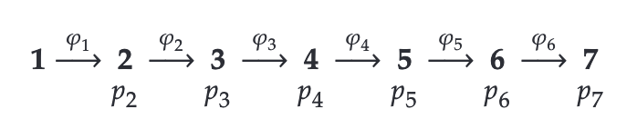
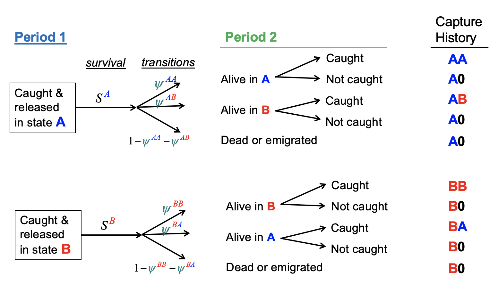

```{r setup, include=FALSE, echo=FALSE, cache = FALSE}
options(htmltools.dir.version = FALSE)
knitr::opts_chunk$set(comment = "")
library(tidyverse)
theme_set(theme_light())
update_geom_defaults("point", list(size = 2)) 
```

# On our plate

+ Estimating survival from capture-recapture data
+ Including discrete and continuous covariates
+ Estimating transitions between sites/states
+ Estimating productivity


---
### Capture, mark and recapture

.pull-left[
```{r, echo=FALSE, out.width="90%"}
knitr::include_graphics("img/gull.jpg")
```
]

.pull-right[
```{r, echo=FALSE, out.width="110%"}
knitr::include_graphics("img/bighorn.png")
```
]

Artificial marks

---
### Capture, mark and recapture

.pull-left[
```{r, echo=FALSE, out.width="90%"}
knitr::include_graphics("img/lynx.png")
```
]

.pull-right[
```{r, echo=FALSE, out.width="120%"}
knitr::include_graphics("img/bearscat.png")
```
]

Natural marks

---
### Exemple histoire à 3 occasions


---
### Définir les paramètres

```{r, echo=FALSE, out.width="60%", fig.cap="", fig.align='center'}

```


---
### 3 sampling occasions, 2 time intervals

```{r, echo = FALSE, fig.width = 7.5, fig.asp = 0.718, dev = "svg", message = FALSE, warning = FALSE,fig.align='center'}
gv <- DiagrammeR::grViz("
digraph dot {

graph [layout = dot,
       rankdir = LR]

node [shape = plaintext,
      label = '',
      fontsize = 30,
      fontname = Arial]

node [label = 'first captured,\n marked\n and released', fontcolor = 'blue']
a

node [label = 'alive \n and present', fontcolor = 'black']
b

node [label = 'dead \n or emigrated', fontcolor = 'black']
c

node [label = 'detected', fontcolor = 'black']
d

node [label = 'non-detected', fontcolor = 'black']
e

node [label = 'alive \n and present', fontcolor = 'black']
f

node [label = 'dead \n or emigrated', fontcolor = 'black']
g

node [label = 'alive \n and present', fontcolor = 'black']
h

node [label = 'dead \n or emigrated', fontcolor = 'black']
i

node [label = 'detected', fontcolor = 'black']
j

node [label = 'non-detected', fontcolor = 'black']
k

node [label = 'detected', fontcolor = 'black']
l

node [label = 'non-detected', fontcolor = 'black']
m

node [label = '111', fontcolor = 'black']
n

node [label = '100', fontcolor = 'black']
t r q 

node [label = '110', fontcolor = 'black']
s o 

node [label = '101', fontcolor = 'black']
p


edge [color = grey, fontsize = 30, labelfontsize = 30]
a -> {b} [label = '$\\\\phi_1$', fontsize = 20]
a -> {c} [label = '$1 - \\\\phi_1$', fontsize = 20]
b -> {d} [label = '$p_2$', fontsize = 20]
b -> {e} [label = '$1 - p_2$', fontsize = 20]
d -> {f} [label = '$\\\\phi_2$', fontsize = 20]
d -> {g} [label = '$1 - \\\\phi_2$', fontsize = 20]
e -> {h} [label = '$\\\\phi_2$', fontsize = 20]
e -> {i} [label = '$1 - \\\\phi_2$', fontsize = 20]
f -> {j} [label = '$p_3$', fontsize = 20]
f -> {k} [label = '$1 - p_3$', fontsize = 20]
h -> {l} [label = '$p_3$', fontsize = 20]
h -> {m} [label = '$1 - p_3$', fontsize = 20]
j -> {n} 
k -> {o} 
l -> {p} 
m -> {q} 
i -> {r} 
g -> {s}
c -> {t}

{ rank = same; n; o; p; q; r; s; t}
{ rank = same; b; c}
{ rank = same; d; e}
{ rank = same; f; g; h; i}
{ rank = same; j; k; l; m}

}", width = 1000, height = 600)

DiagrammeR::add_mathjax(gv, include_mathjax = FALSE)
```


---
### 3 sampling occasions, 2 time intervals

```{r, echo = FALSE, fig.width = 7.5, fig.asp = 0.718, dev = "svg", message = FALSE, warning = FALSE,fig.align='center'}
gv <- DiagrammeR::grViz("
digraph dot {

graph [layout = dot,
       rankdir = LR]

node [shape = plaintext,
      label = '']

node [label = 'first captured,\n marked\n and released', fontcolor = 'blue']
a

node [label = 'alive \n and present', fontcolor = 'black']
b

node [label = 'dead \n or emigrated', fontcolor = 'black']
c

node [label = 'detected', fontcolor = 'black']
d

node [label = 'non-detected', fontcolor = 'black']
e

node [label = 'alive \n and present', fontcolor = 'black']
f

node [label = 'dead \n or emigrated', fontcolor = 'black']
g

node [label = 'alive \n and present', fontcolor = 'black']
h

node [label = 'dead \n or emigrated', fontcolor = 'black']
i

node [label = 'detected', fontcolor = 'black']
j

node [label = 'non-detected', fontcolor = 'black']
k

node [label = 'detected', fontcolor = 'black']
l

node [label = 'non-detected', fontcolor = 'black']
m

node [label = '111', fontcolor = 'black']
n

node [label = '100', fontcolor = 'black']
t r q 

node [label = '110', fontcolor = 'black']
s o 

node [label = '101', fontcolor = 'black']
p


edge [color = grey]
a -> {b} [label = '$\\\\phi_1$']
a -> {c} [label = '$1 - \\\\phi_1$']
b -> {d} [label = '$p_2$']
b -> {e} [label = '$1 - p_2$']
d -> {f} [label = '$\\\\phi_2$']
d -> {g} [label = '$1 - \\\\phi_2$']
e -> {h} [label = '$\\\\phi_2$']
e -> {i} [label = '$1 - \\\\phi_2$']
f -> {j} [label = '$p_3$']
f -> {k} [label = '$1 - p_3$']
h -> {l} [label = '$p_3$']
h -> {m} [label = '$1 - p_3$']
j -> {n} 
k -> {o} 
l -> {p} 
m -> {q} 
i -> {r} 
g -> {s}
c -> {t}

{ rank = same; n; o; p; q; r; s; t}
{ rank = same; b; c}
{ rank = same; d; e}
{ rank = same; f; g; h; i}
{ rank = same; j; k; l; m}

}", width = 1000, height = 600)

DiagrammeR::add_mathjax(gv, include_mathjax = FALSE)
```


---
### Ecrire les probas

```{r, echo=FALSE, out.width="60%", fig.cap="", fig.align='center'}
knitr::include_graphics("img/prob.png")
```

---
### La vraisemblance

Exemple Montana.

---
### CJS


---
### Likelihood

```{r, echo = FALSE, fig.width = 7.5, fig.asp = 0.718, dev = "svg", message = FALSE, warning = FALSE,fig.align='center'}
# From Jay Rotella Univ of Montana 

# Define parameter values
n.occasions <- 3     # Number of capture occasions
n.mark <- 150
marked <- c(n.mark, 0)  # Number of newly marked individuals each year

# Vectors of values for phi and p for each year
# Each vector needs to have (n.occasions - 1) values or fewer and have values 
#  between 0 and 1. If it's fewer, the values will be recycled
# Here, we just give 1 value and it's used in every year
phi <- 0.8 # or, for example, could use phi <- c(0.6, 0.9)
p <- 0.6   # or, for example,  could use p <- c(0.3, 0.5)

# Define matrices with survival and recapture probabilities 
PHI <- matrix(phi, ncol = n.occasions-1, nrow = sum(marked), byrow = TRUE)
P <- matrix(p, ncol = n.occasions-1, nrow = sum(marked), byrow = TRUE)

# Define function to simulate a capture-history (CH) matrix
simul.cjs <- function(PHI, P, marked){
  n.occasions <- dim(PHI)[2] + 1
  CH <- matrix(0, ncol = n.occasions, nrow = sum(marked))
  # Define a vector with the occasion of marking
  # note: length(marked) is the number of marking occasions
  # so this next line indicates which occasion each individual was 1st marked on
  mark.occ <- rep(1:length(marked), marked[1:length(marked)])
  # Fill the CH matrix
  for (i in 1:sum(marked)) {
    CH[i, mark.occ[i]] <- 1       # Write a 1 at the release occasion
    if (mark.occ[i] == n.occasions) next # ignore animals 1st caught on last occasion
    for (t in (mark.occ[i] + 1):n.occasions) {
      # Bernoulli trial: does individual survive occasion?
      sur <- rbinom(1, 1, PHI[i, t - 1])
      if (sur == 0)
        break		# If dead, move to next individual
      # Bernoulli trial: is individual recaptured?
      rp <- rbinom(1, 1, P[i, t - 1])
      if (rp == 1) CH[i,t] <- 1
    } #t
  } #i
  return(CH)
}

# Simulate capture-histories
set.seed(2022)
CH <- simul.cjs(PHI, P, marked)

# collapse the numbers in each row into character data
ch <- apply(CH, 1, paste, collapse = "")

# Store the numbers of animals with each of the 4 histories
x111 <- sum(ch == "111")
x101 <- sum(ch == "101")
x110 <- sum(ch == "110")
x100 <- sum(ch == "100")

# Make a data frame with a grid of combinations of 
#  possible parameter combinations 
# Look up `expand.grid` in R's help if the function is new to you
parms <- expand.grid(phi = seq(0.01, 0.99, by = 0.01),
                     p = seq(0.01, 0.99, by = 0.01))
# calculate the probability of each capture history 
#  for each combination of parameter values in the data frame
parms$p111 <- with(parms, phi*p*phi*p)
parms$p101 <- with(parms, phi*(1-p)*phi*p)
parms$p110 <- with(parms, phi*p*(1-phi*p))
parms$p100 <- with(parms, 1-p111-p101-p110)                 
                   
# work out the multinomial pdf value (log scale) for each pair of 
# possible parameter values GIVEN the data and the model
#  structure (contstant phi and p over time)
parms$log.lik <- NA
for (i in 1:nrow(parms)) {
  parms$log.lik[i] <- dmultinom(x = c(x111, x101, x110, x100), 
                            size = n.mark,
                            prob = c(parms$p111[i], 
                                     parms$p101[i], 
                                     parms$p110[i], 
                                     parms$p100[i]),
                            log = TRUE)
}

# print out values of phi and p associated with highest pdf value
#parms$phi[parms$log.lik == max(parms$log.lik)]
#parms$p[parms$log.lik == max(parms$log.lik)]

# make a contour plot of log-likelihood values
ggplot(parms, aes(x = p, y = phi, z = log.lik)) + 
  geom_contour_filled(bins = 30) +
#  # add green contour line as a form of 95% CI
#  stat_contour(breaks=c(max(parms$log.lik) - 1.92), color = "green") +
  # add black point to show estimates
  geom_point(data = data.frame(x = parms$p[parms$log.lik == max(parms$log.lik)],
                               y = parms$phi[parms$log.lik == max(parms$log.lik)]),
             aes(x = x, y = y, z = 0),
             color = "black") +
  
  # add red point to show the true parameter values
  geom_point(data = data.frame(x = p,
                               y = phi),
             aes(x = x, y = y, z = 0),
             color = "red") +
  scale_x_continuous(limits = c(0, 1), breaks = seq(0, 1, by = 0.2)) +
  scale_y_continuous(limits = c(0, 1), breaks = seq(0, 1, by = 0.2)) +
  labs(x = "detection", y = "survival") + 
  theme(legend.position = "none") + 
  annotate(
    geom = "curve", 
    x = parms$p[parms$log.lik == max(parms$log.lik)] + .1, 
    y = parms$phi[parms$log.lik == max(parms$log.lik)] - .2, 
    xend = parms$p[parms$log.lik == max(parms$log.lik)], 
    yend = parms$phi[parms$log.lik == max(parms$log.lik)], 
    curvature = .3, 
    arrow = arrow(length = unit(2, "mm"))
  ) +
  annotate(geom = "text", 
           x = parms$p[parms$log.lik == max(parms$log.lik)] + .1, 
           y = parms$phi[parms$log.lik == max(parms$log.lik)] - .25, 
           label = "max-lik estimate", 
           hjust = "left") + 
  annotate(
    geom = "curve", 
    color = "red",
    x = p - .1, 
    y = phi - .2, 
    xend = p, 
    yend = phi, 
    curvature = -.3, 
    arrow = arrow(length = unit(2, "mm"))
  ) +
  annotate(geom = "text", 
           color = "red",
           x = p - .1, 
           y = phi - .25, 
           label = "true value", 
           hjust = "right")
```

---


---
### History of the Cormack-Jolly-Seber (CJS) model

--

<font size="5">S.T. Buckland (2016). A Conversation with Richard M. Cormack. Statistical Science 31: 142-150.</font>

--

.pull-left[
```{r, echo=FALSE, out.width="80%"}
knitr::include_graphics("img/cormack-left.png")
```
]

--

.pull-right[
```{r, echo=FALSE, out.width="80%"}
knitr::include_graphics("img/cormack-right.png")
```
]


---
## The famous Dipper example

.center[
.pull-left[
```{r, echo=FALSE, out.width="60%", fig.cap="White-throated Dipper (Cinclus cinclus)"}
knitr::include_graphics("img/Marzo_BaguesMance.jpg")
```
]
]

--

.pull-right[
```{r, echo=FALSE, fig.cap="Gilbert Marzolin", out.width="60%"}
knitr::include_graphics("img/Marzocuissardes.jpg")
```
]

---
## 294 dippers captured and recaptured between 1981 and 1987 with known sex and wing length

.center.nogap[
```{r echo = FALSE, message=FALSE, warning=FALSE}
dipper <- read_csv("dat/dipper.csv")
dipper %>%  
  kableExtra::kable() %>%
  kableExtra::scroll_box(width = "100%", height = "400px")
y <- dipper %>%
  select(year_1981:year_1987) %>%
  as.matrix()
```
]

---
background-color: #234f66
## <span style="color:white">Live demo</span>

.center[

]


---
class: middle

## Can we explain time variation?

---
# Embrace heterogeneity

--

+ Include temporal covariates, say $x_t$.

--

+ $\text{logit}(\phi_t) = \beta_1 + \beta_2 x_t$.

--

+ Let's investigate the effect of water flow on dipper survival ([Marzolin 2002](https://doi.org/10.2307/3802934)).


---
# What about individual heterogeneity?

--

+ Discrete covariate like, e.g., sex

--

+ Continuous covariate like, e.g., mass or size

---
## Sex and wing length in Dipper

.center.nogap[
```{r echo = FALSE, message=FALSE, warning=FALSE}
dipper %>%  
  kableExtra::kable() %>%
  kableExtra::scroll_box(width = "100%", height = "400px")
```
]

---
# Sex effect

--

+ Let's use a covariate $\text{sex}$ that takes value 0 if male, and 1 if female

--

+ And write $\text{logit}(\phi_i) = \beta_1 + \beta_2 \; \text{sex}_i$ for bird $i$

--

+ Then male survival is 

$$\text{logit}(\phi_i) = \beta_1$$

--

+ And female survival is 

$$\text{logit}(\phi_i) = \beta_1 + \beta_2$$


---
## What if covariates vary with individual and time?

--

+ Think of age for example (see exercises in Worksheets); covariate or nested indexing works fine. **Faire un focus sur l'âge ici!**

--

+ Now, think of body size across life.

--

+ Problem is we cannot record size when animal is non-detected.

--

+ Discretize in small, medium and large and treat as a state <span>&#8212;</span> more later.

--

+ Assume a model for covariate and fill in missing values (imputation).


---
background-color: black
# <span style="color:white">Live demo</span>

<br>
<br>

.center[

]


---
## Capture-recapture models rely on assumptions

--

+ Design
    + No mark lost
    + Identity of individuals recorded without error (no false positives)
    + Captured individuals are a random sample

--

+ Model
    + Homogeneity of survival and recapture probabilities
    + Independence between individuals (overdispersion)

--

+ Test validity of assumptions
    + These assumptions should be valid, whatever inferential framework
    + Use goodness-of-fit tests <span>&#8212;</span> Pradel et al. (2005)
    + `R` implementation with [package `R2ucare`](https://besjournals.onlinelibrary.wiley.com/doi/full/10.1111/2041-210X.13014)


---
## What does survival actually mean in capture-recapture ?

--

+ Survival refers to the study area.

--

+ Mortality and permanent emigration are confounded.

--

+ Therefore we estimate apparent survival, not true survival.

--

+ Apparent survival probability = true survival × study area fidelity.

--

+ Consequently, apparent survival < true survival unless study area fidelity = 1.

--

+ Use caution with interpretation. If possible, combine with ring-recovery data, or go spatial to get closer to true survival.

---
class: middle

## On the move: Transition estimation

---

<style>

.center2 {
  margin: 0;
  position: absolute;
  top: 50%;
  left: 50%;
  -ms-transform: translate(-50%, -50%);
  transform: translate(-50%, -50%);
}

</style>

.center2[

]


---

<style>

.center2 {
  margin: 0;
  position: absolute;
  top: 50%;
  left: 50%;
  -ms-transform: translate(-50%, -50%);
  transform: translate(-50%, -50%);
}

</style>

.center2[

]


---
class: middle, center
background-color: #230404

## <span style="color: white;">Thank you Canada!</span>


---
background-image: url(https://media.giphy.com/media/26BRGxMMN3Pn1MMdG/source.gif)
background-size: cover

---

.center[

]


---

```{r, echo=FALSE, out.width="60%", fig.cap="", fig.align='center'}
knitr::include_graphics("img/multistate-cycle.png")
```


---

```{r, echo=FALSE, out.width="60%", fig.cap=""}

```


---
background-image: url("img/geese.png")
background-size: cover

## <span style="color: white;">Wintering site fidelity in Canada Geese</span>

---
### 3 sites Carolinas, Chesapeake, Mid-Atlantic, with 21277 banded geese, data kindly provided by Jay Hestbeck ([Hestbeck et al. 1991](https://esajournals.onlinelibrary.wiley.com/doi/10.2307/2937193))

.center.nogap[
```{r echo = FALSE, message=FALSE, warning=FALSE}
geese <- read_csv("dat/geese.csv")
geese %>%  
  kableExtra::kable() %>%
  kableExtra::scroll_box(width = "100%", height = "400px")
y <- geese %>%
  as.matrix()
```
]

???

(large areas along East coast of US)

---
class: middle
### Biological inference

.center.nogap[
```{r, echo = FALSE, fig.width = 7.5, fig.asp = 0.718, dev = "svg", message = FALSE, warning = FALSE}
ggplot() + 
  geom_point(aes(1, 1), size = 2.5, alpha = .7) + 
  geom_point(aes(1, 1.5), size = 2.5, alpha = .7) + 
  geom_point(aes(1, 2), size = 2.5, alpha = .7) + 
  geom_text(aes(1, 2, label = 'non-detection'), nudge_x = -0.6, size = 7) + 
  geom_text(aes(1, 1.5, label = 'detection in site A'), nudge_x = -0.6, size = 7) + 
  geom_text(aes(1, 1, label = 'detection in site B'), nudge_x = -0.6, size = 7) +
  geom_point(aes(2, 1), size = 2.5, alpha = .7) + 
  geom_point(aes(2, 1.5), size = 2.5, alpha = .7) + 
  geom_point(aes(2, 2), size = 2.5, alpha = .7) + 
  geom_text(aes(2, 2, label = 'alive in site A'), nudge_x = 0.5, size = 7) + 
  geom_text(aes(2, 1.5, label = 'alive in site B'), nudge_x = 0.5, size = 7) + 
  geom_text(aes(2, 1, label = 'dead'), nudge_x = 0.5, size = 7) + 
  xlim(0, 3) + 
  ylim(0.5, 3) + 
  annotate('text', x = 1, y = 2.6, label = 'Observations', size = 10) + 
  annotate('text', x = 2, y = 2.6, label = 'States', size = 10) +
  theme_void()
```
]

??? 

+ Observations and states are closely related, but not entirely.


---
class: middle
### Biological inference

.center.nogap[
```{r, echo = FALSE, fig.width = 7.5, fig.asp = 0.718, dev = "svg", message = FALSE, warning = FALSE}
ggplot() + 
  geom_point(aes(1, 1), size = 2.5, alpha = .7) + 
  geom_point(aes(1, 1.5), size = 2.5, alpha = .7) + 
  geom_point(aes(1, 2), size = 2.5, alpha = .7) + 
  geom_text(aes(1, 2, label = 'non-detection'), nudge_x = -0.6, size = 7) + 
  geom_text(aes(1, 1.5, label = 'detection in site A'), nudge_x = -0.6, size = 7) + 
  geom_text(aes(1, 1, label = 'detection in site B'), nudge_x = -0.6, size = 7) +
  geom_point(aes(2, 1), size = 2.5, alpha = .7) + 
  geom_point(aes(2, 1.5), size = 2.5, alpha = .7) + 
  geom_point(aes(2, 2), size = 2.5, alpha = .7) + 
  geom_text(aes(2, 2, label = 'alive in site A'), nudge_x = 0.5, size = 7) + 
  geom_text(aes(2, 1.5, label = 'alive in site B'), nudge_x = 0.5, size = 7) + 
  geom_text(aes(2, 1, label = 'dead'), nudge_x = 0.5, size = 7) + 
  xlim(0, 3) + 
  ylim(0.5, 3) + 
  annotate('text', x = 1, y = 2.6, label = 'Observations', size = 10) + 
  annotate('text', x = 2, y = 2.6, label = 'States', size = 10) +
  geom_segment(aes(x = 1, y = 1.5, xend = 2, yend = 2), alpha = 0.7, arrow = arrow(length = unit(0.02, "npc"))) + 
  theme_void()
```
]


---
class: middle
### Biological inference

.center.nogap[
```{r, echo = FALSE, fig.width = 7.5, fig.asp = 0.718, dev = "svg", message = FALSE, warning = FALSE}
ggplot() + 
  geom_point(aes(1, 1), size = 2.5, alpha = .7) + 
  geom_point(aes(1, 1.5), size = 2.5, alpha = .7) + 
  geom_point(aes(1, 2), size = 2.5, alpha = .7) + 
  geom_text(aes(1, 2, label = 'non-detection'), nudge_x = -0.6, size = 7) + 
  geom_text(aes(1, 1.5, label = 'detection in site A'), nudge_x = -0.6, size = 7) + 
  geom_text(aes(1, 1, label = 'detection in site B'), nudge_x = -0.6, size = 7) +
  geom_point(aes(2, 1), size = 2.5, alpha = .7) + 
  geom_point(aes(2, 1.5), size = 2.5, alpha = .7) + 
  geom_point(aes(2, 2), size = 2.5, alpha = .7) + 
  geom_text(aes(2, 2, label = 'alive in site A'), nudge_x = 0.5, size = 7) + 
  geom_text(aes(2, 1.5, label = 'alive in site B'), nudge_x = 0.5, size = 7) + 
  geom_text(aes(2, 1, label = 'dead'), nudge_x = 0.5, size = 7) + 
  xlim(0, 3) + 
  ylim(0.5, 3) + 
  annotate('text', x = 1, y = 2.6, label = 'Observations', size = 10) + 
  annotate('text', x = 2, y = 2.6, label = 'States', size = 10) +
  geom_segment(aes(x = 1, y = 1.5, xend = 2, yend = 2), alpha = 0.7, arrow = arrow(length = unit(0.02, "npc"))) + 
  geom_segment(aes(x = 1, y = 1, xend = 2, yend = 1.5), alpha = 0.7, arrow = arrow(length = unit(0.02, "npc"))) + 
  theme_void()
```
]


---
class: middle
### Biological inference

.center.nogap[
```{r, echo = FALSE, fig.width = 7.5, fig.asp = 0.718, dev = "svg", message = FALSE, warning = FALSE}
ggplot() + 
  geom_point(aes(1, 1), size = 2.5, alpha = .7) + 
  geom_point(aes(1, 1.5), size = 2.5, alpha = .7) + 
  geom_point(aes(1, 2), size = 2.5, alpha = .7) + 
  geom_text(aes(1, 2, label = 'non-detection'), nudge_x = -0.6, size = 7) + 
  geom_text(aes(1, 1.5, label = 'detection in site A'), nudge_x = -0.6, size = 7) + 
  geom_text(aes(1, 1, label = 'detection in site B'), nudge_x = -0.6, size = 7) +
  geom_point(aes(2, 1), size = 2.5, alpha = .7) + 
  geom_point(aes(2, 1.5), size = 2.5, alpha = .7) + 
  geom_point(aes(2, 2), size = 2.5, alpha = .7) + 
  geom_text(aes(2, 2, label = 'alive in site A'), nudge_x = 0.5, size = 7) + 
  geom_text(aes(2, 1.5, label = 'alive in site B'), nudge_x = 0.5, size = 7) + 
  geom_text(aes(2, 1, label = 'dead'), nudge_x = 0.5, size = 7) + 
  xlim(0, 3) + 
  ylim(0.5, 3) + 
  annotate('text', x = 1, y = 2.6, label = 'Observations', size = 10) + 
  annotate('text', x = 2, y = 2.6, label = 'States', size = 10) +
  geom_segment(aes(x = 1, y = 2, xend = 2, yend = 2), alpha = 0.7, arrow = arrow(length = unit(0.02, "npc"))) + 
  geom_segment(aes(x = 1, y = 2, xend = 2, yend = 1.5), alpha = 0.7, arrow = arrow(length = unit(0.02, "npc"))) + 
  geom_segment(aes(x = 1, y = 2, xend = 2, yend = 1), alpha = 0.7, arrow = arrow(length = unit(0.02, "npc"))) + 
  geom_segment(aes(x = 1, y = 1.5, xend = 2, yend = 2), alpha = 0.7, arrow = arrow(length = unit(0.02, "npc"))) + 
  geom_segment(aes(x = 1, y = 1, xend = 2, yend = 1.5), alpha = 0.7, arrow = arrow(length = unit(0.02, "npc"))) + 
  theme_void()
```
]


---
class: middle
### The model construction: How we should think. 

.center.nogap[
```{r, echo = FALSE, fig.width = 7.5, fig.asp = 0.718, dev = "svg", message = FALSE, warning = FALSE}
ggplot() + 
  geom_point(aes(1, 1), size = 2.5, alpha = .7) + 
  geom_point(aes(1, 1.5), size = 2.5, alpha = .7) + 
  geom_point(aes(1, 2), size = 2.5, alpha = .7) + 
  geom_text(aes(2, 2, label = 'non-detection'), nudge_x = 0.5, size = 7) + 
  geom_text(aes(2, 1.5, label = 'detection in site A'), nudge_x = 0.6, size = 7) + 
  geom_text(aes(2, 1, label = 'detection in site B'), nudge_x = 0.6, size = 7) +
  geom_point(aes(2, 1), size = 2.5, alpha = .7) + 
  geom_point(aes(2, 1.5), size = 2.5, alpha = .7) + 
  geom_point(aes(2, 2), size = 2.5, alpha = .7) + 
  geom_text(aes(1, 2, label = 'alive in site A'), nudge_x = -0.6, size = 7) + 
  geom_text(aes(1, 1.5, label = 'alive in site B'), nudge_x = -0.6, size = 7) + 
  geom_text(aes(1, 1, label = 'dead'), nudge_x = -0.6, size = 7) + 
  xlim(0, 3) + 
  ylim(0.5, 3) + 
  annotate('text', x = 1, y = 2.6, label = 'States', size = 10) + 
  annotate('text', x = 2, y = 2.6, label = 'Observations', size = 10) + 
  theme_void()
```
]


??? Generative model. States generate observations. 


---
class: middle
### The model construction: How we should think. 

.center.nogap[
```{r, echo = FALSE, fig.width = 7.5, fig.asp = 0.718, dev = "svg", message = FALSE, warning = FALSE}
ggplot() + 
  geom_point(aes(1, 1), size = 2.5, alpha = .7) + 
  geom_point(aes(1, 1.5), size = 2.5, alpha = .7) + 
  geom_point(aes(1, 2), size = 2.5, alpha = .7) + 
  geom_text(aes(2, 2, label = 'non-detection'), nudge_x = 0.5, size = 7) + 
  geom_text(aes(2, 1.5, label = 'detection in site A'), nudge_x = 0.6, size = 7) + 
  geom_text(aes(2, 1, label = 'detection in site B'), nudge_x = 0.6, size = 7) +
  geom_point(aes(2, 1), size = 2.5, alpha = .7) + 
  geom_point(aes(2, 1.5), size = 2.5, alpha = .7) + 
  geom_point(aes(2, 2), size = 2.5, alpha = .7) + 
  geom_text(aes(1, 2, label = 'alive in site A'), nudge_x = -0.6, size = 7) + 
  geom_text(aes(1, 1.5, label = 'alive in site B'), nudge_x = -0.6, size = 7) + 
  geom_text(aes(1, 1, label = 'dead'), nudge_x = -0.6, size = 7) + 
  xlim(0, 3) + 
  ylim(0.5, 3) + 
  annotate('text', x = 1, y = 2.6, label = 'States', size = 10) + 
  annotate('text', x = 2, y = 2.6, label = 'Observations', size = 10) + 
    geom_segment(aes(x = 1, y = 1, xend = 2, yend = 2), alpha = 0.7, arrow = arrow(length = unit(0.02, "npc"))) + 
  theme_void()
```
]


---
class: middle
### The model construction: How we should think. 

.center.nogap[
```{r, echo = FALSE, fig.width = 7.5, fig.asp = 0.718, dev = "svg", message = FALSE, warning = FALSE}
ggplot() + 
  geom_point(aes(1, 1), size = 2.5, alpha = .7) + 
  geom_point(aes(1, 1.5), size = 2.5, alpha = .7) + 
  geom_point(aes(1, 2), size = 2.5, alpha = .7) + 
  geom_text(aes(2, 2, label = 'non-detection'), nudge_x = 0.5, size = 7) + 
  geom_text(aes(2, 1.5, label = 'detection in site A'), nudge_x = 0.6, size = 7) + 
  geom_text(aes(2, 1, label = 'detection in site B'), nudge_x = 0.6, size = 7) +
  geom_point(aes(2, 1), size = 2.5, alpha = .7) + 
  geom_point(aes(2, 1.5), size = 2.5, alpha = .7) + 
  geom_point(aes(2, 2), size = 2.5, alpha = .7) + 
  geom_text(aes(1, 2, label = 'alive in site A'), nudge_x = -0.6, size = 7) + 
  geom_text(aes(1, 1.5, label = 'alive in site B'), nudge_x = -0.6, size = 7) + 
  geom_text(aes(1, 1, label = 'dead'), nudge_x = -0.6, size = 7) + 
  xlim(0, 3) + 
  ylim(0.5, 3) + 
  annotate('text', x = 1, y = 2.6, label = 'States', size = 10) + 
  annotate('text', x = 2, y = 2.6, label = 'Observations', size = 10) + 
    geom_segment(aes(x = 1, y = 2, xend = 2, yend = 2), alpha = 0.7, arrow = arrow(length = unit(0.02, "npc"))) + 
  geom_segment(aes(x = 1, y = 2, xend = 2, yend = 1.5), alpha = 0.7, arrow = arrow(length = unit(0.02, "npc"))) + 
  geom_segment(aes(x = 1, y = 1, xend = 2, yend = 2), alpha = 0.7, arrow = arrow(length = unit(0.02, "npc"))) + 
  theme_void()
```
]


---
class: middle
### The model construction: How we should think. 

.center.nogap[
```{r, echo = FALSE, fig.width = 7.5, fig.asp = 0.718, dev = "svg", message = FALSE, warning = FALSE}
ggplot() + 
  geom_point(aes(1, 1), size = 2.5, alpha = .7) + 
  geom_point(aes(1, 1.5), size = 2.5, alpha = .7) + 
  geom_point(aes(1, 2), size = 2.5, alpha = .7) + 
  geom_text(aes(2, 2, label = 'non-detection'), nudge_x = 0.5, size = 7) + 
  geom_text(aes(2, 1.5, label = 'detection in site A'), nudge_x = 0.6, size = 7) + 
  geom_text(aes(2, 1, label = 'detection in site B'), nudge_x = 0.6, size = 7) +
  geom_point(aes(2, 1), size = 2.5, alpha = .7) + 
  geom_point(aes(2, 1.5), size = 2.5, alpha = .7) + 
  geom_point(aes(2, 2), size = 2.5, alpha = .7) + 
  geom_text(aes(1, 2, label = 'alive in site A'), nudge_x = -0.6, size = 7) + 
  geom_text(aes(1, 1.5, label = 'alive in site B'), nudge_x = -0.6, size = 7) + 
  geom_text(aes(1, 1, label = 'dead'), nudge_x = -0.6, size = 7) + 
  xlim(0, 3) + 
  ylim(0.5, 3) + 
  annotate('text', x = 1, y = 2.6, label = 'States', size = 10) + 
  annotate('text', x = 2, y = 2.6, label = 'Observations', size = 10) + 
    geom_segment(aes(x = 1, y = 2, xend = 2, yend = 2), alpha = 0.7, arrow = arrow(length = unit(0.02, "npc"))) + 
  geom_segment(aes(x = 1, y = 2, xend = 2, yend = 1.5), alpha = 0.7, arrow = arrow(length = unit(0.02, "npc"))) + 
  geom_segment(aes(x = 1, y = 1.5, xend = 2, yend = 2), alpha = 0.7, arrow = arrow(length = unit(0.02, "npc"))) + 
  geom_segment(aes(x = 1, y = 1.5, xend = 2, yend = 1), alpha = 0.7, arrow = arrow(length = unit(0.02, "npc"))) + 
  geom_segment(aes(x = 1, y = 1, xend = 2, yend = 2), alpha = 0.7, arrow = arrow(length = unit(0.02, "npc"))) + 
  theme_void()
```
]


---
class: middle, center

## Sites may be states.

---
## Examples of multistate models

+ *Epidemiological or disease states*: sick/healthy, uninfected/infected/recovered.

--

+ *Morphological states*: small/medium/big,  light/medium/heavy.

--

+ *Breeding states*: e.g. breeder/non-breeder,  failed breeder, first-time breeder. 

--

+ *Developmental or life-history states*: e.g. juvenile/subadult/adult.

--

+ *Social states*: e.g. solitary/group-living,  subordinate/dominant.

--

+ *Death states*: e.g. alive, dead from harvest, dead from natural causes. 

--

&nbsp;

**States = individual, time-specific categorical covariates.**

---
background-image: url("img/sooty.jpg")
background-size: cover

### <span style="color: white;">Sooty shearwater (David Boyle)</span>


---
## Sooty shearwaters and life-history tradeoffs

--

+ We consider data collected between 1940 and 1957 by Lance Richdale on Sooty shearwaters (aka titis). 

--

+ These data were reanalyzed with multistate models by [Scofield et al. (2001)](https://link.springer.com/article/10.1198/108571101750524607) who kindly provided us with the data. 

--

+ Following the way the data were collected, four states were originally considered:
    + Alive breeder;
    + Accompanied by another bird in a burrow;
    + Alone in a burrow;
    + On the surface;
    + Dead.
    
---
## Sooty shearwaters and life-history tradeoffs

+ Because of numerical issues, we pooled all alive states but breeder together in a non-breeder state (NB) that includes:

    + failed breeders (birds that had bred previously – skip reproduction or divorce) and pre-breeders (birds that had yet to breed). 
    
    + Note that because burrows were not checked before hatching, some birds in the category NB might have already failed. 
    
    + We therefore regard those birds in the B state as successful breeders, and those in the NB state as nonbreeders plus prebreeders and failed breeders.

--

+ Observations are non-detections, and detections as breeder and non-breeder

--

+ Does breeding affect survival? Does breeding in current year affect breeding next year?


---

<br>
<br>

.center.nogap[
```{r echo = FALSE, message=FALSE, warning=FALSE}
titis <- read_csv2("dat/titis.csv", col_names = FALSE)
titis %>%
  rename(year_1942 = X1,
         year_1943 = X2,
         year_1944 = X3,
         year_1949 = X4,
         year_1952 = X5,
         year_1953 = X6,
         year_1956 = X7) %>%
  kableExtra::kable() %>%
  kableExtra::scroll_box(width = "100%", height = "400px")
```
]


---
## Multistate models are very flexible

+ Access to reproduction

+ Temporary emigration

+ Combination of life and dead encounters


---
background-color: black
# <span style="color:white">Live demo</span>

<br>
<br>

.center[

]


---
## Further reading

+ CJS state-space formulation [Gimenez et al. (2007)](https://oliviergimenez.github.io/pubs/Gimenezetal2007EcologicalModelling.pdf) and [Royle (2008)](https://onlinelibrary.wiley.com/doi/10.1111/j.1541-0420.2007.00891.x).

+ Work on missing values by [Bonner et al. (2006)](https://onlinelibrary.wiley.com/doi/abs/10.1111/j.1541-0420.2005.00399.x) and [Langrock and King (2013)](https://projecteuclid.org/journals/annals-of-applied-statistics/volume-7/issue-3/Maximum-likelihood-estimation-of-markrecapturerecovery-models-in-the-presence-of/10.1214/13-AOAS644.full) and [Worthington et al. (2015)](https://link.springer.com/article/10.1007/s13253-014-0184-z).

+ The example on how to incorporate prior information is in [McCarthy and Masters (2005)](https://besjournals.onlinelibrary.wiley.com/doi/abs/10.1111/j.1365-2664.2005.01101.x).

+ Combine live recapture w/ dead recoveries by [Lebreton et al. (1999)](https://www.tandfonline.com/doi/pdf/10.1080/00063659909477230) and go spatial to account for emigration [Gilroy et al. (2012)](https://esajournals.onlinelibrary.wiley.com/doi/full/10.1890/12-0124.1) and [Schaub & Royle (2014)](https://besjournals.onlinelibrary.wiley.com/doi/full/10.1111/2041-210X.12134).

+ Non-identifiability in a Bayesian framework, see [Gimenez et al. (2009)](https://oliviergimenez.github.io/pubs/Gimenezetal2009-weakidentifiability.pdf) and [book by Cole (2020)](https://www.routledge.com/Parameter-Redundancy-and-Identifiability/Cole/p/book/9781498720878). 

+ Lebreton, J.-D., J. D. Nichols, R. J. Barker, R. Pradel and J. A. Spendelow (2009). [Modeling Individual Animal Histories with Multistate Capture–Recapture Models](https://multievent.sciencesconf.org/conference/multievent/pages/Lebretonetal2009AER.pdf). Advances in Ecological Research, 41:87-173.

